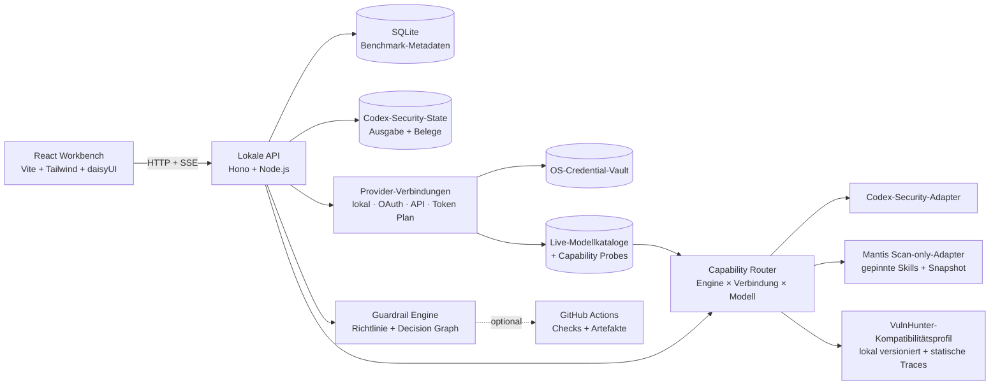

<div align="center">
  
  <h1>OKAMI Sentinel</h1>
  <p><strong>Eine lokale Evidenz-Workbench. Mehrere Security-Scan-Methoden.</strong></p>
  <p>KI-gestützte Sicherheitsscans ausführen, untersuchen, vergleichen und steuern – ohne Belege, Kosten oder den operativen Kontext eines Ergebnisses zu verlieren.</p>

  <p>
    <a href="README.md">English</a> ·
    <a href="README.pt-BR.md">Português (Brasil)</a> ·
    <a href="README.de.md"><strong>Deutsch</strong></a> ·
    <a href="README.fr.md">Français</a>
  </p>

  <p>
    <a href="https://github.com/OkamiOps/okami-sentinel/actions/workflows/ci.yml"></a>
    
    
    
    
    
  </p>
</div>


> [!IMPORTANT]
> OKAMI Sentinel vergleicht **gemeldete Belege**, nicht die Genauigkeit gegenüber einer Ground Truth. Mehr Findings bedeuten nicht automatisch einen besseren Scan, und ein fehlendes Finding beweist keine Behebung. Findings und False Positives müssen geprüft werden, bevor Precision, Recall oder F1 sinnvoll sind.

## Warum dieses Projekt existiert

Sicherheitsscans werden oft isoliert bewertet: ein Terminal, ein Bericht, eine Rechnung. OKAMI Sentinel macht daraus ein vergleichbares Betriebssystem. Jeder Lauf wird zu einem Belegkanal, in dem Modell, Reasoning Effort, Dauer, Tokenvolumen, geschätzte Kosten, Schweregrade, Findings und Ausführungsstatus gemeinsam lokal erhalten bleiben.

Das Projekt richtet sich an Entwickler, DevSecOps-Teams, Security Reviewer und AI Engineers, die Scanner-Methodik und Modellwahl getrennt an realen Repositories bewerten müssen.

## Was enthalten ist

| Oberfläche | Beantwortete Frage |
|---|---|
| **Evidence Field** | Was hat jeder Lauf gemeldet und wie verteilen sich die Schweregrade? |
| **Run Ledger** | Welche Scans wurden abgeschlossen, sind fehlgeschlagen oder haben Teilergebnisse bewahrt? |
| **Launch Sequencer** | Welche Engine, Authentifizierung, welches Modell, Effort, welcher Modus und Scope sollen laufen? |
| **Evidence Inspector** | Wo liegt das Finding, wie verläuft der Angriffspfad und welche Belege stützen es? |
| **Comparison Cockpit** | Welcher Lauf meldete mehr Abdeckung, High+, Geschwindigkeit oder Kosteneffizienz? |
| **Berichte** | Wie wird ein einzelner Scan oder ein Vergleich mit sechs Scans als PDF übergeben? |
| **Guardrails** | Soll dieses Changeset passieren, warnen, geprüft oder blockiert werden? |
| **GitHub Checks** | Wie wird dieselbe versionierte Richtlinie auf Pull Requests angewendet? |

<table>
  <tr>
    <td width="50%"></td>
    <td width="50%"></td>
  </tr>
  <tr>
    <td align="center"><strong>Bis zu sechs Scans vergleichen</strong></td>
    <td align="center"><strong>Belege und Lifecycle untersuchen</strong></td>
  </tr>
</table>

## Kernfunktionen

- **Fähigkeitsbasiertes Routing** — zuerst die Methodik wählen; die UI zeigt danach nur ausführbare Authentifizierungs-, Modell-, Effort- und Modus-Kombinationen.
- **Provider-Verbindungen** — lokale Sitzungen, verwaltete Browser-/Geräteauthentifizierung, API-Schlüssel, Token-Plan-Endpunkte oder kompatible eigene APIs konfigurieren, ohne Credentials in Scan-Manifeste zu schreiben.
- **Live-Modellkatalog** — nur Modelle wählen, die von der ausgewählten authentifizierten Verbindung zurückgegeben werden; Sentinel erfindet keinen Fallback-Katalog.
- **Dynamische Runtime-Steuerung** — Modell, unterstützte Reasoning-Effort-Stufen, Scanmodus und Ausführungsgrenze werden aus den Fähigkeiten der gewählten Verbindung und Engine aufgelöst; nicht unterstützte Werte sind nicht im Launch-Formular fest verdrahtet. Das Laufprofil hält fest, ob ein Effort gesendet wurde, welches Wire-Feld verwendet wurde oder ob der Provider-Default erhalten blieb.
- **Verzeichnisbrowser** — lokale Ordner auswählen, ohne absolute Pfade manuell zu kopieren.
- **Live-Telemetrie** — Status, Phase, SSE-Ereignisse, Dauer, Tokens, geschätzte Kosten und bewahrte Ausgabe verfolgen.
- **Belegorientierte Untersuchung** — nach Schweregrad und Lifecycle filtern, Zusammenfassungen und Fundorte prüfen, Angriffspfade verfolgen und ausdrücklich sehen, wenn einem Finding keine strukturierten Belege beigefügt wurden.
- **Lesbares Run Ledger** — jeder Lauf zeigt Engine- und Modell-Badges sowie `High+` und die Gesamtzahl der Schwachstellen; nur terminale Läufe können aus dem Ledger entfernt werden.
- **Ehrliche Teilergebnisse** — fehlgeschlagene Scans mit Findings bleiben mit `FAILED` und `PARTIAL` vergleichbar.
- **Vergleich von sechs Läufen** — eine Baseline und bis zu fünf Kandidaten mit Schweregrad-Diff, Stückkosten, Durchsatz und expliziten Zielen.
- **Druckfertige Berichte** — markengeprägte Einzel- und Vergleichsberichte für Browserdruck und PDF.
- **Versionierte Guardrails** — lokale Preflight-Richtlinien, explizite Ausnahmen, Decision Graph und optionale GitHub Checks.
- **Fünf UI-Sprachen** — PT-BR, English, Español, Deutsch und Français.

## Scan-Engines

| Engine | Status | Ausführbare Verbindungsrouten | Modelle | Ausführungsgrenze |
|---|---|---|---|---|
| [`@openai/codex-security`](https://github.com/openai/codex-security) | Stabil | Lokale OpenAI-Codex/ChatGPT-Sitzung oder OpenAI API | Authentifizierter Live-Katalog | Standard- oder Deep-Scan; explizite USD-Obergrenze unterstützt |
| [Google Mantis](https://github.com/google/mantis) | Preview | Codex/ChatGPT-Sitzung, lokale Claude-Code-Sitzung, direktes xAI-OAuth und fähigkeitsgeprüfte HTTP-Provider | Authentifizierter Live-Katalog; Claude kann seinen expliziten Runtime-Default verwenden | Neun deterministische Scan-only-Stufen auf einem unveränderlichen Snapshot |
| [Capital One VulnHunter](https://github.com/capitalone/vulnhunter) | Experimentell | Codex/ChatGPT-Sitzung, direktes xAI-OAuth und fähigkeitsgeprüfte HTTP-Provider | Authentifizierter Live-Katalog | Sechsstufiges, schreibgeschütztes statisches Kompatibilitätsprofil aus der geprüften VulnHunter-Methodik |

Mantis wird bei einem geprüften Commit abgerufen, validiert und atomar in einen privaten lokalen Cache veröffentlicht. Phase eins schließt `mantis-reproduce`, `mantis-chain` und `mantis-patch` bewusst aus: Der Adapter schreibt nicht in das Ziel-Repository und führt keinen erzeugten Exploit-Code aus. HTTP-Routen laufen über Sentinels begrenzten Agent-Tool-Host. Läufe mit einem Claude-Code-Abo verwenden ein separates leeres Sitzungsverzeichnis ohne eingebaute Tools und einen privaten schreibgeschützten MCP-Server, der nur begrenztes Auflisten, Lesen und Suchen im unveränderlichen Snapshot bereitstellt. Der rohe Mantis-Status bleibt zur Auditierbarkeit neben den normalisierten Sentinel-Belegen erhalten.

Der Upstream-Ablauf von VulnHunter ist Claude-orientiert und enthält operative Verifizierungsstufen, die Cyber-Schutzmechanismen eines Providers auslösen können. Sentinel speichert deshalb die geprüfte Upstream-Revision als Provenienz für sein separat versioniertes lokales Profil, ruft jedoch **nicht** den Upstream-Skill oder dessen Phasen-Prompts ab und sendet sie zur Laufzeit nicht an Codex. Das experimentelle Kompatibilitätsprofil bewahrt die nützliche Form — Erkundung, vorwärts gerichtete statische Traces, adversarielle Falsifizierung, Coverage-Sweep und beleggestützte Behebung — in einer einzigen schreibgeschützten Sitzung über einen unveränderlichen Snapshot. Behaltene Findings werden in denselben Inspector-Belegvertrag wie bei den anderen Engines normalisiert. Eine Provider-Richtlinie kann eine Repository-Überprüfung weiterhin ablehnen; dann bewahrt Sentinel das vollständige Run-Log, behält bereits vom Codex-App-Server gemeldete Token-Nutzung und weist die Trusted-Access-Anforderung aus, statt einen erfolgreichen Scan vorzutäuschen. Meldet der Provider keine Nutzung, bleiben Kosten nicht verfügbar und erscheinen nie als falscher Null-Dollar-Lauf.

> [!NOTE]
> Abonnement, OAuth, Token Plan und API-Abrechnung sind getrennte Routen. Sentinel bindet jeden Scan an eine persistierte Verbindung und entweder ein live entdecktes Modell oder einen vom Adapter deklarierten Runtime-Default, validiert diese Auswahl vor dem Zugriff auf Credentials erneut und fällt niemals still auf eine andere Route zurück.

## Codex-Security-Ausführungsprofile

Codex Security hat zwei explizite Ausführungsprofile. Sie sind keine Aliasse: Scan-Detail und Bericht bewahren das gewählte Profil, Route, Protokoll, Modell und die Kennung der Fähigkeitsprüfung.

| Profil | Exakte Routen | Ausführung |
|---|---|---|
| **Native** | Lokales Codex, ChatGPT Browser-OAuth, ChatGPT Gerätecode oder OpenAI API | Der Upstream-Vertrag von `@openai/codex-security`. |
| **Portable** | Direkte xAI-OAuth/API, Anthropic API, OpenRouter, Gemini, DeepSeek, MiniMax Token Plan, MiMo Token Plan oder eine kompatible OpenAI-/Anthropic-API | Sentinels versionierte defensive Methodik im begrenzten AgentSession-Host. |

Portable behauptet nicht, dass ein Nicht-OpenAI-Provider den Upstream-Scanner ausführt. Es verwendet `sentinel/codex-security-methodology@v1`: sechs defensive, ausschließlich statische Stufen auf einem unveränderlichen Snapshot, mit begrenzten Lese-/Suchwerkzeugen, strukturierten Artefakten, Abbruch und Isolation als Pflicht. Ein servergeführtes strukturiertes Dossier übergibt Inventar, Kandidatenmenge, Stufenzusammenfassungen, Bewertungen und Scope zwischen den Stufen. Vor dem Start muss das exakt gespeicherte Tupel aus Verbindung/Modell/Protokoll eine frische erfolgreiche Fähigkeitsprüfung besitzen. Eine fehlende, abgelaufene, fehlgeschlagene oder nicht passende Prüfung blockiert den Lauf; Sentinel fällt niemals still auf Native, eine andere Route, CLI oder ein anderes Modell zurück.

Die Berichtsphase teilt bestätigte Kandidaten intern in Seiten mit höchstens 16 Kandidaten auf. Eine Modellseite darf nur ihre Findings liefern; Coverage und abgelehnte Kandidaten bleiben servergeführt. Vor jedem `results.write` prüft Sentinel JSON, Stufenvertrag, Dossier-Semantik, Seitenzuordnung, Coverage sowie Pfade und Zeilenbereiche der Snapshot-Anker. Ein abgelehntes Terminal-Artefakt kann ein begrenztes Reparaturfenster erhalten: vier bis acht Reparatur-Turns, höchstens ein Inspektions-Tool-Aufruf und stets innerhalb der globalen Sitzungsgrenzen. Nur der serverseitig zusammengesetzte Abschlussbericht wird als `sentinel-findings.json` geschrieben; Seitenartefakte werden nicht als Sentinel-Ergebnis veröffentlicht.

Übernommene Findings müssen auf einen bereits vorhandenen Kandidaten zurückgehen und `rootCause`, `impact`, nichtleere `remediation` sowie repository-gestützte Anker enthalten. Der lokale Normalisierer erzeugt daraus das kanonische `findings.json` mit Fundorten und Codebelegen. Die Validierung bleibt statisch: Sie führt weder Zielcode aus noch erzeugt sie Exploits oder wendet Patches automatisch an. Ein Bericht mit null Findings ist nur gültig, wenn die Coverage jeden Kandidaten und den geprüften oder ungeprüften Scope ausdrücklich ausweist.

Portable-Budgets folgen der ausgewählten Effort-Semantik, nicht einer Provider- oder Modellnamen-Allowlist. Der exakte Effort muss vom ausgewählten Modell veröffentlicht sein und von dessen Route übertragen werden können; nicht jeder Effort-Name vergrößert das Budget.

| Effort-Gruppe | Standard | Deep |
|---|---:|---:|
| `minimal`, `low` | 20 Min. / 24 Turns / 96 Tool-Aufrufe | 30 Min. / 48 Turns / 192 Tool-Aufrufe |
| `medium`, `high`, unbekannt oder nicht gesetzt | 30 Min. / 32 Turns / 128 Tool-Aufrufe | 45 Min. / 64 Turns / 256 Tool-Aufrufe |
| `xhigh` | 45 Min. / 48 Turns / 192 Tool-Aufrufe | 60 Min. / 96 Turns / 384 Tool-Aufrufe |
| `max`, `ultra` | 60 Min. / 64 Turns / 256 Tool-Aufrufe | 90 Min. / 128 Turns / 512 Tool-Aufrufe |

Jede Portable-Sitzung ist zusätzlich auf 64 MiB Eingabe und 1 MiB Ausgabe begrenzt. Eine optionale USD-Obergrenze verwendet ein eingefrorenes passendes Preisangebot; ohne ein solches Angebot blockiert Sentinel den Start. Sobald gemeldete Nutzung die Obergrenze erreicht, endet die Sitzung vor der nächsten Provider-Anfrage, auch wenn eine bereits laufende Anfrage die Schätzung noch darüber heben kann. Lässt sich die Usage während des Laufs nicht mehr schätzen, beendet Sentinel die Sitzung, statt Kosten oder eine durchgesetzte Obergrenze zu erfinden.

### Finding-Lifecycle

`standard` und `deep` sind Scanmodi, keine inkrementellen Scanarten. Die Detailansicht zeigt nur Findings der aktuellen Ausführung: Ein expliziter Baseline-Scan oder automatisch der neueste frühere abgeschlossene Lauf derselben Analyse-Lineage (Engine, Provider, Modell, Modus, Effort, Profil, Route, Protokoll und Recipe) klassifiziert sie als `new`, `persisting` oder `regressed`. Das Fehlen eines Findings in einem neuen Lauf ist keine Behebung und wird nicht als `fixed` angezeigt. `fixed` bleibt einem zukünftigen expliziten inkrementellen Vergleich vorbehalten.

## Architektur



| Ebene | Technologie | Pfad |
|---|---|---|
| Webanwendung | React 19, Vite, TypeScript, Tailwind CSS, daisyUI, shadcn, Recharts, Framer Motion | `apps/web` |
| Lokale API | Node.js, Hono | `apps/api` |
| Gate CLI | Headless Security Change Gate | `apps/gate-cli` |
| Gate Engine | Richtlinienauswertung und Runtime-Integration | `packages/gate-core`, `packages/gate-runtime` |
| Gemeinsame Verträge | Paketübergreifende Typen und Schemas | `packages/shared` |
| Metadaten | SQLite | `data/benchmark.db` |

## Voraussetzungen

- Node.js `24.x` (`>=24 <25`)
- pnpm `11.5.2`
- Python `3.10+` für Codex Security
- GitHub CLI (`gh`) für Diagnose, Remote-Baselines und optionale Check-Veröffentlichung
- GitHub Actions in Repositories mit Remote Gate
- Ein vom lokalen Keychain-Adapter unterstützter OS-Credential-Store für Secret-gestützte Verbindungen
- Mindestens eine konfigurierte Route unter **Einstellungen → Verbindungen**. Verfügbare Presets umfassen:
  - lokales OpenAI Codex, ChatGPT-Browser-/Geräteauthentifizierung und OpenAI API;
  - lokale xAI-Grok-Erkennung, von Sentinel lokal orchestriertes Geräte-OAuth und xAI API;
  - lokale Claude-Code-Sitzung und Anthropic API;
  - lokale Cursor-Erkennung und Cursor Background Agents API;
  - OpenRouter, Gemini, DeepSeek, MiniMax Token Plan, Xiaomi MiMo Token Plan sowie eigene OpenAI- oder Anthropic-kompatible APIs.

## Schnellstart

```bash
git clone https://github.com/OkamiOps/okami-sentinel.git
cd okami-sentinel
corepack enable
corepack prepare pnpm@11.5.2 --activate
pnpm install
pnpm dev
```

Falls pnpm die Freigabe von Build-Skripten verlangt:

```bash
pnpm approve-builds --all
pnpm install
```

Danach öffnen:

- Weboberfläche: <http://127.0.0.1:5173>
- Lokale API: <http://127.0.0.1:8787>

Unter **Einstellungen → Verbindungen** eine Route hinzufügen, authentifizieren und ihren Modellkatalog aktualisieren. Lokale Abo-Routen verwenden weiterhin ihren offiziellen Login:

```bash
npx @openai/codex-security login
# oder
npx @openai/codex-security login --device-auth

# Von Codex gehostete Mantis- und VulnHunter-Läufe verwenden die generische Codex-Sitzung
codex login

# Lokales Mantis mit Claude verwendet die bestehende Claude-Code-Sitzung
claude auth login
```

Beim Start indexiert die API kompatible Scans, die bereits im konfigurierten Codex-Security-State vorhanden sind.

## Typischer Ablauf

1. **Übersicht** — indexierte Kanäle, Schweregrade, Kosten und Dauer prüfen.
2. **Ausführen** — Repository und Methodik wählen, danach eine verfügbare Authentifizierungsroute, Modell, Effort, Modus und Scope festlegen.
3. **Aktivität / Scan-Detail** — Telemetrie verfolgen und bewahrte Belege untersuchen.
4. **Vergleichen** — zwei bis sechs Läufe wählen, Baseline festlegen und Abdeckung, High+, `$ / finding`, `$ / High+` und Geschwindigkeit bewerten.
5. **Bericht** — Einzelbericht im Scan-Detail oder Vergleichsbericht nach dem Diff erzeugen.
6. **Guardrails** — lokales Changeset auswerten und die Entscheidung optional als GitHub Check veröffentlichen.

## Provider-Verbindungen

| Provider-Familie | Verbindungsrouten | Scanner-Verfügbarkeit |
|---|---|---|
| **OpenAI** | Lokales Codex, ChatGPT Browser-OAuth, ChatGPT Gerätecode, API-Schlüssel | Codex Security, Mantis und VulnHunter gemäß der aufgelösten Route |
| **xAI** | Von Sentinel lokal orchestriertes Geräte-OAuth, API-Schlüssel, lokale Grok-Erkennung | OAuth/API kann Codex Security Portable ausführen, wenn das exakte Tupel aus Verbindung, Modell und Protokoll eine frische erfolgreiche Capability Probe besitzt; Mantis und VulnHunter bleiben fähigkeitsabhängig. Lokales Grok-Scannen bleibt blockiert, bis seine Plugin-/Hook-Ausführungsfläche isoliert werden kann. |
| **Anthropic** | Bestehende Claude-Code-Sitzung, Anthropic API | Lokales Claude führt Mantis durch die MCP-only-Snapshot-Grenze aus. Anthropic API kann Codex Security Portable ausführen, wenn das exakte Tupel eine frische erfolgreiche Capability Probe besitzt; andere Engines bleiben fähigkeitsabhängig. |
| **Cursor** | Lokale CLI-Erkennung, Background Agents API | Verbindung und Live-Katalog sind verfügbar; Scanner-Ausführung wird erst nach vollständigem Remote-/Local-Artefaktvertrag angeboten. |
| **Andere HTTP** | OpenRouter, Gemini, DeepSeek, MiniMax Token Plan, MiMo Token Plan, benutzerdefinierte kompatible URLs | Codex Security Portable, Mantis und VulnHunter sind nur verfügbar, wenn das exakte Tupel aus Verbindung, Modell und Protokoll Sentinels begrenzte Tool-, Artefakt-, Abbruch- und Snapshot-Probe besteht. |

Modelle und gültige Effort-Stufen kommen aus dem authentifizierten Katalog und den Live-Fähigkeiten des Providers. Die einzige Ausnahme für einen Runtime-Default ist eine ausdrücklich konfigurierte lokale Claude-Code-Sitzung. Bei OpenRouter bedeutet `reasoning.supported_efforts: null`, dass der Gateway-Effort-Satz verfügbar ist; ist `reasoning.mandatory` wahr, wird `none` entfernt. Der von Sentinel gesendete Effort und sein Wire-Feld werden bei Kenntnis erhalten; andernfalls wird der Provider-Default festgehalten, ohne zu behaupten, was der Provider angewendet hat. Secrets und OAuth-Tokens sind über die API write-only, werden im Credential Vault des Betriebssystems gespeichert und in SQLite nur durch undurchsichtige Referenzen repräsentiert. Sentinel orchestriert den öffentlichen xAI-Gerätefluss lokal und hängt nicht von einer Grok-CLI ab; Modellzugriff wird erst nach erfolgreichem Live-Katalog und Fähigkeitsprüfungen akzeptiert.

## Lokale Guardrails

Guardrails bewerten ein Git-Changeset und bewahren die für die Entscheidung verwendeten Belege.

1. Root-Verzeichnis eines lokalen Git-Repositories registrieren.
2. Preflight mit Referenzen wie `main` und `HEAD` ausführen.
3. Changeset, Scanner-Scope, Richtlinienergebnis und Decision Graph prüfen.
4. `.csb/guardrails.json` visuell bearbeiten und das JSON-Diff prüfen.
5. Zeitlich begrenzte Ausnahmen in `.csb/guardrails-exceptions.json` festhalten.

| Ergebnis | Bedeutung | GitHub Conclusion | CLI Exit |
|---|---|---|---:|
| `no_changes` | Keine geänderten Dateien zwischen den Refs | `success` | 0 |
| `bootstrap` | Keine Baseline; niemals eine Freigabe | `neutral` | 0 |
| `pass` | Keine Blockier- oder Review-Regel ausgelöst | `success` | 0 |
| `warning` | Richtlinie verlangt Review | `neutral` | 0 |
| `blocked` | Blockierende Regel ausgelöst | `failure` | 2 |
| `error` | Operativer Fehler; nie als Freigabe gewertet | `action_required` | 3 |

<details>
<summary><strong>Wiederverwendbares GitHub-Actions-Gate</strong></summary>

Im Ziel-Repository `.github/workflows/csb-security-change-gate.yml` anlegen:

```yaml
name: CSB Security Change Gate
on:
  pull_request:
  push:
    branches: [main]
permissions:
  contents: read
  pull-requests: read
  actions: read
  checks: write
jobs:
  security-change-gate:
    uses: OkamiOps/okami-sentinel/.github/workflows/security-change-gate.yml@v1
    with:
      policy_path: .csb/guardrails.json
      default_branch: main
    secrets:
      OPENAI_API_KEY: ${{ secrets.OPENAI_API_KEY }}
```

Die versionierte Referenz `@v1` verwenden; `@main` gilt nicht als Gate-Release. In den Branch-Protection-Regeln muss der exakte Check-Name **`CSB Security Change Gate`** stehen.

Pull Requests aus Forks erhalten üblicherweise keine Secrets des Basis-Repositories. Ohne Scanner-Authentifizierung endet der Lauf mit operativem Exit `3`, niemals als falscher Erfolg.
</details>

<details>
<summary><strong>GitHub-Fähigkeiten prüfen</strong></summary>

- **Git-Repository:** `git rev-parse --show-toplevel`
- **GitHub Remote:** `remote.origin.url` muss auf `github.com/<owner>/<repo>` zeigen
- **GitHub CLI:** `gh --version`
- **Authentifizierung:** `gh auth status`, bei Bedarf `gh auth login`
- **Abonnement:** `codex login status`, bei Bedarf `codex login`
- **API-Secret:** `gh secret list --json name` muss `OPENAI_API_KEY` enthalten
- **Caller Workflow:** Datei, `@v1` und Mindestberechtigungen prüfen
- **Remote-Baseline:** gültiges `csb-gate-artifact` auf dem Default Branch bestätigen

Abgelaufene, fehlende oder schema-ungültige Artefakte sind operative Fehler. Sie lösen keinen stillen Bootstrap aus.
</details>

## Berichte

- **Einzelbericht:** Executive Summary, Schweregrade, Findings, Fundorte und Belege.
- **Vergleichsbericht:** eine Baseline und bis zu fünf Kandidaten nach dem Diff.
- **Ausgabe:** Browser-Druckvorschau oder „Als PDF speichern“.
- **Paginierung:** A4-gerechte Abschnitte schützen Metriken, Header und Findings vor internem Abschneiden.

## Lokalisierung

Die Oberfläche erkennt beim ersten Besuch die Browsersprache und speichert die Auswahl unter `okami-sentinel.locale`.

| Code | Sprache | UI-Unterstützung |
|---|---|---:|
| `pt-BR` | Português do Brasil (Fallback) | Ja |
| `en` | English | Ja |
| `es` | Español | Ja |
| `de` | Deutsch | Ja |
| `fr` | Français | Ja |

Datums- und Zahlenformate folgen dem aktiven Locale. Finanzwerte bleiben ausdrücklich in USD. Vom Scanner erzeugte Titel, Zusammenfassungen, Pfade, Codes, Belege und Logs bleiben in ihrer Originalsprache, damit die technische Bedeutung unverändert bleibt.

Siehe [Lokalisierungsarchitektur](docs/localization.de.md).

## Konfiguration

| Variable | Standard | Zweck |
|---|---|---|
| `CODEX_SECURITY_STATE_DIR` | Globaler State, wenn beschreibbar; sonst `data/codex-security-state` | Scanner-State und Ausgabe |
| `CODEX_SECURITY_BIN` | `npx` | Scanner-CLI |
| `CSB_NPM_CACHE_DIR` | `data/npm-cache` | Isolierter npm-Cache für den Scanner |
| `CODEX_BIN` | Im ChatGPT Desktop enthaltene CLI unter macOS, sonst `codex` | Inferenz-Host für Mantis und VulnHunter |
| `MANTIS_REPOSITORY_URL` | `https://github.com/google/mantis.git` | Geprüftes Mantis-Quell-Repository |
| `MANTIS_SOURCE_REF` | Angehefteter geprüfter Commit | Exakte Mantis-Revision für neue Läufe |
| `MANTIS_CACHE_DIR` | `data/mantis-cache` | Lokaler Cache für die angehefteten Mantis-Skills |
| `VULNHUNTER_REPOSITORY_URL` | `https://github.com/capitalone/vulnhunter.git` | VulnHunter-Quell-Repository, das als Methodik-Provenienz festgehalten wird |
| `VULNHUNTER_SOURCE_REF` | Kennung des geprüften Commits | Als Methodik-Provenienz festgehalten; wird zur Laufzeit nicht abgerufen |
| `CSB_HOST` | `127.0.0.1` | API-Bind-Adresse |
| `CSB_PORT` | `8787` | API-Port |
| `CSB_MAX_CONCURRENT_SCANS` | `8` | Maximale parallele Scanner-Prozesse |

## Entwicklung

```bash
pnpm dev          # API + Web
pnpm dev:api      # nur API
pnpm dev:web      # nur Web
pnpm typecheck
pnpm test
pnpm build
```

```text
okami-sentinel/
├── apps/
│   ├── api/           # lokale HTTP/SSE-API
│   ├── gate-cli/      # Headless-Gate-Befehl
│   └── web/           # React Workbench und Berichte
├── packages/
│   ├── gate-core/     # Richtlinien und Entscheidungsmodell
│   ├── gate-runtime/  # Scanner-/Runtime-Integration
│   └── shared/        # gemeinsame Verträge
├── docs/              # Architektur- und Produktdokumentation
└── data/              # lokale Metadaten und Runtime-State
```

## Kosten- und Sicherheitshinweise

> [!WARNING]
> Scans können teuer sein. Codex Security Native ordnet seinen Kostenrahmen der Upstream-Schutzvorkehrung `--max-cost` zu. Portable kann nach jedem Usage-Ereignis eine eigene USD-Obergrenze mit eingefrorenem Preisangebot anwenden; sie verhindert die nächste Anfrage, während eine bereits laufende Anfrage die Schätzung noch übersteigen kann. Wenn Usage und passendes Angebot vorliegen, zeigt Sentinel eine Schätzung oder ein PAYG-Äquivalent — keine echte Belastung oder Rechnung. Abo- und lokale Sitzungsrouten bleiben **nicht verfügbar**, niemals `$0`, wenn der Provider keine abrechenbare Nutzung meldet. Für eine exakte Modellübereinstimmung schätzt OpenRouter ungecachten Input, Cache-Lesevorgänge, Cache-Schreibvorgänge und Output getrennt. Planfreibeträge, Guthaben und die endgültige Provider-Abrechnung bleiben verschiedene Messgrößen.

- Metadaten und normalisierte Belege bleiben lokal. Provider-Credentials werden lokal gespeichert und nur zur Authentifizierung von Requests der ausgewählten Verbindung verwendet. Diese Inferenzroute erhält die für den Scan nötigen Prompts und Repository-Belege; das Veröffentlichen eines GitHub Checks ist eine separate explizite Aktion.
- Operative Fehler werden nie zu einer positiven Sicherheitsentscheidung.
- Das Löschen eines Scans ist explizit und erst nach einem terminalen Status möglich. Es kann den Anwendungsdatensatz und das zugehörige Scan-Verzeichnis **nur dann entfernen, wenn dieses Verzeichnis von Sentinel verwaltet wird**; das Ziel-Repository wird niemals gelöscht.
- Generierte Findings gelten bis zur Prüfung als nicht vertrauenswürdige Sicherheitsbelege.

## Projektdokumentation

- [Mitwirken](CONTRIBUTING.de.md)
- [Sicherheitsrichtlinie](SECURITY.de.md)
- [Lokalisierungsarchitektur](docs/localization.de.md)
- [Produktprinzipien](apps/web/PRODUCT.de.md)
- [Designsystem](apps/web/DESIGN.de.md)

## Projektstatus

Dieses Repository wird aktiv entwickelt. Oberflächen, lokale Schemas und das wiederverwendbare Gate können sich vor einer stabilen Version ändern. Das Gate sollte an eine versionierte Release-Referenz gebunden und jedes Upgrade geprüft werden.

---

<div align="center">
  <sub>Unabhängige lokale Workbench für KI-gestützte Security-Scanner. OKAMI Sentinel ist kein offizielles Produkt von OpenAI, Google oder Capital One.</sub>
</div>
