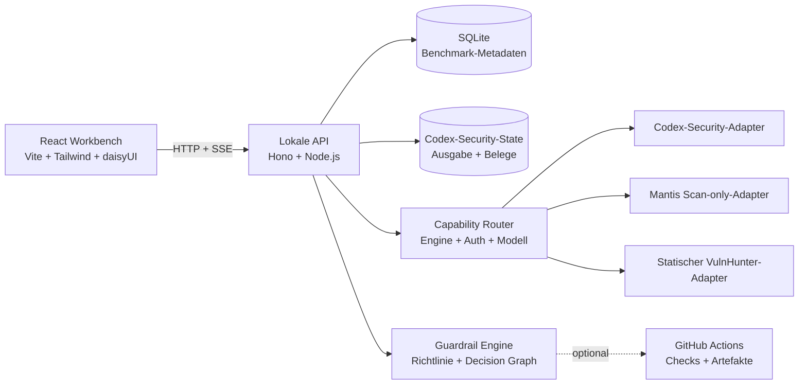

<div align="center">
  
  <h1>OKAMI Sentinel</h1>
  <p><strong>Eine lokale Evidenz-Workbench. Mehrere Security-Scan-Methoden.</strong></p>
  <p>KI-gestützte Sicherheitsscans ausführen, untersuchen, vergleichen und steuern – ohne Belege, Kosten oder den operativen Kontext eines Ergebnisses zu verlieren.</p>

  <p>
    <a href="README.md">English</a> ·
    <a href="README.pt-BR.md">Português (Brasil)</a> ·
    <a href="README.de.md"><strong>Deutsch</strong></a> ·
    <a href="README.fr.md">Français</a>
  </p>

  <p>
    <a href="https://github.com/OkamiOps/okami-sentinel/actions/workflows/ci.yml"></a>
    
    
    
    
    
  </p>
</div>


> [!IMPORTANT]
> OKAMI Sentinel vergleicht **gemeldete Belege**, nicht die Genauigkeit gegenüber einer Ground Truth. Mehr Findings bedeuten nicht automatisch einen besseren Scan, und ein fehlendes Finding beweist keine Behebung. Findings und False Positives müssen geprüft werden, bevor Precision, Recall oder F1 sinnvoll sind.

## Warum dieses Projekt existiert

Sicherheitsscans werden oft isoliert bewertet: ein Terminal, ein Bericht, eine Rechnung. OKAMI Sentinel macht daraus ein vergleichbares Betriebssystem. Jeder Lauf wird zu einem Belegkanal, in dem Modell, Reasoning Effort, Dauer, Tokenvolumen, geschätzte Kosten, Schweregrade, Findings und Ausführungsstatus gemeinsam lokal erhalten bleiben.

Das Projekt richtet sich an Entwickler, DevSecOps-Teams, Security Reviewer und AI Engineers, die Scanner-Methodik und Modellwahl getrennt an realen Repositories bewerten müssen.

## Was enthalten ist

| Oberfläche | Beantwortete Frage |
|---|---|
| **Evidence Field** | Was hat jeder Lauf gemeldet und wie verteilen sich die Schweregrade? |
| **Run Ledger** | Welche Scans wurden abgeschlossen, sind fehlgeschlagen oder haben Teilergebnisse bewahrt? |
| **Launch Sequencer** | Welche Engine, Authentifizierung, welches Modell, Effort, welcher Modus und Scope sollen laufen? |
| **Evidence Inspector** | Wo liegt das Finding, wie verläuft der Angriffspfad und welche Belege stützen es? |
| **Comparison Cockpit** | Welcher Lauf meldete mehr Abdeckung, High+, Geschwindigkeit oder Kosteneffizienz? |
| **Berichte** | Wie wird ein einzelner Scan oder ein Vergleich mit sechs Scans als PDF übergeben? |
| **Guardrails** | Soll dieses Changeset passieren, warnen, geprüft oder blockiert werden? |
| **GitHub Checks** | Wie wird dieselbe versionierte Richtlinie auf Pull Requests angewendet? |

<table>
  <tr>
    <td width="50%"></td>
    <td width="50%"></td>
  </tr>
  <tr>
    <td align="center"><strong>Bis zu sechs Scans vergleichen</strong></td>
    <td align="center"><strong>Belege und Lifecycle untersuchen</strong></td>
  </tr>
</table>

## Kernfunktionen

- **Fähigkeitsbasiertes Routing** — zuerst die Methodik wählen; die UI zeigt danach nur ausführbare Authentifizierungs-, Modell-, Effort- und Modus-Kombinationen.
- **Abo- oder API-Authentifizierung** — lokale Codex/ChatGPT-Sitzung oder eine separat abgerechnete `OPENAI_API_KEY`-Route, sofern die Engine sie unterstützt.
- **Verzeichnisbrowser** — lokale Ordner auswählen, ohne absolute Pfade manuell zu kopieren.
- **Live-Telemetrie** — Status, Phase, SSE-Ereignisse, Dauer, Tokens, geschätzte Kosten und bewahrte Ausgabe verfolgen.
- **Belegorientierte Untersuchung** — nach Schweregrad und Lifecycle filtern, Zusammenfassungen und Fundorte prüfen und Angriffspfade verfolgen.
- **Ehrliche Teilergebnisse** — fehlgeschlagene Scans mit Findings bleiben mit `FAILED` und `PARTIAL` vergleichbar.
- **Vergleich von sechs Läufen** — eine Baseline und bis zu fünf Kandidaten mit Schweregrad-Diff, Stückkosten, Durchsatz und expliziten Zielen.
- **Druckfertige Berichte** — markengeprägte Einzel- und Vergleichsberichte für Browserdruck und PDF.
- **Versionierte Guardrails** — lokale Preflight-Richtlinien, explizite Ausnahmen, Decision Graph und optionale GitHub Checks.
- **Fünf UI-Sprachen** — PT-BR, English, Español, Deutsch und Français.

## Scan-Engines

| Engine | Status in Phase 1 | Authentifizierung | Ausführungsgrenze |
|---|---|---|---|
| [`@openai/codex-security`](https://github.com/openai/codex-security) | Stabil | ChatGPT/Codex-Abo oder OpenAI API | Standard/deep mit expliziter USD-Obergrenze |
| [Google Mantis](https://github.com/google/mantis) | Preview | ChatGPT/Codex-Abo | Neun Scan-only-Stufen auf einem unveränderlichen Snapshot |
| [Capital One VulnHunter](https://github.com/capitalone/vulnhunter) | Experimentell | ChatGPT/Codex-Abo | Sechs agentengesteuerte Stufen auf einem unveränderlichen Snapshot; Payloads, PoC-Code und Exploit-Tests werden weder erzeugt noch ausgeführt |

Der Mantis-Adapter verwendet eine fest angeheftete, geprüfte Revision. Er schreibt nicht in das Ziel-Repository und schließt `mantis-reproduce`, `mantis-chain` und `mantis-patch` bewusst aus. ChatGPT-Abo und API-Abrechnung sind getrennte Routen; Sentinel entfernt API-Schlüssel aus dem Kindprozess, wenn das Abo gewählt ist, und wechselt niemals stillschweigend zwischen beiden.

VulnHunter verwendet ebenfalls eine geprüfte, fest angeheftete Revision. Da der Upstream-Ablauf für Claude entwickelt wurde, führt Sentinel ihn als experimentellen Codex-Port aus: Die Analyse bleibt in einem getrennten Snapshot, Reproduktion wird durch nicht operative Validierungsnotizen ersetzt und eine zweite isolierte Sitzung erstellt nur den defensiven Handoff. Payloads, PoC-Code und Exploit-Tests werden weder erzeugt noch ausgeführt; bestätigte Findings werden in den kanonischen Inspector-Vertrag normalisiert.

## Codex-Security-Ausführungsprofile

Codex Security hat zwei explizite Ausführungsprofile. Sie sind keine Aliasse: Scan-Detail und Bericht bewahren das gewählte Profil, Route, Protokoll, Modell und die Kennung der Fähigkeitsprüfung.

| Profil | Exakte Routen | Ausführung |
|---|---|---|
| **Native** | Lokales Codex, ChatGPT Browser-OAuth, ChatGPT Gerätecode oder OpenAI API | Der Upstream-Vertrag von `@openai/codex-security`. |
| **Portable** | Direkte xAI-OAuth/API, Anthropic API, OpenRouter, Gemini, DeepSeek, MiniMax Token Plan, MiMo Token Plan oder eine kompatible OpenAI-/Anthropic-API | Sentinels versionierte defensive Methodik im begrenzten AgentSession-Host. |

Portable behauptet nicht, dass ein Nicht-OpenAI-Provider den Upstream-Scanner ausführt. Es verwendet `sentinel/codex-security-methodology@v1`: sechs defensive, ausschließlich statische Stufen auf einem unveränderlichen Snapshot, mit begrenzten Lese-/Suchwerkzeugen, strukturierten Artefakten, Abbruch und Isolation als Pflicht. Vor dem Start muss das exakt gespeicherte Tupel aus Verbindung/Modell/Protokoll eine frische erfolgreiche Fähigkeitsprüfung besitzen. Eine fehlende, abgelaufene, fehlgeschlagene oder nicht passende Prüfung blockiert den Lauf; Sentinel fällt niemals still auf Native, eine andere Route, CLI oder ein anderes Modell zurück.

Auch Kosten werden konservativ behandelt. Sentinel speichert eine Schätzung nur, wenn der Provider Usage meldet und die vollständigen passenden Preisdaten vorliegen. Bei unvollständiger Usage oder Preisangaben bleibt der Betrag `null`/nicht verfügbar — niemals ein erfundenes `$0` oder eine Abo-Rechnung.

## Architektur



| Ebene | Technologie | Pfad |
|---|---|---|
| Webanwendung | React 19, Vite, TypeScript, Tailwind CSS, daisyUI, shadcn, Recharts, Framer Motion | `apps/web` |
| Lokale API | Node.js, Hono | `apps/api` |
| Gate CLI | Headless Security Change Gate | `apps/gate-cli` |
| Gate Engine | Richtlinienauswertung und Runtime-Integration | `packages/gate-core`, `packages/gate-runtime` |
| Gemeinsame Verträge | Paketübergreifende Typen und Schemas | `packages/shared` |
| Metadaten | SQLite | `data/benchmark.db` |

## Voraussetzungen

- Node.js `24.x` (`>=24 <25`)
- pnpm `11.5.2`
- Python `3.10+` für Codex Security
- GitHub CLI (`gh`) für Diagnose, Remote-Baselines und optionale Check-Veröffentlichung
- GitHub Actions in Repositories mit Remote Gate
- Mindestens eine Zugriffsroute:
  - **Codex Security per Abo:** aktiver Login laut `npx @openai/codex-security login status`;
  - **Mantis per Abo:** `codex login status` zeigt `Logged in using ChatGPT`;
  - **VulnHunter per Abo:** dieselbe generische Codex-Sitzung mit verfügbarem `gpt-5.6-sol`;
  - **Codex Security per API:** `OPENAI_API_KEY` oder `CODEX_API_KEY` im lokalen API-Prozess oder `OPENAI_API_KEY` als Actions-Secret.

## Schnellstart

```bash
git clone https://github.com/OkamiOps/okami-sentinel.git
cd okami-sentinel
corepack enable
corepack prepare pnpm@11.5.2 --activate
pnpm install
pnpm dev
```

Falls pnpm die Freigabe von Build-Skripten verlangt:

```bash
pnpm approve-builds --all
pnpm install
```

Danach öffnen:

- Weboberfläche: <http://127.0.0.1:5173>
- Lokale API: <http://127.0.0.1:8787>

Bei Bedarf am Scanner anmelden:

```bash
npx @openai/codex-security login
# oder
npx @openai/codex-security login --device-auth

# Mantis und VulnHunter verwenden die generische Codex-Sitzung
codex login
```

Beim Start indexiert die API kompatible Scans, die bereits im konfigurierten Codex-Security-State vorhanden sind.

## Typischer Ablauf

1. **Übersicht** — indexierte Kanäle, Schweregrade, Kosten und Dauer prüfen.
2. **Ausführen** — Repository und Methodik wählen, danach eine verfügbare Authentifizierungsroute, Modell, Effort, Modus und Scope festlegen.
3. **Aktivität / Scan-Detail** — Telemetrie verfolgen und bewahrte Belege untersuchen.
4. **Vergleichen** — zwei bis sechs Läufe wählen, Baseline festlegen und Abdeckung, High+, `$ / finding`, `$ / High+` und Geschwindigkeit bewerten.
5. **Bericht** — Einzelbericht im Scan-Detail oder Vergleichsbericht nach dem Diff erzeugen.
6. **Guardrails** — lokales Changeset auswerten und die Entscheidung optional als GitHub Check veröffentlichen.

## Authentifizierungsarten

| Route | Unterstützte Engines | Geeignet für | `OPENAI_API_KEY` nötig? | Autonom in Actions? |
|---|---|---|---:|---:|
| **ChatGPT-Abonnement** | Codex Security, Mantis, VulnHunter | Lokale interaktive Nutzung | Nein | Nein |
| **OpenAI API** | Codex Security | CI, Pull Requests und unbeaufsichtigte Gates | Ja | Ja |

Die Anwendung liest oder speichert den Wert des Repository-Secrets nicht. Sie diagnostiziert nur, ob die benötigte Fähigkeit verfügbar ist.

## Lokale Guardrails

Guardrails bewerten ein Git-Changeset und bewahren die für die Entscheidung verwendeten Belege.

1. Root-Verzeichnis eines lokalen Git-Repositories registrieren.
2. Preflight mit Referenzen wie `main` und `HEAD` ausführen.
3. Changeset, Scanner-Scope, Richtlinienergebnis und Decision Graph prüfen.
4. `.csb/guardrails.json` visuell bearbeiten und das JSON-Diff prüfen.
5. Zeitlich begrenzte Ausnahmen in `.csb/guardrails-exceptions.json` festhalten.

| Ergebnis | Bedeutung | GitHub Conclusion | CLI Exit |
|---|---|---|---:|
| `no_changes` | Keine geänderten Dateien zwischen den Refs | `success` | 0 |
| `bootstrap` | Keine Baseline; niemals eine Freigabe | `neutral` | 0 |
| `pass` | Keine Blockier- oder Review-Regel ausgelöst | `success` | 0 |
| `warning` | Richtlinie verlangt Review | `neutral` | 0 |
| `blocked` | Blockierende Regel ausgelöst | `failure` | 2 |
| `error` | Operativer Fehler; nie als Freigabe gewertet | `action_required` | 3 |

<details>
<summary><strong>Wiederverwendbares GitHub-Actions-Gate</strong></summary>

Im Ziel-Repository `.github/workflows/csb-security-change-gate.yml` anlegen:

```yaml
name: CSB Security Change Gate
on:
  pull_request:
  push:
    branches: [main]
permissions:
  contents: read
  pull-requests: read
  actions: read
  checks: write
jobs:
  security-change-gate:
    uses: OkamiOps/okami-sentinel/.github/workflows/security-change-gate.yml@v1
    with:
      policy_path: .csb/guardrails.json
      default_branch: main
    secrets:
      OPENAI_API_KEY: ${{ secrets.OPENAI_API_KEY }}
```

Die versionierte Referenz `@v1` verwenden; `@main` gilt nicht als Gate-Release. In den Branch-Protection-Regeln muss der exakte Check-Name **`CSB Security Change Gate`** stehen.

Pull Requests aus Forks erhalten üblicherweise keine Secrets des Basis-Repositories. Ohne Scanner-Authentifizierung endet der Lauf mit operativem Exit `3`, niemals als falscher Erfolg.
</details>

<details>
<summary><strong>GitHub-Fähigkeiten prüfen</strong></summary>

- **Git-Repository:** `git rev-parse --show-toplevel`
- **GitHub Remote:** `remote.origin.url` muss auf `github.com/<owner>/<repo>` zeigen
- **GitHub CLI:** `gh --version`
- **Authentifizierung:** `gh auth status`, bei Bedarf `gh auth login`
- **Abonnement:** `codex login status`, bei Bedarf `codex login`
- **API-Secret:** `gh secret list --json name` muss `OPENAI_API_KEY` enthalten
- **Caller Workflow:** Datei, `@v1` und Mindestberechtigungen prüfen
- **Remote-Baseline:** gültiges `csb-gate-artifact` auf dem Default Branch bestätigen

Abgelaufene, fehlende oder schema-ungültige Artefakte sind operative Fehler. Sie lösen keinen stillen Bootstrap aus.
</details>

## Berichte

- **Einzelbericht:** Executive Summary, Schweregrade, Findings, Fundorte und Belege.
- **Vergleichsbericht:** eine Baseline und bis zu fünf Kandidaten nach dem Diff.
- **Ausgabe:** Browser-Druckvorschau oder „Als PDF speichern“.
- **Paginierung:** A4-gerechte Abschnitte schützen Metriken, Header und Findings vor internem Abschneiden.

## Lokalisierung

Die Oberfläche erkennt beim ersten Besuch die Browsersprache und speichert die Auswahl unter `okami-sentinel.locale`.

| Code | Sprache | UI-Unterstützung |
|---|---|---:|
| `pt-BR` | Português do Brasil (Fallback) | Ja |
| `en` | English | Ja |
| `es` | Español | Ja |
| `de` | Deutsch | Ja |
| `fr` | Français | Ja |

Datums- und Zahlenformate folgen dem aktiven Locale. Finanzwerte bleiben ausdrücklich in USD. Vom Scanner erzeugte Titel, Zusammenfassungen, Pfade, Codes, Belege und Logs bleiben in ihrer Originalsprache, damit die technische Bedeutung unverändert bleibt.

Siehe [Lokalisierungsarchitektur](docs/localization.de.md).

## Konfiguration

| Variable | Standard | Zweck |
|---|---|---|
| `CODEX_SECURITY_STATE_DIR` | Globaler State, wenn beschreibbar; sonst `data/codex-security-state` | Scanner-State und Ausgabe |
| `CODEX_SECURITY_BIN` | `npx` | Scanner-CLI |
| `CSB_NPM_CACHE_DIR` | `data/npm-cache` | Isolierter npm-Cache für den Scanner |
| `CODEX_BIN` | Im ChatGPT Desktop enthaltene CLI unter macOS, sonst `codex` | Inferenz-Host für Mantis und VulnHunter |
| `VULNHUNTER_REPOSITORY_URL` | `https://github.com/capitalone/vulnhunter.git` | Geprüftes Upstream-Repository |
| `VULNHUNTER_SOURCE_REF` | Fest angehefteter geprüfter Commit | Exakte Revision für neue Scans |
| `VULNHUNTER_CACHE_DIR` | `data/vulnhunter-cache` | Lokaler Cache für den angehefteten Skill |
| `VULNHUNTER_SKILL_DIR` | nicht gesetzt | Optional vorinstallierter Skill mit `SKILL.md` und allen Phasen |
| `CSB_HOST` | `127.0.0.1` | API-Bind-Adresse |
| `CSB_PORT` | `8787` | API-Port |
| `CSB_MAX_CONCURRENT_SCANS` | `8` | Maximale parallele Scanner-Prozesse |

## Entwicklung

```bash
pnpm dev          # API + Web
pnpm dev:api      # nur API
pnpm dev:web      # nur Web
pnpm typecheck
pnpm test
pnpm build
```

```text
okami-sentinel/
├── apps/
│   ├── api/           # lokale HTTP/SSE-API
│   ├── gate-cli/      # Headless-Gate-Befehl
│   └── web/           # React Workbench und Berichte
├── packages/
│   ├── gate-core/     # Richtlinien und Entscheidungsmodell
│   ├── gate-runtime/  # Scanner-/Runtime-Integration
│   └── shared/        # gemeinsame Verträge
├── docs/              # Architektur- und Produktdokumentation
└── data/              # lokale Metadaten und Runtime-State
```

## Kosten- und Sicherheitshinweise

> [!WARNING]
> Scans können teuer sein. Der Kostenrahmen von Codex Security wird auf `--max-cost` abgebildet. Mantis und VulnHunter nutzen das ChatGPT-Abo; ihre USD-Werte sind mit öffentlichen OpenRouter-Preisen berechnete Vergleichsschätzungen, keine Rechnung oder Abbuchung. Tokens, Plankontingent, Guthaben und API-Abrechnung sind unterschiedliche Messgrößen.

- Daten und Belege bleiben lokal, außer ein GitHub Check wird ausdrücklich veröffentlicht oder der API-Workflow ausgeführt.
- Operative Fehler werden nie zu einer positiven Sicherheitsentscheidung.
- Das Löschen eines Scans ist explizit und kann den Datensatz sowie das zugehörige verwaltete Scan-Verzeichnis entfernen.
- Generierte Findings gelten bis zur Prüfung als nicht vertrauenswürdige Sicherheitsbelege.

## Projektdokumentation

- [Mitwirken](CONTRIBUTING.de.md)
- [Sicherheitsrichtlinie](SECURITY.de.md)
- [Lokalisierungsarchitektur](docs/localization.de.md)
- [Produktprinzipien](apps/web/PRODUCT.de.md)
- [Designsystem](apps/web/DESIGN.de.md)

## Projektstatus

Dieses Repository wird aktiv entwickelt. Oberflächen, lokale Schemas und das wiederverwendbare Gate können sich vor einer stabilen Version ändern. Das Gate sollte an eine versionierte Release-Referenz gebunden und jedes Upgrade geprüft werden.

---

<div align="center">
  <sub>Unabhängige lokale Workbench für KI-gestützte Security-Scanner. OKAMI Sentinel ist kein offizielles Produkt von OpenAI, Google oder Capital One.</sub>
</div>
