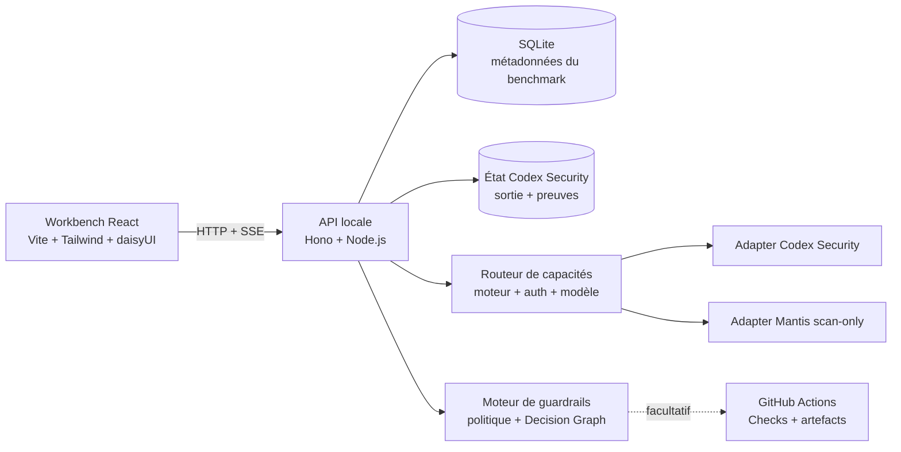

<div align="center">
  
  <h1>OKAMI Sentinel</h1>
  <p><strong>Un banc local de preuves. Plusieurs méthodologies de scan de sécurité.</strong></p>
  <p>Exécutez, inspectez, comparez et gouvernez des scans de sécurité assistés par IA sans perdre les preuves, le coût ni le contexte opérationnel de chaque résultat.</p>

  <p>
    <a href="README.md">English</a> ·
    <a href="README.pt-BR.md">Português (Brasil)</a> ·
    <a href="README.de.md">Deutsch</a> ·
    <a href="README.fr.md"><strong>Français</strong></a>
  </p>

  <p>
    <a href="https://github.com/OkamiOps/okami-sentinel/actions/workflows/ci.yml"></a>
    
    
    
    
    
  </p>
</div>


> [!IMPORTANT]
> OKAMI Sentinel compare des **preuves signalées**, pas l’exactitude par rapport à une vérité terrain. Plus de findings ne signifie pas automatiquement un meilleur scan, et l’absence d’un finding ne prouve pas sa correction. Confirmez les findings et triez les faux positifs avant d’utiliser la précision, le rappel ou le score F1.

## Pourquoi ce projet existe

Les scans de sécurité sont généralement examinés séparément : un terminal, un rapport, une facture. OKAMI Sentinel les transforme en un système opérationnel comparable. Chaque exécution devient un canal de preuves qui conserve localement le modèle, l’effort de raisonnement, la durée, le volume de tokens, le coût estimé, les sévérités, les findings et l’état d’exécution.

Le projet s’adresse aux développeurs, équipes DevSecOps, analystes sécurité et AI Engineers qui doivent évaluer séparément la méthodologie du scanner et le choix du modèle sur de vrais dépôts.

## Ce que vous obtenez

| Surface | Question traitée |
|---|---|
| **Champ de preuves** | Qu’a signalé chaque exécution et comment les sévérités sont-elles réparties ? |
| **Registre des runs** | Quels scans sont terminés, en échec ou ont conservé des résultats partiels ? |
| **Séquenceur de lancement** | Quel scanner, quelle authentification, quel modèle, effort, mode et périmètre faut-il exécuter ? |
| **Inspecteur de preuves** | Où se trouve le finding, quel est son chemin d’attaque et quelles preuves l’étayent ? |
| **Cockpit de comparaison** | Quelle exécution offre le plus de couverture, de High+, de vitesse ou d’efficacité ? |
| **Rapports** | Comment transmettre un scan ou une comparaison de six scans en PDF ? |
| **Guardrails** | Ce changeset doit-il passer, avertir, demander une revue ou bloquer ? |
| **GitHub Checks** | Comment appliquer la même politique versionnée à une pull request ? |

<table>
  <tr>
    <td width="50%"></td>
    <td width="50%"></td>
  </tr>
  <tr>
    <td align="center"><strong>Comparez jusqu’à six scans</strong></td>
    <td align="center"><strong>Inspectez les preuves et le lifecycle</strong></td>
  </tr>
</table>

## Fonctionnalités principales

- **Routage selon les capacités** — choisissez d’abord la méthodologie ; l’interface ne propose ensuite que les combinaisons d’authentification, modèle, effort et mode réellement exécutables.
- **Authentification par abonnement ou API** — session Codex/ChatGPT locale ou route `OPENAI_API_KEY` facturée séparément lorsque le scanner la prend en charge.
- **Navigateur de répertoires** — sélection des dossiers locaux sans copier manuellement les chemins absolus.
- **Télémétrie en direct** — état, phase, événements SSE, durée, tokens, coût estimé et sortie conservée.
- **Inspection centrée sur les preuves** — filtres de sévérité et de lifecycle, résumés, emplacements et chemins d’attaque.
- **Résultats partiels explicites** — les scans en échec ayant conservé des findings restent comparables avec les labels `FAILED` et `PARTIAL`.
- **Comparaison de six runs** — une baseline et jusqu’à cinq candidats, avec diff de sévérité, économie unitaire, débit et objectifs explicites.
- **Rapports prêts à imprimer** — rapports individuels et comparatifs pour l’impression navigateur et l’export PDF.
- **Guardrails versionnés** — politiques preflight locales, exceptions explicites, Decision Graph et publication facultative dans GitHub Checks.
- **Cinq langues dans l’interface** — PT-BR, English, Español, Deutsch et Français.

## Moteurs de scan

| Moteur | État en phase 1 | Authentification | Limite d’exécution |
|---|---|---|---|
| [`@openai/codex-security`](https://github.com/openai/codex-security) | Stable | Abonnement ChatGPT/Codex ou API OpenAI | Standard/deep avec plafond USD explicite |
| [Google Mantis](https://github.com/google/mantis) | Preview | Abonnement ChatGPT/Codex | Neuf étapes scan-only sur un snapshot immuable |
| [Capital One VulnHunter](https://github.com/capitalone/vulnhunter) | Expérimental / indisponible | — | Visible, mais désactivé jusqu’à la validation d’un adapter Codex par benchmark |

L’adapter Mantis utilise une révision auditée et épinglée. Il n’écrit pas dans le dépôt cible et exclut volontairement `mantis-reproduce`, `mantis-chain` et `mantis-patch`. L’abonnement ChatGPT et la facturation API sont des routes distinctes : Sentinel retire les clés API du processus enfant lorsque l’abonnement est sélectionné et ne bascule jamais silencieusement de l’une à l’autre.

## Architecture



| Couche | Technologie | Emplacement |
|---|---|---|
| Application web | React 19, Vite, TypeScript, Tailwind CSS, daisyUI, shadcn, Recharts, Framer Motion | `apps/web` |
| API locale | Node.js, Hono | `apps/api` |
| Gate CLI | Security change gate headless | `apps/gate-cli` |
| Moteur du gate | Évaluation des politiques et intégration runtime | `packages/gate-core`, `packages/gate-runtime` |
| Contrats partagés | Types et schémas inter-paquets | `packages/shared` |
| Métadonnées | SQLite | `data/benchmark.db` |

## Prérequis

- Node.js `24.x` (`>=24 <25`)
- pnpm `11.5.2`
- Python `3.10+` pour Codex Security
- GitHub CLI (`gh`) pour les diagnostics, baselines distantes et la publication facultative de Checks
- GitHub Actions activé dans les dépôts utilisant le gate distant
- Au moins une route d’accès :
  - **Codex Security par abonnement :** connexion active selon `npx @openai/codex-security login status` ;
  - **Mantis par abonnement :** `codex login status` affiche `Logged in using ChatGPT` ;
  - **Codex Security par API :** `OPENAI_API_KEY` ou `CODEX_API_KEY` dans le processus API local, ou `OPENAI_API_KEY` comme secret Actions.

## Démarrage rapide

```bash
git clone https://github.com/OkamiOps/okami-sentinel.git
cd okami-sentinel
corepack enable
corepack prepare pnpm@11.5.2 --activate
pnpm install
pnpm dev
```

Si pnpm demande l’autorisation des scripts de build :

```bash
pnpm approve-builds --all
pnpm install
```

Ouvrez ensuite :

- Interface web : <http://127.0.0.1:5173>
- API locale : <http://127.0.0.1:8787>

Connectez-vous au scanner si nécessaire :

```bash
npx @openai/codex-security login
# ou
npx @openai/codex-security login --device-auth

# Mantis utilise la session Codex générique
codex login
```

Au démarrage, l’API indexe les scans compatibles déjà présents dans le répertoire d’état Codex Security configuré.

## Flux de travail habituel

1. **Vue d’ensemble** — inspecter les canaux indexés, les sévérités, le coût et la durée.
2. **Exécuter** — choisir le dépôt et la méthodologie, puis une route d’authentification disponible, le modèle, l’effort, le mode et le périmètre.
3. **Activité / Détail** — suivre la télémétrie et inspecter les preuves conservées.
4. **Comparer** — sélectionner deux à six runs, choisir une baseline et évaluer couverture, High+, `$ / finding`, `$ / High+` et vitesse.
5. **Rapport** — générer un rapport individuel depuis le détail ou un rapport comparatif après le diff.
6. **Guardrails** — évaluer un changeset local et publier facultativement la décision comme GitHub Check.

## Modes d’authentification

| Route | Moteurs compatibles | Usage recommandé | `OPENAI_API_KEY` requise ? | Autonome dans Actions ? |
|---|---|---|---:|---:|
| **Abonnement ChatGPT** | Codex Security, Mantis | Usage local interactif | Non | Non |
| **API OpenAI** | Codex Security | CI, pull requests et gates sans supervision | Oui | Oui |

L’application ne lit ni ne stocke la valeur du secret du dépôt. Elle vérifie uniquement si la capacité nécessaire est disponible.

## Guardrails locaux

Les guardrails évaluent un changeset Git et conservent les preuves utilisées pour la décision.

1. Enregistrer la racine d’un dépôt Git local.
2. Exécuter le preflight avec des références comme `main` et `HEAD`.
3. Inspecter le changeset, le périmètre du scanner, l’issue de la politique et le Decision Graph.
4. Modifier visuellement `.csb/guardrails.json` et vérifier le JSON avant/après.
5. Enregistrer des exceptions limitées dans le temps dans `.csb/guardrails-exceptions.json`.

| Issue | Signification | Conclusion GitHub | Exit CLI |
|---|---|---|---:|
| `no_changes` | Aucun fichier modifié entre les références | `success` | 0 |
| `bootstrap` | Aucune baseline ; jamais considéré comme une approbation | `neutral` | 0 |
| `pass` | Aucune règle de blocage ou de revue déclenchée | `success` | 0 |
| `warning` | La politique exige une revue | `neutral` | 0 |
| `blocked` | Une règle bloquante est déclenchée | `failure` | 2 |
| `error` | Erreur opérationnelle ; jamais convertie en approbation | `action_required` | 3 |

<details>
<summary><strong>Utiliser le gate GitHub Actions réutilisable</strong></summary>

Créez `.github/workflows/csb-security-change-gate.yml` dans le dépôt cible :

```yaml
name: CSB Security Change Gate
on:
  pull_request:
  push:
    branches: [main]
permissions:
  contents: read
  pull-requests: read
  actions: read
  checks: write
jobs:
  security-change-gate:
    uses: OkamiOps/okami-sentinel/.github/workflows/security-change-gate.yml@v1
    with:
      policy_path: .csb/guardrails.json
      default_branch: main
    secrets:
      OPENAI_API_KEY: ${{ secrets.OPENAI_API_KEY }}
```

Utilisez la référence versionnée `@v1` ; `@main` n’est pas accepté comme release du gate. Configurez le required check avec le nom exact **`CSB Security Change Gate`**.

Les pull requests provenant de forks ne reçoivent généralement pas les secrets du dépôt principal. Sans authentification du scanner, l’exécution se termine par l’erreur opérationnelle `3`, jamais par un faux succès.
</details>

<details>
<summary><strong>Diagnostic des capacités GitHub</strong></summary>

- **Dépôt Git :** `git rev-parse --show-toplevel`
- **Remote GitHub :** vérifier que `remote.origin.url` pointe vers `github.com/<owner>/<repo>`
- **GitHub CLI :** `gh --version`
- **Authentification :** `gh auth status`, puis `gh auth login` si nécessaire
- **Abonnement :** `codex login status`, puis `codex login` si nécessaire
- **Secret API :** `gh secret list --json name` doit inclure `OPENAI_API_KEY`
- **Caller workflow :** vérifier le fichier, `@v1` et les permissions minimales
- **Baseline distante :** confirmer un `csb-gate-artifact` valide sur la branche par défaut

Les artefacts expirés, absents ou invalides au regard du schéma sont des erreurs opérationnelles. Ils ne déclenchent jamais un bootstrap silencieux.
</details>

## Rapports

- **Rapport individuel :** synthèse, sévérités, findings, emplacements et preuves.
- **Rapport comparatif :** une baseline et jusqu’à cinq candidats après le diff.
- **Sortie :** aperçu d’impression du navigateur ou enregistrement PDF.
- **Pagination :** les sections adaptées au format A4 protègent métriques, en-têtes et findings contre les coupures internes.

## Localisation

L’interface détecte la langue du navigateur lors de la première visite et conserve le choix sous `okami-sentinel.locale`.

| Code | Langue | Prise en charge UI |
|---|---|---:|
| `pt-BR` | Português do Brasil (fallback) | Oui |
| `en` | English | Oui |
| `es` | Español | Oui |
| `de` | Deutsch | Oui |
| `fr` | Français | Oui |

Les dates et les nombres suivent la locale active. Les valeurs financières restent explicitement en USD. Les titres, résumés, chemins, codes, preuves et logs produits par le scanner restent dans leur langue d’origine afin de préserver leur sens technique.

Voir l’[architecture de localisation](docs/localization.fr.md).

## Configuration

| Variable | Valeur par défaut | Rôle |
|---|---|---|
| `CODEX_SECURITY_STATE_DIR` | État global s’il est accessible en écriture ; sinon `data/codex-security-state` | État et sortie du scanner |
| `CODEX_SECURITY_BIN` | `npx` | Exécutable CLI du scanner |
| `CSB_NPM_CACHE_DIR` | `data/npm-cache` | Cache npm isolé du scanner |
| `CSB_HOST` | `127.0.0.1` | Adresse d’écoute de l’API |
| `CSB_PORT` | `8787` | Port de l’API |
| `CSB_MAX_CONCURRENT_SCANS` | `8` | Nombre maximal de processus scanner simultanés |

## Développement

```bash
pnpm dev          # API + web
pnpm dev:api      # API uniquement
pnpm dev:web      # web uniquement
pnpm typecheck
pnpm test
pnpm build
```

```text
okami-sentinel/
├── apps/
│   ├── api/           # API HTTP/SSE locale
│   ├── gate-cli/      # commande headless du gate
│   └── web/           # workbench React et rapports
├── packages/
│   ├── gate-core/     # politiques et modèle de décision
│   ├── gate-runtime/  # intégration scanner/runtime
│   └── shared/        # contrats partagés
├── docs/              # documentation d’architecture et produit
└── data/              # métadonnées et état local
```

## Notes sur le coût et la sécurité

> [!WARNING]
> Les scans peuvent être coûteux. L’enveloppe de Codex Security correspond à `--max-cost`. Mantis utilise neuf appels séquentiels via l’abonnement ChatGPT et n’affiche donc pas un faux plafond en USD. Estimation des tokens, quota du forfait, crédits et facturation API sont des mesures distinctes.

- Les données et preuves restent locales, sauf publication explicite d’un GitHub Check ou exécution du workflow API.
- Une erreur opérationnelle ne devient jamais une décision de sécurité positive.
- La suppression d’un scan est explicite et peut retirer l’enregistrement ainsi que le répertoire de scan géré associé.
- Les findings générés doivent être considérés comme des preuves non fiables jusqu’à leur revue.

## Documentation du projet

- [Contribuer](CONTRIBUTING.fr.md)
- [Politique de sécurité](SECURITY.fr.md)
- [Architecture de localisation](docs/localization.fr.md)
- [Principes produit](apps/web/PRODUCT.fr.md)
- [Système de design](apps/web/DESIGN.fr.md)

## État du projet

Ce dépôt est en développement actif. Les interfaces, schémas locaux et le gate réutilisable peuvent évoluer avant une version stable. Épinglez le gate à une référence versionnée et examinez les changements avant toute mise à niveau.

---

<div align="center">
  <sub>Workbench local indépendant pour scanners de sécurité assistés par IA. OKAMI Sentinel n’est pas un produit officiel d’OpenAI, Google ou Capital One.</sub>
</div>
