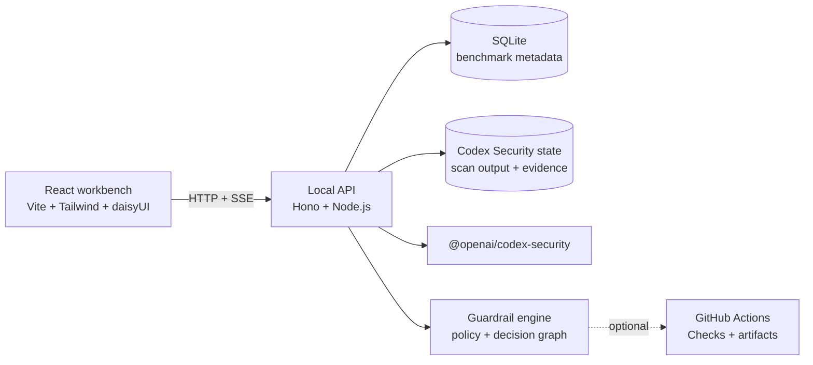

<div align="center">
  
  <h1>OKAMI Sentinel</h1>
  <p><strong>Local security intelligence for Codex Security scans.</strong></p>
  <p>Run, inspect, compare, and govern AI-assisted security scans without losing the evidence, cost, or operational context behind each result.</p>

  <p>
    <a href="README.md"><strong>English</strong></a> ·
    <a href="README.pt-BR.md">Português (Brasil)</a> ·
    <a href="README.de.md">Deutsch</a> ·
    <a href="README.fr.md">Français</a>
  </p>

  <p>
    <a href="https://github.com/OkamiOps/okami-sentinel/actions/workflows/ci.yml"></a>
    
    
    
    
    
  </p>
</div>


> [!IMPORTANT]
> OKAMI Sentinel compares **reported evidence**, not ground-truth accuracy. More findings do not automatically mean a better scan, and a missing finding does not prove remediation. Confirm findings and triage false positives before using precision, recall, or F1.

## Why this exists

Security scans are usually reviewed in isolation: one terminal, one report, one bill. OKAMI Sentinel turns them into a comparable operating system. Every run becomes an evidence channel with its model, reasoning effort, duration, token volume, estimated cost, severity mix, findings, and execution state preserved in one local workspace.

It is built for developers, DevSecOps engineers, security reviewers, and AI engineers evaluating [`@openai/codex-security`](https://github.com/openai/codex-security) across real repositories.

## What you get

| Surface | What it answers |
|---|---|
| **Evidence field** | What did each run report, and how is severity distributed? |
| **Run ledger** | Which scans completed, failed, or preserved partial evidence? |
| **Launch sequencer** | Which repository, model, effort, mode, scope, and cost envelope should run next? |
| **Evidence inspector** | Where is the finding, what is the attack path, and what evidence supports it? |
| **Comparison cockpit** | Which run reported more coverage, High+, speed, or cost efficiency? |
| **Reports** | How do I hand off one scan or a six-scan comparison as print-ready PDF? |
| **Guardrails** | Should this local changeset pass, warn, require review, or block? |
| **GitHub Checks** | How can the same versioned policy annotate and gate a pull request? |

<table>
  <tr>
    <td width="50%"></td>
    <td width="50%"></td>
  </tr>
  <tr>
    <td align="center"><strong>Compare up to six scans</strong></td>
    <td align="center"><strong>Inspect evidence and lifecycle</strong></td>
  </tr>
</table>

## Core capabilities

- **Subscription or API authentication** — use an active Codex/ChatGPT session locally or `OPENAI_API_KEY` for autonomous GitHub Actions runs.
- **Directory browser** — navigate local folders instead of manually copying absolute paths.
- **Live execution telemetry** — follow status, phase, SSE events, duration, tokens, estimated cost, and preserved output.
- **Evidence-first inspection** — filter by severity and lifecycle, inspect summaries and locations, and trace attack paths.
- **Honest partial results** — failed scans that preserved findings remain comparable with explicit `FAILED` and `PARTIAL` labels.
- **Six-run comparison** — one baseline plus up to five candidates, with severity diff, unit economics, throughput, and explicit decision objectives.
- **Print-ready reporting** — branded individual and comparison reports designed for browser printing and PDF export.
- **Versioned guardrails** — local preflight policies, explicit exceptions, decision graphs, and optional GitHub Checks publication.
- **Five UI locales** — PT-BR, English, Español, Deutsch, and Français with persisted browser preference.

## Architecture



| Layer | Technology | Location |
|---|---|---|
| Web application | React 19, Vite, TypeScript, Tailwind CSS, daisyUI, shadcn, Recharts, Framer Motion | `apps/web` |
| Local API | Node.js, Hono | `apps/api` |
| Gate CLI | Headless security-change gate | `apps/gate-cli` |
| Gate engine | Policy evaluation and runtime integration | `packages/gate-core`, `packages/gate-runtime` |
| Shared contracts | Cross-package types and schemas | `packages/shared` |
| Metadata | SQLite | `data/benchmark.db` |

## Requirements

- Node.js `24.x` (`>=24 <25`)
- pnpm `11.5.2`
- Python `3.10+` for Codex Security
- GitHub CLI (`gh`) for GitHub diagnostics, remote baselines, and optional Check publication
- GitHub Actions enabled in repositories using the remote gate
- One scanner access mode:
  - **Codex subscription:** an active local session reported by `codex login status` as `Logged in using ChatGPT`;
  - **API:** `OPENAI_API_KEY` configured as a repository Actions secret.

## Quick start

```bash
git clone https://github.com/OkamiOps/okami-sentinel.git
cd okami-sentinel
corepack enable
corepack prepare pnpm@11.5.2 --activate
pnpm install
pnpm dev
```

If pnpm requests build-script approval:

```bash
pnpm approve-builds --all
pnpm install
```

Open:

- Web UI: <http://127.0.0.1:5173>
- Local API: <http://127.0.0.1:8787>

Log in to the scanner if needed:

```bash
npx @openai/codex-security login
# or
npx @openai/codex-security login --device-auth
```

At startup, the API indexes compatible scans already present in the configured Codex Security state directory.

## Typical workflow

1. **Overview** — inspect indexed channels, severity composition, cost, and duration.
2. **Operate** — browse to a repository and choose model, effort, mode, scope, and cost envelope.
3. **Activity / Scan detail** — follow telemetry and inspect preserved evidence.
4. **Compare** — select two to six runs, choose a baseline, and evaluate coverage, High+, `$ / finding`, `$ / High+`, and speed.
5. **Report** — generate an individual report from scan detail or a comparison report after running the diff.
6. **Guardrails** — evaluate a local changeset against a versioned policy and optionally publish the result as a GitHub Check.

## Authentication modes

| Mode | Best for | Needs `OPENAI_API_KEY`? | Runs autonomously in GitHub Actions? |
|---|---|---:|---:|
| **Codex subscription** | Local interactive use on your Mac | No | No |
| **API** | CI, pull requests, unattended gates | Yes | Yes |

The application never reads or stores the value of the repository secret. It only diagnoses whether the required capability is available.

## Local guardrails

Guardrails evaluate a Git changeset and preserve the evidence used in the decision.

1. Enroll the root of a local Git repository.
2. Run preflight with base and head references such as `main` and `HEAD`.
3. Inspect the effective changeset, scanner scope, policy outcome, and Decision Graph.
4. Edit `.csb/guardrails.json` visually and review the before/after JSON.
5. Record time-bounded exceptions in `.csb/guardrails-exceptions.json`.

| Outcome | Meaning | GitHub conclusion | CLI exit |
|---|---|---|---:|
| `no_changes` | No changed files between refs | `success` | 0 |
| `bootstrap` | No baseline exists; never treated as approval | `neutral` | 0 |
| `pass` | No blocking or review rule fired | `success` | 0 |
| `warning` | Policy requires review | `neutral` | 0 |
| `blocked` | A blocking rule fired | `failure` | 2 |
| `error` | Operational failure; never converted to approval | `action_required` | 3 |

<details>
<summary><strong>Use the reusable GitHub Actions gate</strong></summary>

Create `.github/workflows/csb-security-change-gate.yml` in the target repository:

```yaml
name: CSB Security Change Gate
on:
  pull_request:
  push:
    branches: [main]
permissions:
  contents: read
  pull-requests: read
  actions: read
  checks: write
jobs:
  security-change-gate:
    uses: OkamiOps/okami-sentinel/.github/workflows/security-change-gate.yml@v1
    with:
      policy_path: .csb/guardrails.json
      default_branch: main
    secrets:
      OPENAI_API_KEY: ${{ secrets.OPENAI_API_KEY }}
```

Use the versioned `@v1` reference; `@main` is not accepted as a gate release. Configure the exact required-check name **`CSB Security Change Gate`** in branch protection.

Fork pull requests usually cannot read base-repository secrets. Missing scanner authentication ends as operational exit `3`, never as a false-success Check.
</details>

<details>
<summary><strong>GitHub capability troubleshooting</strong></summary>

- **Git repository:** `git rev-parse --show-toplevel`
- **GitHub remote:** verify `remote.origin.url` points to `github.com/<owner>/<repo>`
- **GitHub CLI:** `gh --version`
- **Authentication:** `gh auth status`, then `gh auth login` when required
- **Subscription:** `codex login status`, then `codex login` when required
- **API secret:** `gh secret list --json name` must include `OPENAI_API_KEY`
- **Caller workflow:** verify the file, `@v1`, and the minimum permissions shown above
- **Remote baseline:** confirm the default branch produced a retained `csb-gate-artifact`

Expired, missing, or schema-invalid artifacts are operational errors. They never trigger a silent bootstrap.
</details>

## Reports

- **Individual report:** generated from scan detail, with executive summary, severity profile, findings, locations, and evidence.
- **Comparison report:** generated from a completed diff with one baseline and up to five candidates.
- **Output:** browser print preview or Save as PDF.
- **Pagination:** report sections are A4-aware and protect metrics, headers, and finding blocks from internal clipping.

## Localization

The UI detects the browser language on first visit and stores the selection under `okami-sentinel.locale`.

| Code | Language | UI support |
|---|---|---:|
| `pt-BR` | Português do Brasil (fallback) | Yes |
| `en` | English | Yes |
| `es` | Español | Yes |
| `de` | Deutsch | Yes |
| `fr` | Français | Yes |

Dates and numbers follow the active locale. Financial values remain explicitly denominated in USD. Scanner-produced titles, summaries, paths, code, evidence, and logs remain in their original language to avoid changing technical meaning.

See [localization architecture](docs/localization.md).

## Configuration

| Variable | Default | Purpose |
|---|---|---|
| `CODEX_SECURITY_STATE_DIR` | Global state when writable; otherwise `data/codex-security-state` | Scanner state and output |
| `CODEX_SECURITY_BIN` | `npx` | Scanner CLI executable |
| `CSB_NPM_CACHE_DIR` | `data/npm-cache` | Isolated npm cache used by scanner `npx` |
| `CSB_HOST` | `127.0.0.1` | API bind address |
| `CSB_PORT` | `8787` | API port |
| `CSB_MAX_CONCURRENT_SCANS` | `8` | Maximum concurrent scanner processes |

## Development

```bash
pnpm dev          # API + web
pnpm dev:api      # API only
pnpm dev:web      # web only
pnpm typecheck
pnpm test
pnpm build
```

```text
okami-sentinel/
├── apps/
│   ├── api/           # local HTTP/SSE API
│   ├── gate-cli/      # headless gate command
│   └── web/           # React workbench and reports
├── packages/
│   ├── gate-core/     # policies and decision model
│   ├── gate-runtime/  # scanner/runtime integration
│   └── shared/        # shared contracts
├── docs/              # architecture and product documentation
└── data/              # local metadata and runtime state (ignored where sensitive)
```

## Cost and security notes

> [!WARNING]
> Scans can be expensive. The UI cost envelope maps to the scanner's `--max-cost` guardrail and stops a run after the estimate crosses the configured ceiling. Estimated token cost can differ from a ChatGPT subscription or final API billing.

- Data and evidence remain local unless you explicitly publish a GitHub Check or run the API-backed GitHub workflow.
- Operational failures never become a passing security decision.
- Deleting a scan is explicit and can remove both the application record and the associated managed scan directory.
- Treat generated findings as untrusted security evidence until reviewed.

## Project documentation

- [Contributing](CONTRIBUTING.md)
- [Security policy](SECURITY.md)
- [Localization architecture](docs/localization.md)
- [Product principles](apps/web/PRODUCT.md)
- [Design system](apps/web/DESIGN.md)

## Status

This repository is under active development. Interfaces, local schemas, and the reusable gate may change before a stable release. Pin the gate to a versioned release reference and review changes before upgrading.

---

<div align="center">
  <sub>Independent local workbench built around OpenAI Codex Security. OKAMI Sentinel is not an official OpenAI product.</sub>
</div>
