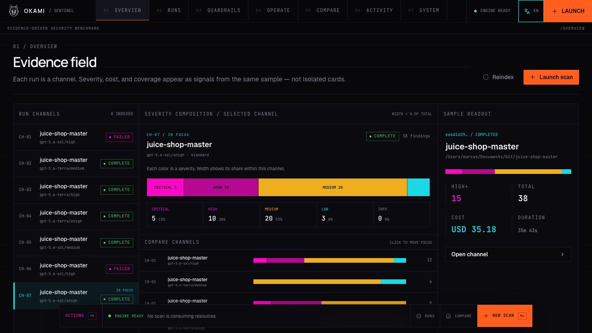
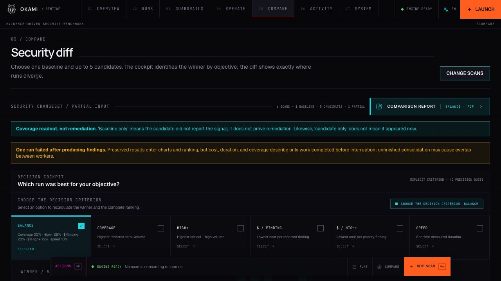
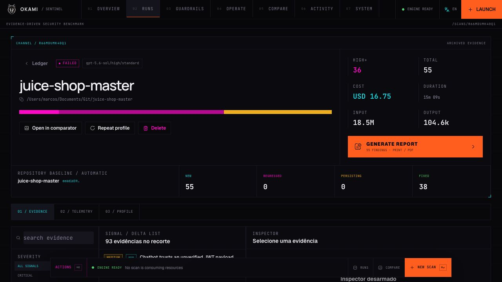
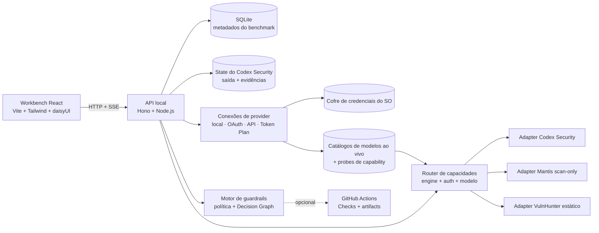

<div align="center">
  
  <h1>OKAMI Sentinel</h1>
  <p><strong>Uma bancada local de evidências. Várias metodologias de scan de segurança.</strong></p>
  <p>Execute, inspecione, compare e governe scans de segurança assistidos por IA sem perder a evidência, o custo ou o contexto operacional de cada resultado.</p>

  <p>
    <a href="README.md">English</a> ·
    <a href="README.pt-BR.md"><strong>Português (Brasil)</strong></a> ·
    <a href="README.de.md">Deutsch</a> ·
    <a href="README.fr.md">Français</a>
  </p>

  <p>
    <a href="https://github.com/OkamiOps/okami-sentinel/actions/workflows/ci.yml"></a>
    
    
    
    
    
  </p>
</div>



> [!IMPORTANT]
> O OKAMI Sentinel compara **evidências reportadas**, não precisão contra ground truth. Mais findings não significam automaticamente um scan melhor, e um finding ausente não comprova correção. Confirme os findings e faça a triagem de falsos positivos antes de usar precisão, recall ou F1.

## Por que este projeto existe

Scans de segurança normalmente são revisados isoladamente: um terminal, um relatório, uma conta. O OKAMI Sentinel transforma essas execuções em um sistema operacional comparável. Cada run vira um canal de evidência com modelo, effort, duração, volume de tokens, custo estimado, severidade, findings e estado de execução preservados em um workspace local.

Foi criado para desenvolvedores, profissionais de DevSecOps, revisores de segurança e AI Engineers que precisam avaliar a metodologia do scanner e o modelo separadamente em repositórios reais.

## O que você recebe

| Superfície | Pergunta respondida |
|---|---|
| **Campo de evidências** | O que cada run reportou e como a severidade está distribuída? |
| **Ledger de runs** | Quais scans concluíram, falharam ou preservaram resultados parciais? |
| **Launch sequencer** | Qual scanner, autenticação, modelo, effort, modo e escopo executar? |
| **Inspector de evidências** | Onde está o finding, qual é o attack path e qual evidência o sustenta? |
| **Cockpit comparativo** | Qual run reportou mais cobertura, High+, velocidade ou eficiência de custo? |
| **Relatórios** | Como entregar um scan ou uma comparação de seis scans em PDF? |
| **Guardrails** | Este changeset deve passar, alertar, exigir revisão ou bloquear? |
| **GitHub Checks** | Como aplicar a mesma política versionada em um pull request? |

<table>
  <tr>
    <td width="50%"></td>
    <td width="50%"></td>
  </tr>
  <tr>
    <td align="center"><strong>Compare até seis scans</strong></td>
    <td align="center"><strong>Inspecione evidência e lifecycle</strong></td>
  </tr>
</table>

## Principais recursos

- **Roteamento por capacidades** — escolha a metodologia; a interface exibe apenas combinações de autenticação, modelo, effort e modo que o adapter consegue executar.
- **Conexões de provider** — configure sessões locais, autenticação gerenciada por navegador/dispositivo, chaves de API, endpoints Token Plan ou APIs compatíveis sem colocar credenciais no manifesto do scan.
- **Catálogo de modelos ao vivo** — escolha somente modelos retornados pela conexão autenticada; o Sentinel não inventa um catálogo de fallback.
- **Controles de runtime dinâmicos** — modelo, níveis de effort suportados, modo do scan e limite de execução são resolvidos pelas capacidades da conexão e do motor selecionados; valores não suportados não são hard-coded no formulário. O perfil do run registra se um effort foi enviado, qual campo wire foi usado ou se o default do provider foi mantido.
- **Navegador de diretórios** — selecione pastas locais sem copiar caminhos absolutos manualmente.
- **Telemetria ao vivo** — acompanhe estado, fase, eventos SSE, duração, tokens, custo estimado e saída preservada.
- **Inspeção orientada por evidência** — filtre severidade e lifecycle, leia resumos e localizações, percorra attack paths e veja explicitamente quando um finding não trouxe evidência estruturada.
- **Ledger de runs legível** — cada run mostra badges de motor e modelo, além de `High+` e do total de vulnerabilidades; apenas runs terminalizados podem ser removidos do ledger.
- **Resultados parciais honestos** — scans falhos que preservaram findings continuam comparáveis com badges `FAILED` e `PARTIAL`.
- **Comparação de seis runs** — um baseline e até cinco candidatos, com diff de severidade, economia unitária, throughput e objetivos explícitos.
- **Relatórios para impressão** — relatórios individuais e comparativos com marca e exportação em PDF.
- **Guardrails versionados** — políticas locais, exceções explícitas, Decision Graph e publicação opcional no GitHub Checks.
- **Cinco locales na interface** — PT-BR, English, Español, Deutsch e Français.

## Motores de scan

| Motor | Estado | Rotas de conexão executáveis | Modelos | Limite de execução |
|---|---|---|---|---|
| [`@openai/codex-security`](https://github.com/openai/codex-security) | Estável | Sessão local Codex/ChatGPT da OpenAI ou API OpenAI | Catálogo autenticado ao vivo | Scan standard ou deep; teto explícito em USD suportado |
| [Google Mantis](https://github.com/google/mantis) | Preview | Sessão Codex/ChatGPT, sessão local Claude Code, OAuth direto da xAI e providers HTTP aprovados por capability | Catálogo autenticado ao vivo; Claude pode usar seu default explícito de runtime | Nove etapas determinísticas scan-only em snapshot imutável |
| [Capital One VulnHunter](https://github.com/capitalone/vulnhunter) | Experimental | Sessão Codex/ChatGPT, OAuth direto da xAI e providers HTTP aprovados por capability | Catálogo autenticado ao vivo | Perfil de compatibilidade estático, somente leitura, com seis etapas derivado da metodologia VulnHunter revisada |

O Mantis é obtido em um commit revisado, validado e publicado atomicamente em um cache local privado. A primeira fase exclui deliberadamente `mantis-reproduce`, `mantis-chain` e `mantis-patch`: o adapter não escreve no repositório-alvo e não executa código de exploit gerado. Rotas HTTP passam pelo host de ferramentas limitado do Sentinel. Runs da assinatura Claude Code usam um diretório de sessão vazio e separado, sem ferramentas integradas, com um único servidor MCP privado e somente leitura que expõe operações limitadas de listar, ler e buscar sobre o snapshot imutável. O estado bruto do Mantis permanece ao lado das evidências normalizadas do Sentinel para auditoria.

O workflow upstream do VulnHunter é orientado a Claude e inclui etapas de verificação operacionais que podem acionar salvaguardas cibernéticas do provider. Por isso o Sentinel registra a revisão upstream como proveniência para seu perfil local versionado, mas **não** busca nem envia a skill upstream ou seus prompts de fase ao Codex em runtime. O perfil experimental de compatibilidade preserva o formato útil — reconhecimento, rastros estáticos para frente, falsificação adversarial, varredura de cobertura e remediação com evidência — em uma única sessão somente leitura sobre snapshot imutável. Findings retidos são normalizados para o mesmo contrato de evidência do Inspector usado pelos demais motores. Uma política do provider ainda pode recusar a revisão; nesse caso o Sentinel preserva o log completo, retém o uso de tokens já informado e reporta a exigência de Trusted Access sem fingir que o scan foi concluído. Sem usage reportado, o custo permanece indisponível, nunca um falso zero.

> [!NOTE]
> Assinatura, OAuth, Token Plan e cobrança por API são rotas separadas. O Sentinel vincula cada scan a uma conexão persistida e a um modelo descoberto ao vivo ou default de runtime declarado pelo adapter, revalida essa seleção antes de acessar credenciais e nunca faz fallback silencioso entre rotas.

## Perfis de execução do Codex Security

O Codex Security tem dois perfis explícitos. Eles não são apelidos: o detalhe e o relatório do run preservam perfil, rota, protocolo, modelo e identificador da verificação de capacidade selecionados.

| Perfil | Rotas exatas | O que é executado |
|---|---|---|
| **Native** | Codex local, ChatGPT por OAuth no navegador, ChatGPT por código de dispositivo ou API OpenAI | O contrato upstream do `@openai/codex-security`. |
| **Portable** | OAuth/API direta da xAI, API Anthropic, OpenRouter, Gemini, DeepSeek, MiniMax Token Plan, MiMo Token Plan ou API compatível OpenAI/Anthropic | A metodologia defensiva versionada do Sentinel, executada no host AgentSession com limites. |

Portable não afirma que um provider que não é OpenAI está executando o scanner upstream. Ele executa `sentinel/codex-security-methodology@v1`: seis estágios defensivos e somente estáticos sobre um snapshot imutável, com ferramentas limitadas de leitura/busca, artefatos estruturados, cancelamento e isolamento obrigatórios. Um dossiê estruturado, mantido pelo servidor, carrega inventário, conjunto de candidatos, resumos das etapas, avaliações e escopo entre os estágios. Páginas internas do relatório são limitadas a 16 candidatos confirmados cada, validadas antes de I/O e podem usar apenas reparo limitado dentro dos limites do scan; o servidor publica somente o relatório final consolidado. Findings retidos precisam partir de um candidato já carregado e conter `rootCause`, impacto, remediação e anchors sustentados pelo repositório; um relatório com zero findings só é válido quando a cobertura registra explicitamente cada candidato e o escopo inspecionado ou não inspecionado. Antes do lançamento, a tupla persistida exata de conexão/modelo/protocolo precisa ter uma capability probe nova e aprovada. Probe ausente, expirada, falha ou incompatível bloqueia o run; o Sentinel nunca faz fallback para Native, outra rota, CLI ou outro modelo.

Os limites Portable seguem o modo selecionado e o grupo de effort, nunca uma allowlist de vendors ou nomes de modelo. O effort exato precisa ser publicado pelo modelo escolhido e serializável pela rota; o nome do effort, sozinho, não aumenta o orçamento.

| Grupo de effort | Standard | Deep |
|---|---:|---:|
| `minimal`, `low` | 20 min / 24 turnos / 96 chamadas de ferramenta | 30 min / 48 turnos / 192 chamadas de ferramenta |
| `medium`, `high`, desconhecido ou ausente | 30 min / 32 turnos / 128 chamadas de ferramenta | 45 min / 64 turnos / 256 chamadas de ferramenta |
| `xhigh` | 45 min / 48 turnos / 192 chamadas de ferramenta | 60 min / 96 turnos / 384 chamadas de ferramenta |
| `max`, `ultra` | 60 min / 64 turnos / 256 chamadas de ferramenta | 90 min / 128 turnos / 512 chamadas de ferramenta |

Cada AgentSession Portable também é limitada a 64 MiB de entrada e 1 MiB de saída. Um teto opcional `maxCostUsd` exige cotação correspondente congelada no lançamento; sem ela, o lançamento falha de forma fechada. Usage reportado que alcança o teto encerra a sessão antes da próxima request ao provider, embora uma request já em voo possa exceder a estimativa; usage que não pode ser estimado encerra em vez de alegar que o teto foi aplicado.

## Arquitetura



| Camada | Tecnologia | Local |
|---|---|---|
| Aplicação web | React 19, Vite, TypeScript, Tailwind CSS, daisyUI, shadcn, Recharts, Framer Motion | `apps/web` |
| API local | Node.js, Hono | `apps/api` |
| Gate CLI | Security change gate headless | `apps/gate-cli` |
| Motor do gate | Avaliação de política e integração de runtime | `packages/gate-core`, `packages/gate-runtime` |
| Contratos compartilhados | Tipos e schemas entre pacotes | `packages/shared` |
| Metadados | SQLite | `data/benchmark.db` |

## Pré-requisitos

- Node.js `24.x` (`>=24 <25`)
- pnpm `11.5.2`
- Python `3.10+` para o Codex Security
- GitHub CLI (`gh`) para diagnóstico, baseline remoto e publicação opcional de Checks
- GitHub Actions nos repositórios que usarão o gate remoto
- Um cofre de credenciais do sistema operacional compatível com o adapter de keychain local para conexões com secrets
- Ao menos uma rota configurada em **Configurações → Conexões**. Presets disponíveis incluem:
  - Codex local da OpenAI, autenticação ChatGPT por navegador/dispositivo e API OpenAI;
  - detecção local do Grok da xAI, OAuth de dispositivo orquestrado localmente pelo Sentinel e API xAI;
  - sessão local Claude Code e API Anthropic;
  - detecção local do Cursor e Cursor Background Agents API;
  - OpenRouter, Gemini, DeepSeek, MiniMax Token Plan, Xiaomi MiMo Token Plan e APIs compatíveis OpenAI ou Anthropic customizadas.

## Início rápido

```bash
git clone https://github.com/OkamiOps/okami-sentinel.git
cd okami-sentinel
corepack enable
corepack prepare pnpm@11.5.2 --activate
pnpm install
pnpm dev
```

Se o pnpm solicitar aprovação de build scripts:

```bash
pnpm approve-builds --all
pnpm install
```

Abra:

- Interface: <http://127.0.0.1:5173>
- API local: <http://127.0.0.1:8787>

Abra **Configurações → Conexões** para adicionar uma rota, autenticá-la e atualizar seu catálogo de modelos. Rotas de assinatura local continuam usando o login oficial:

```bash
npx @openai/codex-security login
# ou
npx @openai/codex-security login --device-auth

# Mantis e VulnHunter hospedados pelo Codex usam a sessão genérica do Codex
codex login

# Mantis local pelo Claude usa a sessão Claude Code existente
claude auth login
```

Na inicialização, a API indexa scans compatíveis já existentes no state configurado do Codex Security.

## Fluxo principal

1. **Visão** — inspecione canais indexados, severidade, custo e duração.
2. **Operar** — navegue até o repositório, escolha a metodologia e selecione uma rota disponível de autenticação, modelo, effort, modo e escopo.
3. **Atividade / Detalhe** — acompanhe telemetria e inspecione as evidências preservadas.
4. **Comparar** — selecione de duas a seis runs, defina o baseline e avalie cobertura, High+, `$ / finding`, `$ / High+` e velocidade.
5. **Relatório** — gere o relatório individual no detalhe ou o comparativo após executar o diff.
6. **Guardrails** — avalie um changeset local e publique opcionalmente a decisão como GitHub Check.

> [!NOTE]
> **Semântica de lifecycle.** Runs `standard` e `deep` contêm apenas evidências do scan atual; seus rótulos de lifecycle são `new`, `persisting` ou `regressed`. `fixed` fica reservado a um futuro contrato incremental explícito. Um baseline é uma referência de comparação da mesma linhagem, não um modo incremental, e a ausência de finding nunca prova remediação.

## Conexões de provider

| Família de provider | Rotas de conexão | Disponibilidade de scanner |
|---|---|---|
| **OpenAI** | Codex local, OAuth ChatGPT no navegador, código de dispositivo ChatGPT, chave de API | Codex Security, Mantis e VulnHunter de acordo com a rota resolvida |
| **xAI** | OAuth de dispositivo orquestrado localmente pelo Sentinel, chave de API, detecção local do Grok | OAuth/API pode executar Codex Security Portable quando a tupla exata conexão/modelo/protocolo tem capability probe nova e aprovada; Mantis e VulnHunter continuam dependentes de capability. Scan local do Grok permanece bloqueado até que a superfície de execução de plugin/hook possa ser isolada. |
| **Anthropic** | Sessão existente Claude Code, API Anthropic | Claude local executa Mantis pela fronteira MCP-only do snapshot. A API Anthropic pode executar Codex Security Portable quando a tupla exata tem capability probe nova e aprovada; os demais motores continuam dependentes de capability. |
| **Cursor** | Detecção de CLI local, Background Agents API | Conexão e catálogo ao vivo disponíveis; execução de scanner não é anunciada até que o contrato de artefatos remoto/local esteja completo. |
| **Outros HTTP** | OpenRouter, Gemini, DeepSeek, MiniMax Token Plan, MiMo Token Plan, URLs compatíveis customizadas | Codex Security Portable, Mantis e VulnHunter ficam disponíveis somente quando a tupla exata conexão/modelo/protocolo passa a probe limitada de ferramentas, artefatos, cancelamento e snapshot do Sentinel. |

Os modelos e os níveis de effort válidos vêm do catálogo autenticado e das capacidades ao vivo do provider. A única exceção de default de runtime é uma sessão local Claude Code configurada explicitamente. No OpenRouter, `reasoning.supported_efforts: null` significa que o conjunto de efforts do gateway está disponível; se `reasoning.mandatory` é `true`, `none` é removido. Quando conhecido, o effort enviado pelo Sentinel e seu campo wire são preservados; caso contrário o run registra o default do provider sem afirmar o que ele aplicou. Secrets e tokens OAuth são write-only pela API, armazenados no cofre de credenciais do sistema operacional e representados no SQLite apenas por referências opacas. O Sentinel orquestra localmente o device flow público da xAI e não depende da CLI do Grok; o acesso ao modelo é aceito somente após catálogo ao vivo e verificações de capability aprovadas.

## Guardrails locais e remotos

Os guardrails avaliam um changeset Git e preservam a evidência usada na decisão. Um repositório pode ser autorizado por checkout local ou por uma instalação privada do GitHub App; o Sentinel nunca troca silenciosamente uma autoridade pela outra.

1. Cadastre a raiz de um repositório Git local ou um repositório autorizado no GitHub.
2. Escolha o executor: snapshot imutável gerenciado pelo Sentinel ou caller fixado no GitHub Actions do repositório.
3. Resolva uma comparação local ou um alvo remoto explícito por pull request/base/head antes de executar.
4. Inspecione SHAs, digest da policy, escopo, envelope de custo, outcome e Decision Graph congelados.
5. Edite `.csb/guardrails.json` localmente; no remoto, copie ou baixe a proposta e publique-a pelo pull request normal do repositório.

No remoto, a policy é somente leitura e vem da branch protegida padrão. O GitHub App solicita apenas `metadata:read`, `contents:read`, `pull_requests:read`, `actions:write` e `checks:write`. O Sentinel não faz commit nem push no repositório alvo. Capability, caller, ref, policy, linhagem ou baseline ausentes, stale ou divergentes falham fechados em vez de virar aprovação.

| Outcome | Significado | Conclusão no GitHub | Exit do CLI |
|---|---|---|---:|
| `no_changes` | Nenhum arquivo alterado entre as refs | `success` | 0 |
| `bootstrap` | Não há baseline; nunca representa aprovação | `neutral` | 0 |
| `pass` | Nenhuma regra de bloqueio ou revisão foi acionada | `success` | 0 |
| `warning` | A política exige revisão | `neutral` | 0 |
| `blocked` | Uma regra bloqueante foi acionada | `failure` | 2 |
| `error` | Falha operacional; nunca vira aprovação | `action_required` | 3 |

<details>
<summary><strong>Usar o workflow reutilizável no GitHub Actions</strong></summary>

Em **Guardrails → Configurar GitHub**, copie ou baixe o `.github/workflows/csb-security-change-gate.yml` gerado e publique-o por pull request. O caller gerado inclui o contrato completo de dispatch e fixa `uses` e `csb_ref` no mesmo SHA imutável de 40 caracteres do release Sentinel. Branch ou tag mutável, como `@main` ou `@v1`, é recusada.

O caller usa este envelope mínimo de permissões:

```yaml
name: CSB Security Change Gate
on:
  pull_request:
  push:
    branches: [main]
permissions:
  contents: read
  pull-requests: read
  actions: read
  checks: write
```

Configure o required check com o nome exato **`CSB Security Change Gate`**. `CSB_GITHUB_ACTIONS_WORKFLOW_SHA` deve conter o mesmo SHA imutável antes de o Sentinel declarar o executor Actions pronto ou dispará-lo.

Pull requests de forks normalmente não acessam os secrets do repositório base. Sem autenticação do scanner, a execução termina com erro operacional `3`, nunca como falso sucesso.
</details>

<details>
<summary><strong>Troubleshooting das capabilities do GitHub</strong></summary>

- **Repositório Git:** `git rev-parse --show-toplevel`
- **Remote GitHub:** confirme `remote.origin.url` como `github.com/<owner>/<repo>`
- **GitHub CLI:** `gh --version`
- **Autenticação:** `gh auth status` e, quando necessário, `gh auth login`
- **Assinatura:** `codex login status` e, quando necessário, `codex login`
- **Secret de API:** `gh secret list --json name` deve incluir `OPENAI_API_KEY`
- **Caller workflow:** confirme o arquivo, a referência `@v1` e as permissões mínimas
- **Baseline remoto:** confirme um artifact `csb-gate-artifact` válido na default branch

Artifacts expirados, ausentes ou com schema inválido são erros operacionais. Eles nunca iniciam bootstrap silencioso.
</details>

## Relatórios

- **Individual:** resumo executivo, severidade, findings, localizações e evidências.
- **Comparativo:** um baseline e até cinco candidatos após a execução do diff.
- **Saída:** impressão do navegador ou Save as PDF.
- **Paginação:** seções A4 preservam métricas, headers e findings sem cortes internos.

## Localização

A interface detecta o idioma do navegador e salva a preferência em `okami-sentinel.locale`.

| Código | Idioma | Suporte na interface |
|---|---|---:|
| `pt-BR` | Português do Brasil (fallback) | Sim |
| `en` | English | Sim |
| `es` | Español | Sim |
| `de` | Deutsch | Sim |
| `fr` | Français | Sim |

Datas e números seguem o locale ativo. Valores financeiros continuam explicitamente em USD. Títulos, resumos, caminhos, código, evidências e logs produzidos pelo scanner permanecem no idioma original para preservar o significado técnico.

Veja a [arquitetura de localização](docs/localization.pt-BR.md).

## Configuração

| Variável | Default | Finalidade |
|---|---|---|
| `CODEX_SECURITY_STATE_DIR` | State global quando gravável; senão `data/codex-security-state` | State e saída do scanner |
| `CODEX_SECURITY_BIN` | `npx` | Executável do scanner |
| `CSB_NPM_CACHE_DIR` | `data/npm-cache` | Cache npm isolado usado pelo scanner |
| `CODEX_BIN` | CLI incluída no ChatGPT Desktop no macOS; senão `codex` | Host de inferência do Mantis e VulnHunter |
| `MANTIS_REPOSITORY_URL` | `https://github.com/google/mantis.git` | Repositório Mantis revisado |
| `MANTIS_SOURCE_REF` | Commit revisado e fixado | Revisão exata do Mantis usada em novos scans |
| `MANTIS_CACHE_DIR` | `data/mantis-cache` | Cache local das skills Mantis fixadas |
| `VULNHUNTER_REPOSITORY_URL` | `https://github.com/capitalone/vulnhunter.git` | Repositório upstream do VulnHunter registrado como proveniência metodológica |
| `VULNHUNTER_SOURCE_REF` | Rótulo de commit revisado | Revisão metodológica do VulnHunter registrada como proveniência; não é buscada em runtime |
| `CSB_HOST` | `127.0.0.1` | Bind da API |
| `CSB_PORT` | `8787` | Porta da API |
| `CSB_GITHUB_ACTIONS_WORKFLOW_SHA` | indisponível | SHA imutável de 40 caracteres do release Sentinel aceito pelos callers remotos |
| `CSB_MAX_CONCURRENT_SCANS` | `8` | Máximo de processos simultâneos |

Para runs de assinatura ChatGPT no macOS, o Sentinel prefere o executável Codex incluído no ChatGPT Desktop. Isso mantém o host de inferência alinhado ao schema compartilhado de autenticação e cache de modelos; um `CODEX_BIN` explícito sempre prevalece.

## Desenvolvimento

```bash
pnpm dev          # API + web
pnpm dev:api      # somente API
pnpm dev:web      # somente web
pnpm typecheck
pnpm test
pnpm build
```

```text
okami-sentinel/
├── apps/
│   ├── api/           # API HTTP/SSE local
│   ├── gate-cli/      # comando headless do gate
│   └── web/           # workbench React e relatórios
├── packages/
│   ├── gate-core/     # políticas e modelo de decisão
│   ├── gate-runtime/  # integração com scanner/runtime
│   └── shared/        # contratos compartilhados
├── docs/              # arquitetura e documentação do produto
└── data/              # metadados e state local
```

## Notas de custo e segurança

> [!WARNING]
> Scans podem ser caros. O Codex Security Native mapeia seu envelope de custo para a proteção upstream `--max-cost`. O Portable pode aplicar seu próprio teto em USD a partir de uma cotação congelada após cada evento de usage; ele bloqueia a próxima request, mas uma request já em voo ainda pode exceder a estimativa. Quando existem usage e cotação correspondentes, o Sentinel mostra uma estimativa ou equivalente PAYG — não uma cobrança real nem fatura. Rotas de assinatura e sessão local permanecem **indisponíveis**, nunca `$0`, quando o provider não reporta uso faturável. Para uma correspondência exata de modelo, OpenRouter estima separadamente input sem cache, leituras de cache, escritas de cache e output. Franquia do plano, créditos e cobrança final do provider continuam sendo medidas diferentes.

- Dados e evidências normalizadas permanecem locais. Credenciais de provider são armazenadas localmente e usadas apenas para autenticar requests da conexão selecionada. Essa rota de inferência recebe os prompts e evidências de repositório necessários ao scan; publicar um GitHub Check é uma ação explícita separada.
- Falhas operacionais nunca se transformam em decisão de segurança aprovada.
- A exclusão de um scan é explícita e fica disponível apenas após estado terminal. Ela pode remover o registro e o diretório do scan associado **somente se esse diretório for gerenciado pelo Sentinel**; nunca apaga o repositório-alvo.
- Trate findings gerados como evidência de segurança não confiável até a revisão.

## Documentação do projeto

- [Como contribuir](CONTRIBUTING.pt-BR.md)
- [Política de segurança](SECURITY.pt-BR.md)
- [Arquitetura de localização](docs/localization.pt-BR.md)
- [Princípios do produto](apps/web/PRODUCT.pt-BR.md)
- [Design system](apps/web/DESIGN.pt-BR.md)

## Estado do projeto

Este repositório está em desenvolvimento ativo. Interfaces, schemas locais e o gate reutilizável podem mudar antes de uma versão estável. Fixe o gate em uma referência versionada e revise as mudanças antes de atualizar.

---

<div align="center">
  <sub>Workbench local independente para scanners de segurança assistidos por IA. O OKAMI Sentinel não é um produto oficial da OpenAI, Google ou Capital One.</sub>
</div>
