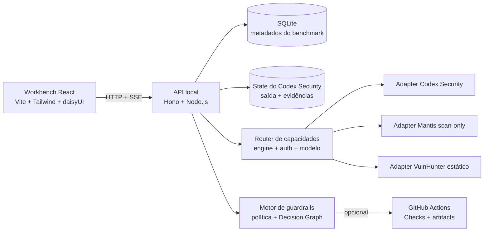

<div align="center">
  
  <h1>OKAMI Sentinel</h1>
  <p><strong>Uma bancada local de evidências. Várias metodologias de scan de segurança.</strong></p>
  <p>Execute, inspecione, compare e governe scans de segurança assistidos por IA sem perder a evidência, o custo ou o contexto operacional de cada resultado.</p>

  <p>
    <a href="README.md">English</a> ·
    <a href="README.pt-BR.md"><strong>Português (Brasil)</strong></a> ·
    <a href="README.de.md">Deutsch</a> ·
    <a href="README.fr.md">Français</a>
  </p>

  <p>
    <a href="https://github.com/OkamiOps/okami-sentinel/actions/workflows/ci.yml"></a>
    
    
    
    
    
  </p>
</div>


> [!IMPORTANT]
> O OKAMI Sentinel compara **evidências reportadas**, não precisão contra ground truth. Mais findings não significam automaticamente um scan melhor, e um finding ausente não comprova correção. Confirme os findings e faça a triagem de falsos positivos antes de usar precisão, recall ou F1.

## Por que este projeto existe

Scans de segurança normalmente são revisados isoladamente: um terminal, um relatório, uma conta. O OKAMI Sentinel transforma essas execuções em um sistema operacional comparável. Cada run vira um canal de evidência com modelo, effort, duração, volume de tokens, custo estimado, severidade, findings e estado de execução preservados em um workspace local.

Foi criado para desenvolvedores, profissionais de DevSecOps, revisores de segurança e AI Engineers que precisam avaliar a metodologia do scanner e o modelo separadamente em repositórios reais.

## O que você recebe

| Superfície | Pergunta respondida |
|---|---|
| **Campo de evidências** | O que cada run reportou e como a severidade está distribuída? |
| **Ledger de runs** | Quais scans concluíram, falharam ou preservaram resultados parciais? |
| **Launch sequencer** | Qual scanner, autenticação, modelo, effort, modo e escopo executar? |
| **Inspector de evidências** | Onde está o finding, qual é o attack path e qual evidência o sustenta? |
| **Cockpit comparativo** | Qual run reportou mais cobertura, High+, velocidade ou eficiência de custo? |
| **Relatórios** | Como entregar um scan ou uma comparação de seis scans em PDF? |
| **Guardrails** | Este changeset deve passar, alertar, exigir revisão ou bloquear? |
| **GitHub Checks** | Como aplicar a mesma política versionada em um pull request? |

<table>
  <tr>
    <td width="50%"></td>
    <td width="50%"></td>
  </tr>
  <tr>
    <td align="center"><strong>Compare até seis scans</strong></td>
    <td align="center"><strong>Inspecione evidência e lifecycle</strong></td>
  </tr>
</table>

## Principais recursos

- **Roteamento por capacidades** — escolha a metodologia; a interface exibe apenas combinações de autenticação, modelo, effort e modo que o adapter consegue executar.
- **Assinatura ou API** — use uma sessão Codex/ChatGPT local ou uma rota `OPENAI_API_KEY` cobrada separadamente quando o scanner oferecer suporte.
- **Navegador de diretórios** — selecione pastas locais sem copiar caminhos absolutos manualmente.
- **Telemetria ao vivo** — acompanhe estado, fase, eventos SSE, duração, tokens, custo estimado e saída preservada.
- **Inspeção orientada por evidência** — filtre severidade e lifecycle, leia resumos e localizações e percorra attack paths.
- **Resultados parciais honestos** — scans falhos que preservaram findings continuam comparáveis com badges `FAILED` e `PARTIAL`.
- **Comparação de seis runs** — um baseline e até cinco candidatos, com diff de severidade, economia unitária, throughput e objetivos explícitos.
- **Relatórios para impressão** — relatórios individuais e comparativos com marca e exportação em PDF.
- **Guardrails versionados** — políticas locais, exceções explícitas, Decision Graph e publicação opcional no GitHub Checks.
- **Cinco locales na interface** — PT-BR, English, Español, Deutsch e Français.

## Motores de scan

| Motor | Estado na fase 1 | Autenticação | Limite de execução |
|---|---|---|---|
| [`@openai/codex-security`](https://github.com/openai/codex-security) | Estável | Assinatura ChatGPT/Codex ou API OpenAI | Standard/deep, com teto explícito em USD |
| [Google Mantis](https://github.com/google/mantis) | Preview | Assinatura ChatGPT/Codex | Nove etapas scan-only sobre snapshot imutável |
| [Capital One VulnHunter](https://github.com/capitalone/vulnhunter) | Experimental | Assinatura ChatGPT/Codex | Seis etapas agent-driven sobre snapshot imutável; payloads, código PoC e testes de exploit não são gerados nem executados |

O adapter Mantis usa uma revisão fixa e auditada. Ele não escreve no repositório-alvo e exclui deliberadamente `mantis-reproduce`, `mantis-chain` e `mantis-patch`. Assinatura ChatGPT e faturamento da API são rotas diferentes; o Sentinel remove chaves de API do processo filho quando a assinatura é selecionada e nunca troca silenciosamente de uma rota para outra.

O VulnHunter também usa uma revisão fixa e auditada. Como o fluxo upstream foi criado para Claude, o Sentinel o executa como um port Codex experimental: a análise ocorre em um snapshot separado, a reprodução é substituída por notas de validação não operacionais e uma segunda sessão isolada apenas fecha o handoff defensivo. Nenhum payload, código PoC ou teste de exploit é gerado ou executado, e os findings retidos são normalizados para o Inspector canônico.

## Arquitetura



| Camada | Tecnologia | Local |
|---|---|---|
| Aplicação web | React 19, Vite, TypeScript, Tailwind CSS, daisyUI, shadcn, Recharts, Framer Motion | `apps/web` |
| API local | Node.js, Hono | `apps/api` |
| Gate CLI | Security change gate headless | `apps/gate-cli` |
| Motor do gate | Avaliação de política e integração de runtime | `packages/gate-core`, `packages/gate-runtime` |
| Contratos compartilhados | Tipos e schemas entre pacotes | `packages/shared` |
| Metadados | SQLite | `data/benchmark.db` |

## Pré-requisitos

- Node.js `24.x` (`>=24 <25`)
- pnpm `11.5.2`
- Python `3.10+` para o Codex Security
- GitHub CLI (`gh`) para diagnóstico, baseline remoto e publicação opcional de Checks
- GitHub Actions nos repositórios que usarão o gate remoto
- Ao menos uma rota de acesso:
  - **Codex Security por assinatura:** login ativo em `npx @openai/codex-security login status`;
  - **Mantis por assinatura:** `codex login status` exibindo `Logged in using ChatGPT`;
  - **VulnHunter por assinatura:** a mesma sessão genérica do Codex, com `gpt-5.6-sol` disponível;
  - **Codex Security por API:** `OPENAI_API_KEY` ou `CODEX_API_KEY` no processo local da API, ou `OPENAI_API_KEY` como secret do Actions.

## Início rápido

```bash
git clone https://github.com/OkamiOps/okami-sentinel.git
cd okami-sentinel
corepack enable
corepack prepare pnpm@11.5.2 --activate
pnpm install
pnpm dev
```

Se o pnpm solicitar aprovação de build scripts:

```bash
pnpm approve-builds --all
pnpm install
```

Abra:

- Interface: <http://127.0.0.1:5173>
- API local: <http://127.0.0.1:8787>

Faça login no scanner quando necessário:

```bash
npx @openai/codex-security login
# ou
npx @openai/codex-security login --device-auth

# Mantis e VulnHunter usam a sessão genérica do Codex
codex login
```

Na inicialização, a API indexa scans compatíveis já existentes no state configurado do Codex Security.

## Fluxo principal

1. **Visão** — inspecione canais indexados, severidade, custo e duração.
2. **Operar** — navegue até o repositório, escolha a metodologia e selecione uma rota disponível de autenticação, modelo, effort, modo e escopo.
3. **Atividade / Detalhe** — acompanhe telemetria e inspecione as evidências preservadas.
4. **Comparar** — selecione de duas a seis runs, defina o baseline e avalie cobertura, High+, `$ / finding`, `$ / High+` e velocidade.
5. **Relatório** — gere o relatório individual no detalhe ou o comparativo após executar o diff.
6. **Guardrails** — avalie um changeset local e publique opcionalmente a decisão como GitHub Check.

## Modos de autenticação

| Rota | Motores compatíveis | Melhor uso | Exige `OPENAI_API_KEY`? | Actions autônomo? |
|---|---|---|---:|---:|
| **Assinatura ChatGPT** | Codex Security, Mantis, VulnHunter | Uso local e interativo | Não | Não |
| **API OpenAI** | Codex Security | CI, pull requests e gates autônomos | Sim | Sim |

A aplicação nunca lê ou armazena o valor do secret do repositório. Ela apenas diagnostica se a capability necessária está disponível.

## Guardrails locais

Os guardrails avaliam um changeset Git e preservam a evidência usada na decisão.

1. Cadastre a raiz de um repositório Git local.
2. Execute o preflight com referências como `main` e `HEAD`.
3. Inspecione changeset, escopo do scanner, outcome e Decision Graph.
4. Edite `.csb/guardrails.json` visualmente e revise o JSON antes/depois.
5. Registre exceções com prazo em `.csb/guardrails-exceptions.json`.

| Outcome | Significado | Conclusão no GitHub | Exit do CLI |
|---|---|---|---:|
| `no_changes` | Nenhum arquivo alterado entre as refs | `success` | 0 |
| `bootstrap` | Não há baseline; nunca representa aprovação | `neutral` | 0 |
| `pass` | Nenhuma regra de bloqueio ou revisão foi acionada | `success` | 0 |
| `warning` | A política exige revisão | `neutral` | 0 |
| `blocked` | Uma regra bloqueante foi acionada | `failure` | 2 |
| `error` | Falha operacional; nunca vira aprovação | `action_required` | 3 |

<details>
<summary><strong>Usar o workflow reutilizável no GitHub Actions</strong></summary>

Crie `.github/workflows/csb-security-change-gate.yml` no repositório alvo:

```yaml
name: CSB Security Change Gate
on:
  pull_request:
  push:
    branches: [main]
permissions:
  contents: read
  pull-requests: read
  actions: read
  checks: write
jobs:
  security-change-gate:
    uses: OkamiOps/okami-sentinel/.github/workflows/security-change-gate.yml@v1
    with:
      policy_path: .csb/guardrails.json
      default_branch: main
    secrets:
      OPENAI_API_KEY: ${{ secrets.OPENAI_API_KEY }}
```

Use a referência versionada `@v1`; `@main` não é aceito como release do gate. Configure o required check com o nome exato **`CSB Security Change Gate`**.

Pull requests de forks normalmente não acessam os secrets do repositório base. Sem autenticação do scanner, a execução termina com erro operacional `3`, nunca como falso sucesso.
</details>

<details>
<summary><strong>Troubleshooting das capabilities do GitHub</strong></summary>

- **Repositório Git:** `git rev-parse --show-toplevel`
- **Remote GitHub:** confirme `remote.origin.url` como `github.com/<owner>/<repo>`
- **GitHub CLI:** `gh --version`
- **Autenticação:** `gh auth status` e, quando necessário, `gh auth login`
- **Assinatura:** `codex login status` e, quando necessário, `codex login`
- **Secret de API:** `gh secret list --json name` deve incluir `OPENAI_API_KEY`
- **Caller workflow:** confirme o arquivo, a referência `@v1` e as permissões mínimas
- **Baseline remoto:** confirme um artifact `csb-gate-artifact` válido na default branch

Artifacts expirados, ausentes ou com schema inválido são erros operacionais. Eles nunca iniciam bootstrap silencioso.
</details>

## Relatórios

- **Individual:** resumo executivo, severidade, findings, localizações e evidências.
- **Comparativo:** um baseline e até cinco candidatos após a execução do diff.
- **Saída:** impressão do navegador ou Save as PDF.
- **Paginação:** seções A4 preservam métricas, headers e findings sem cortes internos.

## Localização

A interface detecta o idioma do navegador e salva a preferência em `okami-sentinel.locale`.

| Código | Idioma | Suporte na interface |
|---|---|---:|
| `pt-BR` | Português do Brasil (fallback) | Sim |
| `en` | English | Sim |
| `es` | Español | Sim |
| `de` | Deutsch | Sim |
| `fr` | Français | Sim |

Datas e números seguem o locale ativo. Valores financeiros continuam explicitamente em USD. Títulos, resumos, caminhos, código, evidências e logs produzidos pelo scanner permanecem no idioma original para preservar o significado técnico.

Veja a [arquitetura de localização](docs/localization.pt-BR.md).

## Configuração

| Variável | Default | Finalidade |
|---|---|---|
| `CODEX_SECURITY_STATE_DIR` | State global quando gravável; senão `data/codex-security-state` | State e saída do scanner |
| `CODEX_SECURITY_BIN` | `npx` | Executável do scanner |
| `CSB_NPM_CACHE_DIR` | `data/npm-cache` | Cache npm isolado usado pelo scanner |
| `CODEX_BIN` | CLI incluída no ChatGPT Desktop no macOS; senão `codex` | Host de inferência do Mantis e VulnHunter |
| `VULNHUNTER_REPOSITORY_URL` | `https://github.com/capitalone/vulnhunter.git` | Repositório upstream revisado |
| `VULNHUNTER_SOURCE_REF` | Commit revisado e fixado | Revisão exata usada em novos scans |
| `VULNHUNTER_CACHE_DIR` | `data/vulnhunter-cache` | Cache local da skill fixada |
| `VULNHUNTER_SKILL_DIR` | não definido | Skill já provisionada opcional, com `SKILL.md` e todas as fases |
| `CSB_HOST` | `127.0.0.1` | Bind da API |
| `CSB_PORT` | `8787` | Porta da API |
| `CSB_MAX_CONCURRENT_SCANS` | `8` | Máximo de processos simultâneos |

## Desenvolvimento

```bash
pnpm dev          # API + web
pnpm dev:api      # somente API
pnpm dev:web      # somente web
pnpm typecheck
pnpm test
pnpm build
```

```text
okami-sentinel/
├── apps/
│   ├── api/           # API HTTP/SSE local
│   ├── gate-cli/      # comando headless do gate
│   └── web/           # workbench React e relatórios
├── packages/
│   ├── gate-core/     # políticas e modelo de decisão
│   ├── gate-runtime/  # integração com scanner/runtime
│   └── shared/        # contratos compartilhados
├── docs/              # arquitetura e documentação do produto
└── data/              # metadados e state local
```

## Notas de custo e segurança

> [!WARNING]
> Scans podem ser caros. O envelope do Codex Security mapeia para `--max-cost`. Mantis e VulnHunter usam a assinatura ChatGPT; seus valores em USD são estimativas equivalentes calculadas com os preços públicos do OpenRouter, não cobrança ou fatura. Tokens, franquia do plano, créditos e cobrança final da API são medidas diferentes.

- Dados e evidências permanecem locais, exceto quando você publica um GitHub Check ou executa o workflow com API.
- Falhas operacionais nunca se transformam em decisão de segurança aprovada.
- A exclusão de um scan é explícita e pode remover o registro e o diretório gerenciado associado.
- Trate findings gerados como evidência de segurança não confiável até a revisão.

## Documentação do projeto

- [Como contribuir](CONTRIBUTING.pt-BR.md)
- [Política de segurança](SECURITY.pt-BR.md)
- [Arquitetura de localização](docs/localization.pt-BR.md)
- [Princípios do produto](apps/web/PRODUCT.pt-BR.md)
- [Design system](apps/web/DESIGN.pt-BR.md)

## Estado do projeto

Este repositório está em desenvolvimento ativo. Interfaces, schemas locais e o gate reutilizável podem mudar antes de uma versão estável. Fixe o gate em uma referência versionada e revise as mudanças antes de atualizar.

---

<div align="center">
  <sub>Workbench local independente para scanners de segurança assistidos por IA. O OKAMI Sentinel não é um produto oficial da OpenAI, Google ou Capital One.</sub>
</div>
