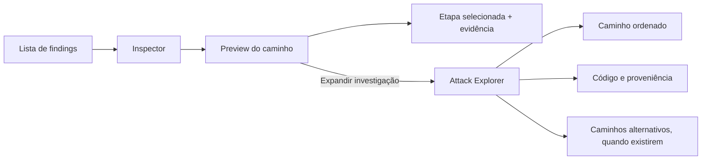

# Attack Path Workbench

Status: aprovado em conversa em 7 de agosto de 2026.

## Contexto

O Codex Security Benchmark já permite operar scans, comparar perfis, acompanhar lifecycle e registrar triagem. O próximo ganho de produto é explicar como um risco se materializa, sem transformar o finding em um score opaco ou em um grafo decorativo.

Os findings atuais já trazem `attackPath`, `codeEvidence`, `locations`, `validation` e referências estáveis entre essas estruturas. O frontend exibe parte desses dados no Inspector, mas ainda como uma sequência textual. A decisão aprovada é oferecer duas profundidades da mesma investigação:

1. preview compacto dentro do Inspector;
2. Attack Explorer dedicado para investigação completa.

## Objetivo

Permitir que uma pessoa responda, a partir de um finding:

- quem ou o que controla a entrada;
- por onde o dado ou ação entra;
- qual controle está ausente ou é insuficiente;
- qual sink ou estado protegido é alcançado;
- qual impacto foi validado;
- quais trechos de código sustentam cada etapa;
- quais partes são comprovadas, inferidas ou ausentes.

O sucesso não é “mostrar um grafo”. O sucesso é reduzir o tempo entre abrir um finding e entender a cadeia causal sustentada pelas evidências.

## Não objetivos

- Não criar grafo force-directed, visualização 3D ou mapa livre de nós.
- Não fabricar etapas com IA quando o scan não trouxe evidência.
- Não recalcular CVSS ou criar score proprietário de risco.
- Não executar exploit, alterar código ou abrir pull request nesta entrega.
- Não construir ainda a topologia completa do repositório.
- Não adicionar colaboração, SLA ou gestão de equipe.

## Modelo de experiência



### Preview no Inspector

O preview substitui a sequência textual atual da aba `Fluxo`. Ele mostra a cadeia principal em ordem estável:

`attacker → source/entrypoint → implementation/control → sink → outcome`

Regras visuais e de interação:

- cada etapa é um `button` nativo com label, papel e estado de evidência;
- desktop usa uma trilha horizontal quando couber; mobile usa trilha vertical;
- a cadeia compacta mostra no máximo cinco agrupamentos, sem descartar evidências;
- etapas adicionais aparecem como contagem e ficam disponíveis no Explorer;
- selecionar uma etapa mostra logo abaixo arquivo, linhas, explicação e um trecho curto de código;
- `Expandir investigação` abre o Explorer preservando finding, lane e etapa selecionada;
- cor complementa os labels `comprovado`, `inferido` e `evidência ausente`, mas nunca os substitui;
- o preview não usa zoom, canvas ou arraste.

### Attack Explorer

Rota canônica:

`/scans/:scanId/findings/:findingId/path`

Quando um finding `fixed` usa evidência de um baseline diferente, a rota mantém `scanId` como contexto de regressão e acrescenta `?evidenceScan=:sourceScanId`. Assim, voltar ao scan preserva o recorte atual e recarregar a URL continua abrindo a evidência correta.

Desktop possui três regiões conectadas:

1. **Path index:** lista caminhos estruturados. No schema atual haverá normalmente um caminho. A região só aparece como lista quando houver mais de um.
2. **Path stage:** visual principal ordenado da esquerda para a direita, com conectores simples e gaps explícitos.
3. **Evidence inspector:** código, localização, papel, explicação, confiança e proveniência do nó selecionado.

O header mantém título, severidade, lifecycle, baseline e retorno ao finding. A command dock global continua disponível, mas o conteúdo reserva espaço inferior para não ser coberto.

No mobile, a ordem é `header → seletor de caminho → trilha vertical → evidência`. A evidência extensa pode abrir em `Sheet` Shadcn, mas a localização e o estado da etapa permanecem visíveis na página.

## Contrato de dados

O frontend não deve interpretar livremente objetos `unknown`. A API normaliza o payload bruto e preserva os dados originais no finding.

Tipos compartilhados propostos:

```ts
type AttackPathEvidenceState = "proven" | "inferred" | "missing";

type AttackPathNodeKind =
  | "attacker"
  | "source"
  | "entrypoint"
  | "implementation"
  | "control"
  | "sink"
  | "evidence"
  | "outcome";

interface AttackPathLocation {
  path: string;
  startLine: number | null;
  endLine: number | null;
}

interface AttackPathNode {
  id: string;
  kind: AttackPathNodeKind;
  label: string;
  summary: string | null;
  evidenceState: AttackPathEvidenceState;
  evidenceRef: string | null;
  location: AttackPathLocation | null;
  code: string | null;
  language: string | null;
  explanation: string | null;
}

interface AttackPathLane {
  id: string;
  label: string;
  nodes: AttackPathNode[];
}

interface AttackPathModel {
  status: "validated" | "partial" | "unstructured";
  summary: string | null;
  preconditions: string | null;
  limitations: string[];
  impact: { level: string | null; rationale: string | null };
  likelihood: { level: string | null; rationale: string | null };
  lanes: AttackPathLane[];
  warnings: string[];
}
```

### Normalização

Um normalizador puro na API combina `attackPath.evidenceRefs` com `codeEvidence[].id`.

- referência resolvida para `codeEvidence` produz nó `proven`;
- etapa textual sem trecho vinculado produz nó `inferred`;
- referência declarada que não existe em `codeEvidence` produz nó `missing`;
- `role` define o `kind` por uma tabela explícita, com fallback para `evidence`;
- a ordem primária segue `attackPath.evidenceRefs`; na ausência dela, usa a ordem de `codeEvidence`;
- no schema atual, `lanes` contém uma lane `primary`; lanes adicionais só são criadas quando o payload bruto trouxer caminhos distintos — o normalizador nunca inventa alternativas;
- attacker, preconditions e outcome podem ser adicionados como nós textuais, sem fingir que possuem trecho de código;
- `validated` exige source ou entrypoint comprovado, sink comprovado e `finding.validation` com `method` ou `summary`;
- `partial` indica cadeia existente com pelo menos um papel central ausente ou não resolvido;
- `unstructured` indica que não há cadeia utilizável; não significa “seguro” ou “inalcançável”.

Nenhum estado `unreachable` será inferido. Ausência de caminho permanece `unstructured` ou `partial`.

O endpoint existente de detalhe retorna `attackPathModel` ao lado de `attackPath`. O payload bruto continua disponível para compatibilidade e diagnóstico.

## Componentes e limites

### API e shared

- `normalizeAttackPath(finding)`: função pura, sem acesso a banco ou filesystem.
- `AttackPathModel`: contrato serializável compartilhado.
- `getFinding`: anexa o modelo normalizado ao detalhe existente.

### Frontend

- `AttackPathPreview`: trilha compacta e seleção local.
- `AttackPathStage`: composição ordenada dos nós e conectores.
- `AttackPathNode`: botão acessível com papel e estado.
- `AttackPathEvidence`: localização, explicação e código do nó ativo.
- `AttackPathPage`: orquestra rota, scan de contexto, finding de evidência e URL.

Os componentes recebem dados tipados e não conhecem o schema bruto do Codex Security. `ScanDetailPage` não deve absorver a implementação do Explorer; ele apenas renderiza o preview e constrói o link profundo.

## Estado, navegação e URL

- `node` e `lane` ficam em query params para permitir reload e compartilhamento. `lane` evita confusão com caminhos de arquivo.
- ausência de `node` seleciona o primeiro nó comprovado; se não houver, seleciona o primeiro nó.
- um `node` inválido é removido da URL e cai no comportamento padrão.
- seleção por mouse ou teclado atualiza a URL com `replace`, evitando poluir o histórico.
- entrar e sair do Explorer preserva o finding selecionado no scan.
- o módulo `Runs` permanece ativo em ambas as rotas.

## Estados de erro e dados incompletos

- Sem `attackPathModel`: mostrar `Fluxo indisponível`, manter Resumo, Evidências e Correção utilizáveis.
- Modelo `unstructured`: explicar que o scan não trouxe cadeia estruturada; nunca declarar ausência de exploração.
- Referência ausente: renderizar gap `evidência ausente` no lugar correto da trilha.
- Falha ao carregar finding: manter o shell e oferecer retorno ao scan; não deixar uma tela vazia.
- Evidência de baseline removida do disco: informar que o lifecycle existe, mas o artefato original não está disponível.
- Código muito largo: overflow somente dentro do bloco de código; a página não cria scroll horizontal.

## Acessibilidade e responsividade

- Nós são botões nativos e têm nome acessível com papel, estado e posição.
- Navegação segue tab order nativo; setas esquerda/direita ou cima/baixo podem mover a seleção sem substituir Tab.
- O foco é visível e retorna ao botão de expansão ao fechar o Explorer ou voltar.
- Conectores e estados não dependem apenas de cor.
- Textos essenciais não ficam abaixo de 11 px.
- Movimento de seleção é curto e desativado em `prefers-reduced-motion`.
- Validar 1600×1000, 1024×768 e 390×844.

## Design visual

O recurso segue o Test Bench existente:

- canvas e painéis conectados, sem cards flutuantes;
- cobre para seleção e comando;
- seafoam para evidência comprovada;
- straw para inferência;
- coral para gap ou risco, sempre acompanhado de texto;
- tipografia JetBrains Mono em papéis, caminhos e linhas;
- Manrope/Geist para títulos e explicações;
- Shadcn para Button, Sheet e infraestrutura de foco;
- sem nova biblioteca de grafos: a cadeia ordenada pode ser construída com layout CSS e conectores SVG simples.

## Testes e validação

### Testes determinísticos

O normalizador terá fixtures para:

1. finding completo com referências resolvidas;
2. finding parcial com referência ausente;
3. finding sem `attackPath` mas com `codeEvidence`;
4. finding recuperado sem evidência estruturada;
5. roles desconhecidos usando fallback `evidence`;
6. ordem estável e IDs determinísticos.

### Gates de frontend

- typecheck e build de produção;
- deep link com `lane`, `node` e `evidenceScan`;
- seleção de nó atualizando código e URL;
- retorno ao Inspector preservando o finding;
- teclado, foco visível e reduced motion;
- inspeção visual em desktop, tablet e mobile;
- ausência de overflow horizontal, sobreposição com command dock e erro de console.

## Critérios de aceitação

- Um finding completo mostra source/entrypoint, controle, sink e outcome em ordem rastreável.
- Clicar em uma etapa revela exatamente a evidência vinculada a ela.
- O Preview e o Explorer exibem a mesma cadeia e o mesmo estado de evidência.
- Dados ausentes aparecem como ausência, não como conclusão inventada.
- A URL do Explorer é recarregável e preserva contexto de baseline para findings corrigidos.
- O Inspector continua útil quando não existe cadeia estruturada.
- Desktop e mobile não apresentam clipping, overlap ou scroll horizontal do documento.
- Nenhuma nova dependência de visualização é necessária.

## Sequência de entrega

1. contrato compartilhado e normalizador com testes;
2. endpoint de detalhe enriquecido;
3. componentes reutilizáveis de trilha e evidência;
4. preview na aba Fluxo do Inspector;
5. rota e layout do Attack Explorer;
6. deep links, baseline e estados incompletos;
7. validação visual e funcional.
