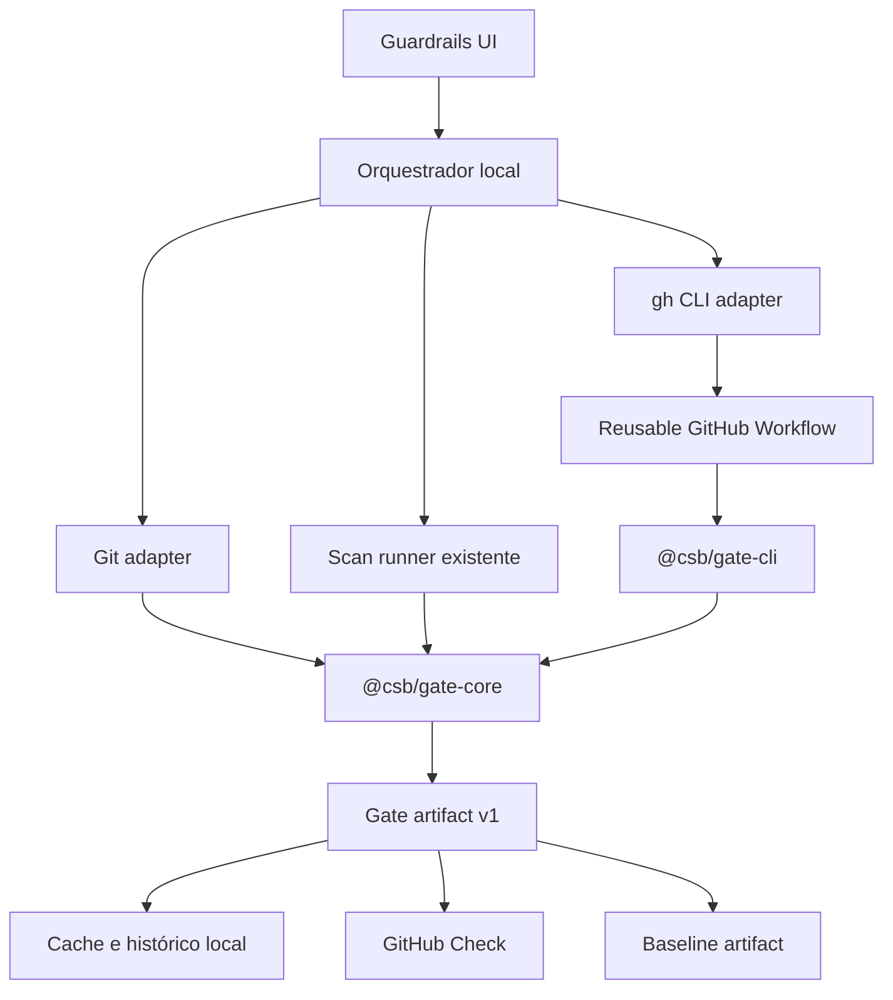

# Security Change Gate

**Status:** aprovado para planejamento

**Data:** 2026-08-07

**Produto:** Codex Security Benchmark

**Direção:** gate híbrido local + GitHub Pull Request, orientado a mudanças

## Contexto

O produto já executa scans, mantém um ledger de runs, compara modelos, calcula custo, registra triagem, acompanha regressões contra baseline e explica findings por meio do Inspector e do Attack Path Explorer.

O próximo ganho não é outro dashboard. É transformar esses recursos em um ciclo de segurança contínua que responda, para cada mudança:

1. o que mudou;
2. qual superfície foi afetada;
3. quais findings são novos, reabertos, persistentes ou corrigidos;
4. qual regra foi aplicada;
5. por que o pull request passou, alertou ou foi bloqueado.

O gate deve produzir a mesma decisão no app local e no GitHub Actions. O frontend não pode aprovar uma mudança que o CI bloqueia, nem interpretar novamente regras já avaliadas pelo backend.

## Objetivos

- Executar preflights locais limitados ao changeset selecionado.
- Publicar a mesma decisão como GitHub Check em pull requests.
- Comparar findings com o último baseline válido da branch principal.
- Aplicar políticas versionadas, determinísticas e auditáveis.
- Explicar cada bloqueio como uma cadeia causal rastreável até a evidência.
- Controlar concorrência, duração e envelope de custo.
- Diferenciar regressão de falha operacional.
- Manter autenticação do GitHub fora do banco e do frontend.

## Não objetivos da primeira versão

- Suportar GitLab, Bitbucket ou outros provedores.
- Criar um GitHub App, serviço público de webhook ou backend hospedado.
- Corrigir código ou abrir pull requests automaticamente.
- Executar scans a cada arquivo salvo.
- Construir um grafo semântico completo de dependências do repositório.
- Tratar falha de engine ou de credencial como aprovação.
- Armazenar tokens do GitHub ou segredos do scanner no SQLite.
- Substituir branch protection ou as permissões nativas do GitHub.

## Decisões aprovadas

### Gate orientado a mudança

O fluxo primário usa o diff entre `baseRef` e `headRef`. Scans completos continuam disponíveis como ação explícita e futura rotina periódica, mas não são o comportamento padrão do preflight.

### Execução híbrida

- O app oferece feedback local antes do push.
- Um reusable workflow executa o mesmo gate no GitHub Actions.
- O resultado serializado usa um contrato compartilhado.

### Integração por GitHub Actions e `gh` CLI

- O app usa a autenticação já mantida pelo `gh` CLI.
- O frontend nunca recebe tokens.
- A API invoca `gh` com argumentos separados, sem `shell: true`.
- O workflow usa o `GITHUB_TOKEN` do job apenas para ler o PR, baixar artifacts e publicar o Check.
- A credencial do scanner entra no job como secret nomeado; ela não é lida ou copiada pelo app local.

### Superfície Guardrails híbrida

O topo da página mostra um pipeline entre repositórios. Selecionar uma lane abre abaixo o contexto aprofundado da decisão.

A parte inferior usa um **Decision Graph**:

`changeset → affected surface → regression signal → policy rule → gate verdict`

Selecionar um nó atualiza a evidência exibida sem navegar para outra página. Evidências completas continuam acessíveis no Inspector e no Attack Path Explorer.

## Arquitetura



### `@csb/gate-core`

Pacote puro e determinístico, sem React, SQLite, subprocessos ou chamadas de rede. Responsabilidades:

- normalizar o changeset recebido;
- comparar findings por identidade estável;
- aplicar lifecycle e exceções;
- avaliar regras em ordem explícita;
- produzir o Decision Graph;
- produzir o `GateArtifact` serializável;
- mapear o resultado para `no_changes`, `pass`, `warning`, `blocked`, `bootstrap` ou `error`.

O pacote recebe dados prontos. Descoberta de Git, execução do scanner, persistência e publicação pertencem aos adapters.

### Orquestrador local

Vive na API existente e coordena:

- repositórios protegidos;
- resolução do diff;
- fila e concorrência;
- chamada ao runner existente com `paths` explícitos;
- avaliação pelo gate core;
- persistência do resultado;
- streaming SSE;
- importação e publicação via `gh`.

Um preflight é uma operação própria que referencia um scan. Isso evita deformar `ScanRun` com estados específicos de GitHub.

### `@csb/gate-cli`

Entrada headless usada no GitHub Actions. Ela:

1. resolve o contexto fornecido pelo workflow;
2. executa o scanner;
3. carrega o baseline;
4. chama o gate core;
5. grava `csb-gate-result.json`;
6. escreve um resumo legível no GitHub Step Summary;
7. retorna código de saída coerente com o resultado.

O CLI não possui regras próprias.

### Reusable workflow

O workflow central fica versionado neste repositório. Repositórios protegidos recebem apenas um caller workflow pequeno. O workflow concede permissões mínimas:

- `contents: read`;
- `pull-requests: read`;
- `checks: write` ou permissão equivalente para publicar o resultado;
- `actions: read` para localizar o baseline artifact.

O app instala ou atualiza o caller workflow somente após ação explícita do usuário. Ele nunca faz commit ou push automaticamente.

## Configuração versionada

Cada repositório protegido usa `.csb/guardrails.json`:

```json
{
  "schemaVersion": 1,
  "protectedBranches": ["main"],
  "scope": {
    "mode": "changed",
    "maxChangedPaths": 50,
    "fallback": "repository"
  },
  "scan": {
    "model": "gpt-5.6-sol",
    "effort": "high",
    "mode": "standard",
    "maxCostUsd": 18
  },
  "rules": [
    { "severity": ["critical"], "lifecycle": ["new", "reopened"], "decision": "block" },
    { "severity": ["high"], "lifecycle": ["new", "reopened"], "decision": "block" },
    { "severity": ["high"], "lifecycle": ["persistent"], "decision": "review" }
  ]
}
```

O editor visual altera esse arquivo localmente e mostra o diff antes de salvar. A política só chega ao CI por commit revisável.

### Exceções

Exceções ficam em `.csb/guardrails-exceptions.json`, também versionado. Cada entrada contém:

- identidade estável do finding;
- motivo obrigatório;
- responsável declarado;
- data de criação;
- data de expiração obrigatória;
- branches ou regra afetada.

Exceções expiradas são ignoradas e aparecem como erro de configuração na simulação da política. O app não publica uma exceção fora do fluxo Git.

## Contratos de domínio

### `GuardrailRepository`

- `repositoryKey`
- `repositoryPath`
- `displayName`
- `defaultBranch`
- `remoteOwner`
- `remoteName`
- `enabled`
- `policyPath`
- `lastGateId`
- `githubStatus`

O caminho absoluto existe apenas no app local. Artifacts de CI usam owner, repositório e commit.

### `GateRun`

- `id`
- `repositoryKey`
- `source`: `local | github`
- `baseRef`
- `headRef`
- `pullRequestNumber`
- `scanId`
- `status`: `queued | resolving | scanning | evaluating | publishing | completed | cancelled | error`
- `outcome`: `no_changes | bootstrap | pass | warning | blocked | error | null`
- `policyVersion`
- `baselineCommit`
- `startedAt`
- `completedAt`
- `estimatedUsd`
- `artifactPath`

### `ChangeSet`

- `baseSha`
- `headSha`
- arquivos adicionados, modificados, renomeados e removidos;
- contagem de linhas adicionadas e removidas quando disponível;
- paths selecionados para o scan;
- modo efetivo: `changed | repository`;
- motivo do fallback para scan completo.

Arquivos removidos não são enviados como `--path`, mas permanecem no contexto do GateArtifact.

### `GateDecision`

- `outcome`
- `summary`
- `violations`
- `warnings`
- `exceptionsApplied`
- `decisionGraph`
- `githubConclusion`: `success | neutral | failure | action_required`

### `GateArtifact`

Artefato versionado e portável contendo:

- `schemaVersion`;
- identidade do repositório e commits;
- configuração efetiva sem segredos;
- changeset;
- resumo do scan;
- findings normalizados;
- lifecycle contra baseline;
- decisão e Decision Graph;
- versão do CLI, gate core e scanner;
- timestamps e custo.

O app rejeita versões futuras que não consegue interpretar e informa incompatibilidade; não tenta adivinhar campos.

## Resolução do changeset

### Execução local

- `baseRef` padrão: branch upstream ou default branch identificada pelo Git.
- `headRef` padrão: `HEAD`.
- O usuário pode escolher referências diferentes antes de executar.
- O adapter usa `git diff --name-status` e `git diff --numstat` com argumentos separados.
- O preflight informa claramente se há alterações locais não commitadas e se elas estão incluídas.

### Execução em pull request

- O workflow usa os SHAs base e head fornecidos pelo evento do GitHub.
- Forks recebem as permissões restritas do GitHub; ausência de secret retorna `action_required`.
- O artifact registra os SHAs reais, não apenas nomes de branch.

### Escopo

O modo `changed` envia paths adicionados, modificados e renomeados ao scanner. Se a quantidade ultrapassar `maxChangedPaths`, a política aplica o fallback configurado. A v1 não afirma conhecer dependências sem evidência; a UI mostra o modo efetivamente usado.

## Baseline

### Fonte de verdade

O baseline remoto é o GateArtifact mais recente produzido na branch principal e marcado como elegível. Um run é elegível quando:

- terminou sem erro operacional;
- corresponde ao commit executado na branch principal;
- produziu findings válidos;
- não foi cancelado.

O app local baixa esse artifact por `gh` e mantém cache no SQLite. O cache não substitui o artifact remoto.

### Bootstrap

Quando não existe baseline:

- o outcome é `bootstrap`;
- o GitHub Check usa conclusão `neutral`;
- findings são mostrados como observados, não como regressões;
- a interface orienta a executar o gate na branch principal para estabelecer o baseline.

Bootstrap nunca aparece como `pass`.

### Artifact indisponível

Se o histórico do GitHub existe, mas o artifact expirou ou não pode ser baixado, o gate retorna `error/action_required`. O usuário pode estabelecer um novo baseline explicitamente.

## Política e decisão

As regras são avaliadas após lifecycle, triagem e exceções. A ordem da lista é preservada para explicação, mas o resultado final usa a decisão mais restritiva:

`error > block > review > pass`

- `block` produz outcome `blocked`.
- `review` sem bloqueio produz `warning`.
- ausência de violações produz `pass`.
- diff vazio produz `no_changes` sem executar scan.
- problema operacional produz `error`, fora da matriz de segurança.

O GitHub mapeia `pass` e `no_changes` para `success`, `warning` e `bootstrap` para `neutral`, `blocked` para `failure` e `error` para `action_required`.

Findings `false_positive` e exceções ativas continuam no artifact, mas não acionam bloqueio. A explicação registra por que foram excluídos.

## Experiência do usuário

### Navegação

`Guardrails` entra como área própria da navegação principal, antes de `Operar`. Rotas:

- `/guardrails` — portfolio pipeline e lane selecionada;
- `/guardrails/:gateId` — deep link de um gate;
- `/guardrails/repositories/:repositoryKey/policy` — editor e simulador da política;
- `/guardrails/setup` — enrollment e diagnóstico de GitHub.

### Portfolio Pipeline

Cada lane representa um repositório/PR e mostra:

- changeset;
- scope;
- scan;
- decision;
- PR Check.

Selecionar uma lane atualiza a URL e a área inferior. O estado selecionado não depende apenas de cor e usa `aria-current`.

### Decision Graph

O graph apresenta cinco estágios fixos:

1. changeset;
2. affected surface;
3. regression signal;
4. policy rule;
5. gate verdict.

Não são inventadas superfícies ou causalidades. Quando o scanner não oferece evidência suficiente, o nó informa `não determinado` e o gate mantém links para o material disponível.

Selecionar um nó atualiza o Evidence Trace. O nó de finding abre o Attack Path Explorer; o nó de regra abre a simulação da política; o veredito abre o resumo publicável do Check.

### Evidence Trace

Exibe apenas evidência relacionada ao nó selecionado:

- source, control e sink;
- paths e linhas;
- trecho de código;
- estado no baseline e no head;
- links para Inspector e Attack Path.

### Policy Editor

O editor usa componentes Shadcn/DaisyUI já adotados pelo produto. Ele oferece:

- regras ordenadas;
- severidade e lifecycle;
- ação `block | review`;
- branch protegida;
- modelo, effort, mode e custo;
- modo de escopo e fallback;
- simulação contra um GateArtifact existente;
- preview do diff JSON antes de salvar.

Salvar escreve somente no workspace do repositório selecionado. Commit e push permanecem sob controle do usuário.

### Setup GitHub

O diagnóstico mostra separadamente:

- repositório Git válido;
- remote GitHub reconhecido;
- `gh` instalado;
- sessão autenticada;
- permissão para ler Actions e publicar Checks;
- caller workflow instalado e atualizado;
- secret do scanner presente pelo nome esperado;
- baseline disponível.

Cada falha possui ação específica. Não existe uma mensagem genérica `GitHub indisponível` quando o problema pode ser identificado.

## API local

Endpoints propostos:

- `GET /guardrails/repositories`
- `POST /guardrails/repositories`
- `GET /guardrails/repositories/:repositoryKey`
- `GET /guardrails/repositories/:repositoryKey/policy`
- `PUT /guardrails/repositories/:repositoryKey/policy`
- `POST /guardrails/repositories/:repositoryKey/policy/simulate`
- `GET /guardrails/repositories/:repositoryKey/github-status`
- `POST /guardrails/repositories/:repositoryKey/install-workflow`
- `GET /guardrails/gates`
- `POST /guardrails/gates`
- `GET /guardrails/gates/:gateId`
- `GET /guardrails/gates/:gateId/events`
- `POST /guardrails/gates/:gateId/cancel`
- `POST /guardrails/gates/:gateId/publish`

Mutações validam o repositório novamente e nunca aceitam um caminho vindo do frontend como autoridade suficiente.

## Persistência

SQLite mantém:

- enrollment local de repositórios;
- GateRuns;
- referência ao ScanRun;
- eventos resumidos;
- caminho de artifacts locais;
- cache de baseline remoto;
- tentativas de publicação e erros.

Políticas e exceções não têm o SQLite como fonte de verdade. Elas permanecem versionadas no repositório protegido.

Migrações são aditivas e preservam runs existentes.

## Falhas e recuperação

### Git

- Repositório inválido: impedir enrollment.
- Referência ausente: manter formulário e indicar qual ref falhou.
- Diff vazio: concluir com outcome `no_changes`, sem iniciar scan e sem custo.
- Arquivos demais: aplicar fallback e registrar o motivo.

### Scanner

- Processo não inicia: `error`.
- Processo cancelado: `cancelled`, sem decisão.
- Saída incompleta: preservar logs e artifacts recuperáveis, mas não publicar `pass`.
- API reiniciada: recuperar GateRun por `scanId` e estado em disco, seguindo o mecanismo já usado por scans destacados.

### GitHub

- `gh` ausente ou desautenticado: local continua funcionando; publicação fica indisponível.
- PR inexistente: permitir preflight local, ocultar publicação.
- Secret ausente: Check remoto usa `action_required`.
- Permissão insuficiente: preservar artifact e oferecer comando de correção.
- Publicação falha: outcome local permanece; `publishStatus` registra erro e pode ser repetido.

### Respostas HTTP

O cliente trata respostas vazias e não JSON sem expor `Unexpected end of JSON input`. Mensagens distinguem API indisponível, erro de configuração e falha de domínio.

## Segurança

- Todo subprocesso usa `spawn`/`execFile` com array de argumentos e `shell: false`.
- Refs e paths são validados e nunca interpolados em comando de shell.
- A API limita operações ao repositório enrolled e revalida o diretório Git.
- Tokens e secrets são filtrados dos logs.
- O app não lê valores de GitHub Actions secrets; verifica apenas nomes disponíveis.
- Artifacts externos são validados pelo schema antes de persistir ou renderizar.
- Workflow de fork não recebe secrets indiscriminadamente.
- Caller workflow usa referência versionada, não `main` mutável.
- Instalar workflow, escrever política e criar exceção exigem ação explícita.

## Acessibilidade e responsividade

- Lanes e nós são botões semânticos com foco visível.
- Status possui texto e ícone, nunca apenas cor.
- Decision Graph vira uma trilha vertical em telas estreitas.
- Portfolio Pipeline vira uma lista de lanes expansíveis em vez de causar overflow horizontal na página.
- Evidence Trace preserva linhas de código com rolagem interna controlada.
- O dock inferior não cobre ações ou evidências.
- Contraste deve atender WCAG AA para texto normal e estados de foco.
- Breakpoints obrigatórios de QA: 390px, 1024px e 1600px.

## Testes

### Gate core

- matriz de severidade × lifecycle × decisão;
- prioridade entre block, review e error;
- finding novo, reaberto, persistente e corrigido;
- exceção ativa e expirada;
- bootstrap sem baseline;
- artifact incompatível;
- Decision Graph completo e parcial;
- determinismo com a mesma entrada.

### Git e API

- repositório temporário com commits base/head;
- adição, modificação, rename e remoção;
- diff vazio;
- fallback por excesso de paths;
- fila, cancelamento e recuperação após restart;
- persistência e migração;
- adapters falsos para scanner e `gh`, sem rede real nos testes determinísticos.

### CLI e workflow

- fixture golden de `csb-gate-result.json`;
- códigos de saída por outcome;
- ausência de secret;
- baseline ausente e expirado;
- falha de publicação não altera a decisão;
- caller workflow validado por parser YAML.

### Frontend

- seleção de lane atualiza gate e URL;
- seleção de nó atualiza Evidence Trace;
- deep link recarrega o mesmo contexto;
- simulador não escreve arquivo;
- salvar política mostra diff e exige confirmação;
- respostas vazias da API mostram erro útil;
- navegação completa por teclado.

### Validação visual

- 390px, 1024px e 1600px;
- sem sobreposição, corte ou overflow de documento;
- pipeline legível com estados longos;
- Decision Graph horizontal e vertical;
- contraste e foco;
- console sem erros ou warnings do produto.

## Critérios de aceitação

- Um preflight local usa o diff selecionado e mostra o escopo efetivo antes de consumir custo.
- A mesma fixture produz a mesma decisão no app e no CLI.
- Um finding High corrigido no baseline e presente no head é classificado como `reopened`.
- A política padrão bloqueia esse finding e explica a regra aplicada.
- Falha da engine produz `error/action_required`, nunca `pass`.
- Sem baseline, o resultado é `bootstrap/neutral`.
- Selecionar uma lane atualiza o Decision Graph sem perder o pipeline.
- Selecionar um nó mostra evidência relacionada e permite abrir o Attack Path.
- O GitHub Check contém resumo, decisão e links, sem segredo ou path local.
- Política e exceções são revisáveis no Git; o app não faz commit ou push automático.
- A aplicação permanece utilizável sem `gh`, com publicação remota claramente indisponível.

## Sequência de entrega

1. Contratos e gate core determinístico.
2. Persistência e orquestração local.
3. Git adapter e preflight incremental.
4. Guardrails UI, Portfolio Pipeline e Decision Graph.
5. Policy Editor e simulação.
6. Gate CLI e reusable workflow.
7. `gh` adapter, setup e publicação.
8. Baseline remoto, recuperação e visual QA.

Cada etapa mantém gates locais executáveis. A integração GitHub não bloqueia a entrega do preflight local, mas a versão só é considerada completa quando ambos usam o mesmo GateArtifact e o mesmo gate core.
