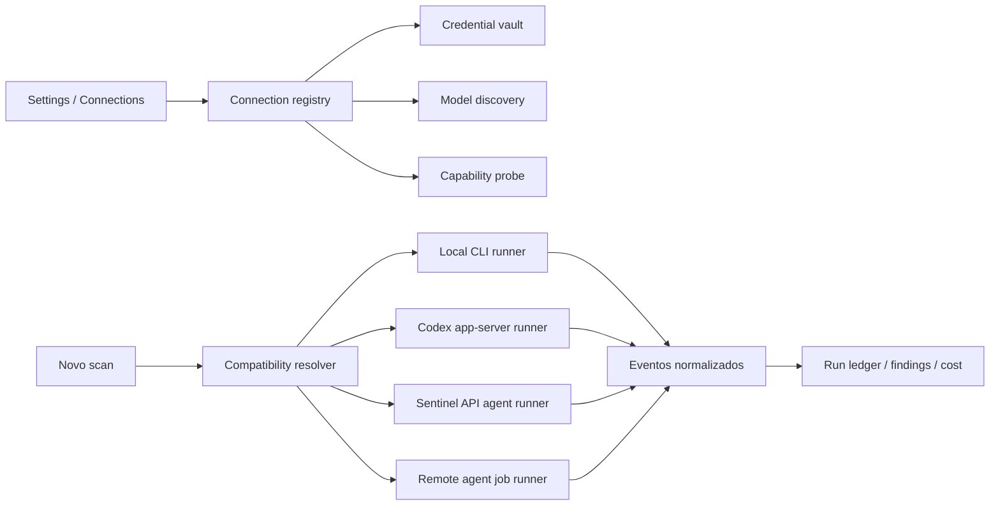
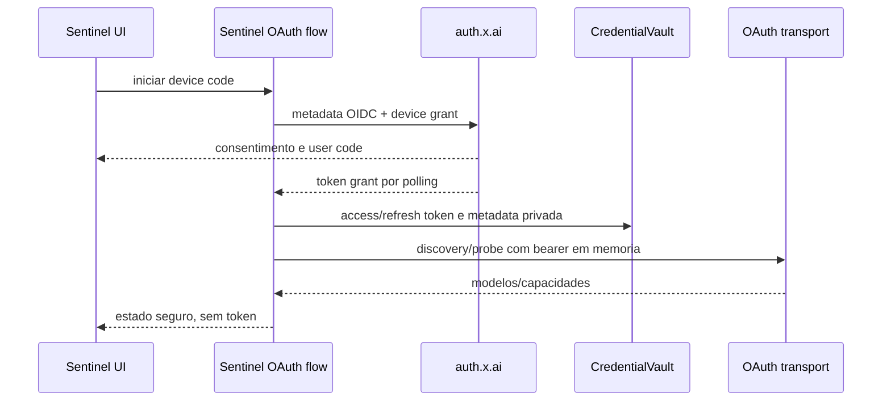

# Provider Connections and Authentication

Status: aprovado em conversa em 10 de agosto de 2026, incluindo as correções de rotas CLI, OAuth/device e API por fornecedor.

## Contexto

O Okami Sentinel hoje executa Codex Security, Google Mantis e Capital One VulnHunter, mas o catálogo de scanners assume OpenAI, modelos fixos e apenas dois modos de autenticação: sessão ChatGPT ou API key disponível no ambiente do processo.

Esse desenho exclui usuários que possuem outras assinaturas, token plans ou endpoints compatíveis. Também mistura quatro conceitos que precisam permanecer independentes:

1. **provider:** quem fornece a inferência ou o agente;
2. **autenticação:** sessão existente, browser OAuth, device code, API key ou headers customizados;
3. **transporte:** CLI local, Codex app-server, HTTP de inferência ou API remota de agente;
4. **runner:** quem conduz ferramentas, artifacts, telemetria e cancelamento.

A decisão aprovada é criar uma camada persistente de Connections, local-first e preparada para escopo servidor, sem fingir que todos os fornecedores expõem o mesmo protocolo.

## Objetivos

- Permitir cadastrar múltiplas conexões para o mesmo provider.
- Reutilizar assinaturas oficialmente suportadas sem pedir login a cada scan.
- Oferecer rotas distintas de CLI, OAuth/device e API onde elas realmente existem.
- Suportar APIs OpenAI Responses, OpenAI Chat Completions e Anthropic Messages com URL customizada.
- Suportar URLs específicas de MiniMax Token Plan e Xiaomi MiMo Token Plan.
- Descobrir modelos dinamicamente pelo provider ou runtime; nenhuma lista de modelos fica hardcoded.
- Calcular compatibilidade como interseção entre scanner, runner, protocolo, modelo e capacidades verificadas.
- Manter chaves, tokens, URLs customizadas e headers secretos fora do SQLite, logs, SSE, manifests e argumentos visíveis.
- Preservar comparabilidade, telemetria e proveniência dos runs independentemente do provider.

## Não objetivos

- Não extrair tokens de sessão pertencentes a Codex, Claude Code, Cursor ou Grok Build.
- Não reutilizar token de assinatura como se fosse API key do provider.
- Não acoplar o OAuth xAI ao Grok Build CLI, importar sua sessão ou executar seus comandos para autenticar.
- Não ampliar o v1 xAI para browser authorization-code/loopback, registro dinâmico de client ou host de inferência configurável pela UI.
- Não afirmar que uma API de agente remoto é equivalente a uma API de inferência.
- Não prometer custo ou tokens quando o runtime não os reporta.
- Não suportar FreeBuf como provider enquanto não houver uma API pública compatível documentada.
- Não usar OpenCode como cofre de credenciais. Ele poderá ser um runtime opcional posterior.
- Não ampliar GitHub Actions ou operação multiusuário nesta primeira entrega local.

## Modelo conceitual



Uma Connection representa exatamente uma rota operacional. O usuário pode ter, por exemplo, três conexões OpenAI simultâneas:

- `Codex local — sessão existente`;
- `ChatGPT — conectado pelo Sentinel via browser/device`;
- `OpenAI API — projeto DevSecOps`.

Isso evita campos condicionais ambíguos e permite defaults diferentes por scanner.

## Rotas aprovadas por provider

### OpenAI

Três rotas independentes:

1. **Codex CLI local:** detecta e reutiliza a sessão já autenticada no Codex CLI.
2. **ChatGPT OAuth/device:** o Sentinel inicia browser login ou device code pelo contrato oficial do Codex app-server e acompanha o estado na interface. A credencial continua no armazenamento oficial do Codex.
3. **OpenAI API:** API key protegida pelo vault, descoberta por `GET /v1/models` e execução direta por Responses.

Codex CLI e OAuth/device podem usar a mesma tecnologia de runtime, mas são jornadas diferentes: uma reaproveita estado existente e a outra permite conectar a conta sem preparo manual no terminal.

### Grok / xAI

Três rotas independentes:

1. **Grok Build local:** detecta e reutiliza uma sessão existente do CLI.
2. **Conta xAI/Grok — OAuth gerenciado pelo Sentinel:** device code RFC 8628 iniciado, acompanhado, renovado e cancelado pelo Sentinel. Esta rota não invoca, instala, lê ou depende do Grok Build CLI.
3. **xAI API:** `XAI_API_KEY` no vault, `GET https://api.x.ai/v1/models` e execução direta pelo xAI Responses API.

As três rotas têm cartões, `routeKind`, lifecycle, telemetria e compatibilidade próprios. O preset server-only `XaiPublicOAuthPreset` usa o cliente OAuth público Grok-CLI que OpenCode e Hermes implementam sem executar o CLI: `clientId` `b1a00492-073a-47ea-816f-4c329264a828`, scopes `openid profile email offline_access grok-cli:access api:access`, issuer `https://auth.x.ai` e Responses base URL `https://api.x.ai/v1`. Esses valores são imutáveis no backend e nunca vêm da UI.

O consent screen pode mostrar “Grok Build” porque o client OAuth é compartilhado; isso é uma identidade do client de consentimento, não uma dependência de runtime. A UI precisa comunicar literalmente: `OAuth xAI gerenciado pelo Sentinel — o consentimento pode mencionar Grok Build; nenhum Grok Build CLI será executado ou lido.` O trade-off explícito é acompanhar a disponibilidade desse cliente público compartilhado; erro de OAuth, remoção do client ou mudança de entitlement deixa a conexão expirada/degradada, sem fallback escondido para CLI ou API key.

O Sentinel descobre os endpoints no OIDC e exige correspondência literal: origin OAuth `https://auth.x.ai`, device path `/oauth2/device/code`, token path `/oauth2/token` e revocation path `/oauth2/revoke`. Depois de obter bearer, a rota OAuth aceita exclusivamente a origin `https://api.x.ai`, com model discovery em `/v1/models` e inferência em `/v1/responses`, como o plugin xAI do OpenCode. OAuth bearer não vira `XAI_API_KEY`: ambos são segredos distintos, mas o adapter OAuth coloca o primeiro somente no header `Authorization` em memória para a origin e paths pinados.

#### Boundary do OAuth xAI gerenciado



- **Device v1:** RFC 8628 não usa redirect/callback nem PKCE. O backend guarda `device_code` apenas no `AuthFlowStore`; a UI recebe `verification_uri_complete` (ou `verification_uri`), `user_code`, expiração e `flowId`, abre a URL no browser desktop quando possível e sempre preserva a ação de copiar/abrir manualmente. Polling usa 5 segundos quando `interval` estiver ausente, não numérico ou menor/igual a zero. `authorization_pending` espera o intervalo corrente; cada `slow_down` soma 5 segundos ao intervalo e mantém esse novo valor em todos os polls seguintes. Timeout ou erro de rede nunca gera retry imediato: aumenta o backoff persistente em pelo menos 5 segundos, espera respeitando o intervalo corrente e o deadline, e encerra ao expirar. Qualquer erro OAuth diferente de `authorization_pending` e `slow_down` é terminal. Um `AbortSignal` por flow encerra cancelamento, expiração e fechamento; nenhum caminho pode entrar em busy-loop.
- **Tokens:** access, refresh e id token opcional só entram no `CredentialVault`; SQLite armazena apenas `credential_ref`. Refresh é single-flight por conexão e persiste o refresh token rotacionado antes de qualquer uso subsequente. `disconnect` aborta flow pendente, tenta o `revocation_endpoint` descoberto com token retirado do vault, apaga o bundle local e registra apenas resultado seguro (`revoked`, `revoke_pending` ou `local_removed`).
- **Transporte e logs:** o bearer só é colocado em memória no request do `xai-oauth-responses` adapter para `https://api.x.ai/v1/models` ou `https://api.x.ai/v1/responses`. Nenhum token, `device_code`, URL com query ou header atravessa SQLite, logs, SSE, manifest, analytics ou mensagens de erro. O redactor é registrado antes de trocar tokens.

### Claude / Anthropic

Duas rotas independentes:

1. **Claude Code local:** reutiliza ou inicia o login oficial Claude.ai Pro/Max e executa pelo Claude Code CLI.
2. **Anthropic API:** API key da Anthropic Console e execução direta pelo protocolo Messages.

Uma assinatura Claude Max não autoriza chamadas à Messages API. Os dois cartões permanecem separados, inclusive em custo e limites.

### Cursor

Duas famílias operacionais:

1. **Cursor Agent local:** browser login ou `CURSOR_API_KEY`, ambos executados pelo Cursor Agent CLI dentro da boundary local aprovada.
2. **Cursor Background Agents API:** API pública beta de jobs remotos em repositórios GitHub. É um `RemoteAgentJobRunner`, não uma API de inferência Responses/Chat/Messages.

Cursor não documenta uma API pública de inferência bruta. A integração remota só poderá aparecer para repositórios e fluxos compatíveis com GitHub, com confirmação explícita de envio e branch. Ela não substitui a execução local de um snapshot.

### APIs conhecidas e token plans

Presets suportados pela mesma camada de protocolo:

- OpenRouter;
- Gemini;
- DeepSeek;
- xAI API;
- Anthropic API;
- OpenAI API;
- MiniMax Token Plan;
- Xiaomi MiMo Token Plan;
- custom OpenAI-compatible;
- custom Anthropic-compatible.

O preset define protocolo, formato de autenticação e estratégia de discovery. URLs regionais ou de token plan permanecem editáveis e são salvas no vault. Presets não contêm modelos.

## Contratos compartilhados

```ts
type ConnectionTransport =
  | "local-cli"
  | "codex-app-server"
  | "http-inference"
  | "remote-agent-api";

type ConnectionAuthKind =
  | "existing-session"
  | "browser-oauth"
  | "device-code"
  | "api-key"
  | "custom-headers";

type ProviderProtocol =
  | "codex-cli"
  | "codex-app-server"
  | "claude-code-cli"
  | "cursor-agent-cli"
  | "grok-build-cli"
  | "xai-oauth-responses"
  | "openai-responses"
  | "openai-chat"
  | "anthropic-messages"
  | "cursor-background-agents";

type ModelSelectionMode = "catalog" | "runtime-default";

type ConnectionStatus =
  | "draft"
  | "authentication-required"
  | "testing"
  | "ready"
  | "degraded"
  | "expired"
  | "unavailable";

interface ProviderConnection {
  id: string;
  scopeId: "local";
  name: string;
  providerKind: string;
  routeKind: string;
  transport: ConnectionTransport;
  authKind: ConnectionAuthKind;
  protocol: ProviderProtocol;
  status: ConnectionStatus;
  modelSelectionMode: ModelSelectionMode;
  defaultModelId: string | null;
  lastTestedAt: string | null;
  lastModelSyncAt: string | null;
  display: ConnectionDisplay;
}

interface StoredProviderConnection extends ProviderConnection {
  credentialRef: string | null;
}

interface ConnectionDisplay {
  providerLabel: string;
  routeLabel: string;
  secretConfigured: boolean;
  endpointConfigured: boolean;
  endpointKind: "preset" | "custom" | null;
}

interface ScanConnectionSelection {
  connectionId: string;
  modelSelectionMode: ModelSelectionMode;
  modelId: string | null;
}

interface ProviderModel {
  connectionId: string;
  id: string;
  displayName: string;
  contextWindow: number | null;
  capabilities: ModelCapabilities;
  pricing: ModelPricing | null;
  discoveredAt: string;
  source: "provider-api" | "runtime";
}

interface XaiPublicOAuthPreset {
  issuer: "https://auth.x.ai";
  deviceAuthorizationPath: "/oauth2/device/code";
  tokenPath: "/oauth2/token";
  revocationPath: "/oauth2/revoke";
  clientId: "b1a00492-073a-47ea-816f-4c329264a828";
  scopes: "openid profile email offline_access grok-cli:access api:access";
  inferenceOrigin: "https://api.x.ai";
  modelsPath: "/v1/models";
  responsesPath: "/v1/responses";
  allowedOrigins: readonly ["https://auth.x.ai", "https://api.x.ai"];
}

type XaiOAuthFlowMode = "device-code";
type XaiOAuthFlowStatus =
  | "pending-device"
  | "exchanging"
  | "completed"
  | "cancelled"
  | "expired"
  | "denied"
  | "failed";
```

O `routeKind` é um identificador de adapter, não um enum fechado compartilhado. Novos adapters podem ser registrados sem alterar o contrato central.

`ConnectionDisplay` é um contrato fechado produzido pelo backend. Ele nunca contém URL, hostname, path, nome de header ou qualquer valor derivado do secret bundle. `credentialRef` existe apenas no registro interno da API e nunca atravessa o contrato HTTP.

`XaiPublicOAuthPreset` e os valores de `AuthFlowStore` são contratos **server-only**; não pertencem a `packages/shared`, SQLite, log ou resposta HTTP. A UI recebe somente o modo device, `flowId`, estado, expiração, URI/user code e mensagens redigidas.

## Persistência e cofre

### SQLite

Novas tabelas:

- `provider_connections`: apenas metadados não secretos e `credential_ref`;
- `provider_models`: catálogo normalizado por conexão;
- `connection_capability_checks`: resultado, evidência, erro seguro e timestamp;
- `scan_connection_snapshots`: snapshot imutável do provider, rota, modelo e capacidades usadas no run.

O banco nunca recebe API key, token OAuth, refresh token, URL customizada completa ou valor de header secreto.

### CredentialVault

Interface única:

```ts
interface CredentialVault {
  available(): Promise<VaultAvailability>;
  put(ref: string, value: ConnectionSecretBundle): Promise<void>;
  get(ref: string): Promise<ConnectionSecretBundle>;
  delete(ref: string): Promise<void>;
}
```

- macOS: Keychain;
- Linux desktop: Secret Service;
- ausência de cofre seguro: bloquear persistência de conexão secreta com instrução clara; nunca cair para plaintext.

O bundle criptografado inclui base URL, discovery URL, API key e nomes/valores de headers customizados. Para OAuth gerenciado inclui access token, refresh token, id token opcional, expiração e token endpoint. A UI recebe apenas representação mascarada. Atualizar um segredo exige informar um novo valor.

Credenciais de CLIs permanecem sob custódia do próprio runtime. O Sentinel guarda apenas a referência lógica e o último status observado.

## Redaction e isolamento

Aceitar segredos pela UI exige corrigir a boundary de logs antes de habilitar Connections:

- todo stdout/stderr passa por redaction antes de arquivo, buffer, SSE e console;
- headers `Authorization`, `X-Api-Key`, cookies, tokens, chaves e valores conhecidos do vault são removidos;
- requests e erros persistem URL sanitizada, sem query secreta;
- nenhum segredo entra em argumento de processo ou display command;
- API key é injetada apenas no ambiente do processo filho ou no request HTTP em memória;
- arquivos temporários de configuração, quando inevitáveis, usam modo `0600`, conteúdo mínimo e cleanup ao encerrar;
- a API local aceita apenas origem permitida e token anti-CSRF para operações de segredo;
- responses de endpoints de Connections usam `Cache-Control: no-store`.

O redactor deve preservar diagnóstico útil. Ele substitui valores por marcador estável e nunca registra hash reversível do segredo.

## Tela de Connections

Rota canônica: `/settings/connections`.

`/settings` passa a ter duas seções:

1. **System:** runtime, capacidade e ingest existentes;
2. **Connections:** autenticação, providers e modelos.

### Lista

Cada conexão mostra:

- nome e rota, não apenas o logo do provider;
- status de autenticação;
- protocolo e transporte;
- modelo padrão;
- última sincronização e último teste;
- disponibilidade para cada scanner;
- ações `Testar`, `Sincronizar modelos`, `Reconectar`, `Editar` e `Remover`.

### Fluxo de cadastro

Um Sheet/Dialog Shadcn em três etapas:

1. **Escolher rota:** assinatura local, conectar conta, API conhecida ou API customizada.
2. **Autenticar:** status de CLI, browser OAuth, device code ou formulário write-only de segredo.
3. **Descobrir e validar:** carregar catálogo real, escolher modelo padrão e executar probe explícito.

Browser OAuth mostra progresso e callback local para providers que o suportam. Para xAI v1, device code mostra URL, código copiável, expiração e polling cancelável; o desktop abre `verification_uri_complete` quando presente. Fechar o diálogo não apaga uma sessão já concluída.

Para xAI, os rótulos precisam impedir a falsa equivalência: `Grok Build local — sessão do CLI existente`, `Conta xAI/Grok — OAuth gerenciado pelo Sentinel` e `xAI API — API key`. No cartão OAuth, a interface informa que o Sentinel guarda os tokens no vault do sistema, usa o cliente OAuth público compartilhado e não usa nem lê o Grok Build CLI.

Para OpenAI, a interface diferencia `Reutilizar Codex local` de `Conectar ChatGPT pelo Sentinel`, embora ambos possam chegar ao mesmo runtime oficial.

## API local de Connections

Endpoints propostos:

```text
GET    /connections
POST   /connections
GET    /connections/:id
PATCH  /connections/:id
DELETE /connections/:id

POST   /connections/:id/auth/start
GET    /connections/:id/auth/:flowId
POST   /connections/:id/auth/:flowId/cancel
POST   /connections/:id/disconnect

POST   /connections/:id/test
POST   /connections/:id/models/refresh
GET    /connections/:id/models
```

`POST /connections` aceita o segredo uma única vez e devolve somente metadados. O fluxo OAuth/device devolve status, `verification_uri` e `user_code` quando aplicável, nunca access/refresh/id token, `device_code`, endpoints completos ou valores internos do preset.

Os erros são normalizados em:

- `credential_rejected`;
- `credential_expired`;
- `provider_unreachable`;
- `model_discovery_unsupported`;
- `model_access_denied`;
- `endpoint_access_denied`;
- `rate_limited`;
- `secure_storage_unavailable`;
- `runtime_missing`;
- `runtime_version_unsupported`.
- `oauth_flow_expired`;
- `oauth_access_denied`;
- `oauth_metadata_invalid`.

## Descoberta de modelos

Nenhuma opção de modelo é mantida no catálogo estático do frontend.

Fontes:

- Codex app-server: `model/list`;
- Grok Build local: comando de catálogo suportado pelo runtime, sem importar token para o Sentinel;
- xAI OAuth gerenciado: `GET https://api.x.ai/v1/models` com bearer somente em memória; sem lista estática ou fallback de endpoint;
- Cursor Agent: comando de catálogo suportado pelo runtime;
- OpenAI-compatible: `GET {baseUrl}/models` ou discovery URL configurada;
- Anthropic-compatible: `GET /v1/models` ou discovery URL configurada;
- xAI API: models endpoint oficial;
- OpenRouter: catálogo completo da API;
- Cursor Background Agents: modelos/capacidades retornados pela API quando disponíveis.

Se o provider não expuser catálogo, a conexão não fabrica modelos. Claude Code é a exceção operacional conhecida: enquanto o CLI não expuser catálogo programático oficial, a única seleção permitida é `Runtime default`, identificada como delegada e não como model ID descoberto.

Catálogos ficam em cache para experiência offline e histórico, mas aparecem como `stale` até nova sincronização. Ao iniciar um scan com catálogo stale, o backend revalida acesso ao modelo escolhido sem substituir silenciosamente a seleção.

## Capability probe

Discovery prova existência, não compatibilidade. O usuário executa um probe barato apenas no modelo escolhido.

O relatório normaliza:

- protocolo aceito;
- streaming;
- tool calls;
- structured output estrito ou apenas validado localmente;
- usage input/output/cache/reasoning;
- pricing retornado pelo provider;
- contexto conhecido;
- cancelamento remoto ou somente local;
- erros de ACL por endpoint ou modelo.

Capacidade não comprovada fica `unknown`; nunca é convertida automaticamente em `supported`.

## Runner de API controlado pelo Sentinel

Mantis e VulnHunter não podem enviar um prompt grande para qualquer `/chat/completions` e esperar artifacts mágicos. APIs genéricas usam um loop agentic pequeno e controlado:

```ts
interface AgentSessionRunner {
  probe(input: ProbeInput): Promise<CapabilityReport>;
  createSession(input: SessionSpec): AgentSession;
}
```

Ferramentas v1:

- `workspace.list`;
- `workspace.read`;
- `workspace.search`;
- `results.write`.

Não há shell, edição do snapshot, rede adicional ou execução de código. Paths são canonicalizados; `..`, absolutos e symlinks que escapam da raiz são bloqueados. Escrita ocorre apenas no artifact store do run.

Adapters de wire:

- OpenAI Responses;
- OpenAI Chat Completions;
- Anthropic Messages.

Todos emitem o mesmo stream de eventos de run, tool, artifact, usage, completion, cancellation e failure.

## Compatibilidade com scanners

### Codex Security

Estável apenas nas rotas oficialmente suportadas pelo pacote atual:

- OpenAI/ChatGPT;
- OpenAI API;
- OpenRouter;
- Fireworks;
- Amazon Bedrock.

O Codex CLI suporta providers customizados via TOML/Responses, mas o wrapper Codex Security 0.1.8 não oferece contrato estável para credencial e recipe de provider arbitrário. Por isso, conexões customizadas ficam indisponíveis para Codex Security com razão objetiva. Elas são executadas exclusivamente pelo Sentinel API Agent Runner em Mantis e VulnHunter. Suporte futuro exige contrato oficial novo ou adapter explicitamente versionado; um probe isolado não altera essa decisão.

### Mantis e VulnHunter

Podem usar:

- Codex CLI/app-server;
- Sentinel API Agent Runner;
- Sentinel API Agent Runner com `xai-oauth-responses`, somente depois de metadata OIDC, device OAuth, vault, catálogo e probe autenticado terem passado;
- Claude Code CLI após validar sandbox e artifacts;
- Grok Build CLI após validar sandbox do sistema operacional;
- Cursor Agent CLI em preview até provar isolamento de rede e filesystem;
- Cursor Background Agents apenas como job remoto explícito, nunca como substituto transparente de um scan local.

No macOS, qualquer CLI cujo sandbox não bloqueie egress de processos filhos permanece preview até existir isolamento externo verificável.

### Resolver

O frontend não mantém essa matriz. A API calcula:

```text
scanner requirements
  ∩ runner capabilities
  ∩ connection protocol
  ∩ model probe
  ∩ operating-system guarantees
= compatibility decision + reasons
```

Conexões incompatíveis aparecem desabilitadas no novo scan, acompanhadas da razão objetiva.

## Novo fluxo de scan

Ordem aprovada:

1. selecionar repositório e escopo;
2. selecionar scanner;
3. selecionar Connection compatível;
4. selecionar modelo descoberto;
5. configurar opções do scanner;
6. revisar custo/telemetria disponíveis;
7. iniciar.

`StartScanRequest` passa a receber `connectionId`, `modelSelectionMode` e `modelId: string | null`. O backend resolve o segredo e o runner. No modo `catalog`, `modelId` é obrigatório e precisa pertencer ao catálogo da conexão. No modo `runtime-default`, `modelId` deve ser `null` e a conexão precisa declarar exatamente esse modo. `provider`, `authMode` e `model` permanecem no run apenas como snapshot legível e histórico.

Um run nunca muda de conexão ou modelo silenciosamente. Fallback exige política explícita futura.

## Telemetria, custo e histórico

- APIs com usage reportado alimentam input, cache write/read, output e reasoning.
- xAI pode fornecer custo por request; ele prevalece sobre estimativa externa.
- Quando há tokens e preço conhecido, o Sentinel calcula estimativa com fonte e timestamp.
- Quando CLI não reporta usage, tokens e custo ficam `null`, não zero.
- Runs preservam connection snapshot mesmo após editar ou remover a conexão.
- Histórico nunca depende de conseguir reabrir o segredo.
- Status OAuth/device e testes de conexão usam eventos separados da telemetria de scan.

## Estados de erro

- Vault indisponível: permitir apenas conexões sem segredo e bloquear save de API key.
- CLI ausente: mostrar comando de instalação/documentação; não tentar instalar silenciosamente.
- Sessão expirada: preservar cadastro e marcar `expired`.
- Device code expirado: permitir gerar um novo fluxo sem duplicar a conexão.
- Cancelamento/fechamento de flow: abortar polling, descartar `device_code` efêmero e manter credencial anterior intacta.
- Metadata OIDC divergente da origin `https://auth.x.ai` ou dos paths `/oauth2/device/code`, `/oauth2/token` e `/oauth2/revoke`: falhar fechado em `oauth_metadata_invalid`; nunca usar host/path sugerido por token ou UI.
- Discovery falhou: manter último catálogo como stale, sem afirmar acesso atual.
- Modelo removido: bloquear novo scan e manter runs históricos intactos.
- Provider custom sem `/models`: permitir discovery URL explícita; sem ela, cadastro não fica ready.
- API key sem ACL de models: identificar `endpoint_access_denied`, não `credential_rejected`.
- Cancelamento local sem confirmação remota: mostrar `local cancellation requested`, não `provider cancelled`.

## Acessibilidade e responsividade

- Etapas, cards, menus e status têm nomes acessíveis e foco visível.
- Status não depende apenas de cor.
- Device code e URLs possuem ação de copiar com confirmação anunciada.
- Erros ficam vinculados ao campo correspondente e resumidos no topo do diálogo.
- Segredos suportam password manager e toggle de visibilidade temporário.
- Desktop usa lista + detalhe; tablet e mobile empilham a lista e abrem o detalhe em Sheet.
- Validar 1600×1000, 1024×768, 820×1180, 390×844 e 344×882.
- Movimento curto e removido em `prefers-reduced-motion`.

## Design visual

O recurso segue o Test Bench Okami existente:

- painéis conectados, sem grade de cards genéricos;
- cobre para comando e seleção;
- seafoam para conexão comprovadamente pronta;
- straw para stale/preview;
- coral para erro ou auth expirada, sempre acompanhado de texto;
- JetBrains Mono para protocolos, model IDs, timestamps e status técnicos;
- Manrope/Geist para títulos e explicações;
- Shadcn/Radix para Dialog, Sheet, Tabs, Select, Password input, Tooltip e foco;
- logos identificam provider, mas nome da rota e método de autenticação têm hierarquia maior.

## Testes

### Determinísticos

1. migrations nunca persistem secret bundle;
2. vault round-trip e indisponibilidade sem fallback plaintext;
3. API nunca devolve segredo em GET, PATCH error ou JSON de validação;
4. redaction antes de arquivo, SSE e console;
5. múltiplas conexões do mesmo provider permanecem independentes;
6. discovery normaliza APIs e CLIs sem lista hardcoded;
7. catálogo stale não troca modelo silenciosamente;
8. probe diferencia unsupported, denied, invalid credential e rate limit;
9. resolver produz razões estáveis por scanner e sistema operacional;
10. run snapshot sobrevive à remoção da conexão;
11. usage ausente continua `null`;
12. OAuth/device nunca aparece nos logs como token, `device_code` ou URL com query;
13. cancelamento impede novas tool calls;
14. tool host bloqueia traversal, symlink escape e escrita fora de artifacts.

### Integração

- fake OpenAI Responses com tools e usage;
- fake Chat Completions com tool calls;
- fake Anthropic Messages com `tool_use`/`tool_result`;
- mock `/models` com paginação, ACL e modelo removido;
- fake device flow com relógio controlado: `interval` ausente/inválido usa 5 segundos, `authorization_pending` mantém intervalo, cada `slow_down` soma 5 segundos persistentemente, timeout/rede aplica backoff até o deadline, erro OAuth desconhecido encerra e nenhum caso entra em busy-loop;
- fake preset público imutável, metadata OIDC recusada fora da origin `https://auth.x.ai` ou dos paths `/oauth2/device/code`, `/oauth2/token` e `/oauth2/revoke`, sem configuração vinda da UI;
- fake refresh rotacionado, revogação e Responses recusados fora da origin `https://api.x.ai` ou dos paths `/v1/models` e `/v1/responses`;
- fake CLI status/models/scan sem depender de conta real;
- teste opcional, explicitamente autorizado, com provider real sem registrar payload secreto.

### Frontend

- fluxo de cadastro por teclado;
- browser OAuth para providers que o suportam e device code para xAI v1;
- API key write-only;
- conexão pronta, stale, expirada e indisponível;
- filtro de catálogos extensos como OpenRouter;
- compatibilidade e razões no novo scan;
- ausência de overlap, clipping e scroll horizontal nos breakpoints definidos;
- contraste, reduced motion e erros de console.

## Sequência de entrega

1. Redaction global e abstração `CredentialVault`.
2. Schema SQLite e contratos de Connections.
3. API CRUD, auth flow e discovery registry.
4. Tela `/settings/connections` com OpenAI, Grok, Claude, Cursor e APIs customizadas.
5. Integração do novo seletor no fluxo de scan.
6. Sentinel API Agent Runner com Responses.
7. Adapters Chat Completions e Anthropic Messages.
8. Rotas Codex CLI/app-server e Claude Code.
9. Rota xAI OAuth device-code gerenciada pelo Sentinel após a foundation; rota Grok Build e Cursor Agent sob os gates de sandbox.
10. Cursor Background Agents em preview remoto.
11. Probes reais autorizados e matriz final de compatibilidade.

## Critérios de aceitação

- O usuário cadastra e mantém várias conexões sem reautenticar a cada scan.
- OpenAI mostra separadamente CLI existente, OAuth/device conduzido pelo Sentinel e API.
- Grok/xAI mostra separadamente CLI existente, OAuth device-code gerenciado pelo Sentinel sem CLI e xAI API. A rota OAuth usa o preset público compartilhado, seus tokens ficam somente no vault e entitlement é validado por catálogo/probe.
- Claude mostra Claude Code Max e Anthropic API como limites e cobranças distintas.
- Cursor mostra CLI e Background Agents API sem fingir que existe inferência HTTP genérica.
- MiniMax e MiMo aceitam a URL correta do token plan.
- Modelos exibidos vêm exclusivamente de discovery real ou de `Runtime default` explicitamente delegado.
- Scanner, conexão e modelo incompatíveis não iniciam um run.
- Nenhum segredo aparece em banco, logs, SSE, manifests, erros ou comandos apresentados.
- Mantis e VulnHunter produzem artifacts equivalentes usando os protocolos HTTP suportados.
- Codex Security só anuncia estabilidade para providers realmente suportados pela versão instalada.
- Usage e custo ausentes aparecem como indisponíveis, nunca como zero.
- A tela funciona sem clipping ou sobreposição em desktop, tablet, mobile e telas estreitas.

## Fontes de contrato

- [Codex app-server](https://developers.openai.com/codex/app-server)
- [Codex configuration reference](https://developers.openai.com/codex/config-reference)
- [Codex Security CLI reference](https://learn.chatgpt.com/docs/security/cli/reference)
- [Claude Code authentication](https://docs.anthropic.com/en/docs/claude-code/getting-started)
- [Claude Code CLI](https://docs.anthropic.com/en/docs/claude-code/cli-usage)
- [Cursor CLI authentication](https://docs.cursor.com/en/cli/reference/authentication)
- [Cursor Background Agents API](https://docs.cursor.com/background-agent/api/overview)
- [Grok Build CLI](https://docs.x.ai/build/cli/reference)
- [Grok Build enterprise authentication](https://docs.x.ai/build/enterprise)
- [xAI inference API](https://docs.x.ai/developers/rest-api-reference/inference)
- [xAI OIDC discovery — live](https://auth.x.ai/.well-known/openid-configuration)
- [xAI Responses API](https://docs.x.ai/developers/rest-api-reference/inference/create-new-response)
- [OpenCode xAI OAuth implementation, commit b9f3b38](https://github.com/anomalyco/opencode/blob/b9f3b382fcfd82b57103b29b77572f112ce9e1e5/packages/opencode/src/plugin/xai.ts)
- [OpenClaw xAI OAuth implementation, commit 8e91d6c](https://github.com/openclaw/openclaw/blob/8e91d6c0c195d53667f2cd221517c55fe9ad6251/extensions/xai/xai-oauth.ts)
- [OpenClaw OAuth transport/catalog, commit 8e91d6c](https://github.com/openclaw/openclaw/blob/8e91d6c0c195d53667f2cd221517c55fe9ad6251/extensions/xai/provider-catalog.ts)
- [Hermes xAI OAuth guide, commit 49c6323](https://github.com/NousResearch/hermes-agent/blob/49c632310dd6877302e8dfa92e740b0ceddb97b8/website/docs/guides/xai-grok-oauth.md)
- [Cline xAI provider, commit 149abb0](https://github.com/cline/cline/blob/149abb0ddb51d8f1827751b731dd572027069591/apps/vscode/webview-ui/src/components/settings/providers/XaiProvider.tsx)
