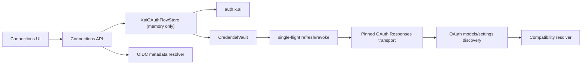

# xAI OAuth independente do Grok Build — plano de implementação

> **Pré-requisito:** executar somente depois do plano `2026-08-10-provider-connections-foundation.md` estar integrado e verde. Esta entrega adiciona OAuth xAI gerenciado pelo Sentinel; ela não executa, instala, importa sessão ou chama o Grok Build CLI.

## Objetivo

Entregar uma Connection `xai-oauth` para contas xAI/Grok com browser authorization-code + PKCE S256 ou device code RFC 8628, tokens somente no `CredentialVault`, refresh/revoke, catálogo/probe pelo transporte OAuth aprovado e execução posterior pelo `Sentinel API Agent Runner` usando Responses. A rota xAI API key permanece um adapter diferente.

## Decisão e gates que não podem ser pulados

O documento OIDC live em `https://auth.x.ai/.well-known/openid-configuration` anuncia `authorization_code`, `refresh_token`, `urn:ietf:params:oauth:grant-type:device_code`, `S256`, token/device/revocation endpoints, mas não anuncia `registration_endpoint`. OpenCode, OpenClaw e Hermes demonstram um fluxo xAI independente de CLI, porém seus `client_id`, scopes e, no caso de OpenClaw, upstream OAuth, pertencem a seus próprios contratos.

Antes de expor o botão de login em produção, deve existir uma `XaiOAuthRegistration` fornecida por xAI ou explicitamente autorizada para o Sentinel. Não reutilizar `client_id`, scopes, User-Agent, headers ou `cli-chat-proxy.grok.com` copiados de projetos de terceiros. Sem essa registration, a UI mostra a rota como indisponível; CLI local e `XAI_API_KEY` não são afetados.

## Arquitetura



### Server-only contracts

These types stay in `apps/api`; neither values nor fields leak through `packages/shared`, SQLite, SSE, activity logs or command displays.

```ts
interface XaiOAuthRegistration {
  registrationId: string;
  clientId: string;
  issuer: "https://auth.x.ai";
  scopes: readonly string[];
  browserRedirectUri: string | null;
  transport: {
    inferenceBaseUrl: string;
    modelsPath: string;
    settingsPath: string | null;
    allowedOrigins: readonly string[];
    protocol: "openai-responses";
  };
}

interface XaiOAuthSecretBundle {
  accessToken: string;
  refreshToken: string;
  idToken?: string;
  expiresAt: string | null;
  tokenEndpoint: string;
  transport: XaiOAuthRegistration["transport"];
}

interface XaiOAuthFlowPublic {
  id: string;
  mode: "browser-pkce" | "device-code";
  status: "pending-browser" | "pending-device" | "exchanging" | "completed" | "cancelled" | "expired" | "denied" | "failed";
  expiresAt: string;
  authorizationUrl?: string;
  verificationUri?: string;
  userCode?: string;
  safeErrorCode?: string;
}
```

`XaiOAuthFlowStore` retains a hashed `state` and PKCE verifier for browser mode, or `device_code` for device mode, plus an `AbortController`. The only UI-visible identifiers are `flowId`, expiry, authorization URL or verification URI/user code. No callback code, device code, verifier, access token, refresh token, complete token response, provider error body or transport endpoint appears in a public DTO.

## File map

### Shared API-safe types

- Modify `packages/shared/src/index.ts`: add public route ID `xai-oauth`, non-secret auth-flow DTO/status and normalized safe error codes. Do not add registration, endpoint, client ID or OAuth secret types.

### API

- Create `apps/api/src/connections/xai-oauth-registration.ts`: immutable, server-injected registration loader and strict validation; disabled result when no reviewed registration exists.
- Create `apps/api/src/connections/xai-oauth-metadata.ts`: OIDC discovery and exact issuer/origin/grant/S256 validation.
- Create `apps/api/src/connections/xai-oauth-flow-store.ts`: bounded in-memory flow lifetime, one-use state and abort/expiry cleanup.
- Create `apps/api/src/connections/xai-oauth-flow.ts`: browser PKCE and device-code start/exchange/poll/cancel orchestration.
- Create `apps/api/src/connections/xai-oauth-credentials.ts`: secret bundle validation, vault-only load/store, single-flight refresh rotation, revocation.
- Create `apps/api/src/connections/xai-oauth-transport.ts`: strict origin/path validation and Responses requests with an in-memory bearer.
- Create `apps/api/src/connections/xai-oauth-model-discovery.ts`: authenticated model/settings discovery, no static model fallback.
- Modify `apps/api/src/connections-service.ts`: register the xAI route and status transitions after foundation exists.
- Modify `apps/api/src/connections-api.ts`: route-specific auth start/status/cancel/disconnect handlers with no-store output.
- Modify `apps/api/src/connections-store.ts`: persist only route/status/credential reference, never flow, registration or OAuth values.
- Modify `apps/api/src/runner.ts` and the future Responses adapter registry: select `xai-oauth-responses` only after a ready connection and capability probe.

### Tests

- Create `apps/api/src/connections/xai-oauth-registration.test.ts`
- Create `apps/api/src/connections/xai-oauth-metadata.test.ts`
- Create `apps/api/src/connections/xai-oauth-flow-store.test.ts`
- Create `apps/api/src/connections/xai-oauth-flow.test.ts`
- Create `apps/api/src/connections/xai-oauth-credentials.test.ts`
- Create `apps/api/src/connections/xai-oauth-transport.test.ts`
- Create `apps/api/src/connections/xai-oauth-model-discovery.test.ts`
- Extend `apps/api/src/connections-api.test.ts`, `apps/api/src/connections-service.test.ts`, `apps/api/src/connections-store.test.ts` and the future API-agent adapter tests.

### Web (after API tests are green)

- Modify `apps/web/src/api.ts`: safe start/status/cancel/disconnect calls only.
- Create `apps/web/src/components/connections/XaiOAuthAuthPanel.tsx`: device/browser state, copy action, expiry and cancel.
- Modify `apps/web/src/components/connections/ConnectionEditorSheet.tsx`: separate xAI CLI, managed OAuth and API-key route choices.
- Modify `apps/web/src/i18n.tsx`: all supported locale strings.
- Create `apps/web/src/lib/xai-oauth-flow.ts` and `apps/web/src/lib/xai-oauth-flow.test.ts`: pure polling/display state logic.

The web task must use the `frontend-design` skill, existing Shadcn/Radix components, the Test Bench system and visual QA at `1600×1000`, `1024×768`, `820×1180`, `390×844`, and `344×882`. No hand-written global CSS or `apps/web/.impeccable/` changes.

## TDD delivery slices

All commands below use Node 24. Each numbered behavior begins with its test, the focused test is observed failing for the expected missing behavior, implementation is minimal, then focused and relevant regression tests are green. Do not write production code before that red observation.

### 1. Fail closed without an approved registration

1. Write `xai-oauth-registration.test.ts` with an absent config and malformed/origin-escaping registration. Assert `oauth_registration_unavailable`, no client ID in public DTO and no dynamic client registration request.
2. Run RED:

   ```bash
   PATH=/Users/marcos/.nvm/versions/node/v24.17.0/bin:$PATH pnpm --filter @csb/api exec tsx --test src/connections/xai-oauth-registration.test.ts
   ```

3. Implement `loadXaiOAuthRegistration()` with injected release config. Permit only issuer `https://auth.x.ai`, HTTPS descriptor origins, path-only model/settings paths and no user-supplied replacement.
4. Re-run focused test, then `connections-service.test.ts`.

### 2. Resolve and pin OIDC metadata

1. Write a fake OIDC-server test that accepts only the expected issuer, `authorization_code`, device-code grant, token/device/revocation endpoints and `S256`; reject missing fields, HTTP, non-x.ai and a discovery redirect.
2. Run RED:

   ```bash
   PATH=/Users/marcos/.nvm/versions/node/v24.17.0/bin:$PATH pnpm --filter @csb/api exec tsx --test src/connections/xai-oauth-metadata.test.ts
   ```

3. Implement `resolveXaiOAuthMetadata()`. It is cached by issuer only, bounds response bytes and never logs the document or errors verbatim.
4. GREEN plus registration test. Metadata may discover endpoints; it may not discover a client ID or transport descriptor.

### 3. Browser authorization-code flow is stateful and PKCE-bound

1. Write flow-store/flow tests that start browser mode and assert a 127.0.0.1 registered redirect, one public `authorizationUrl`, opaque `state`, a `code_challenge_method=S256`, and no verifier/device code in returned JSON.
2. Test callback success, duplicate callback, mismatched/expired state, authorization error, server restart and cancellation. Only the valid one-use callback can call the token endpoint.
3. Run RED:

   ```bash
   PATH=/Users/marcos/.nvm/versions/node/v24.17.0/bin:$PATH pnpm --filter @csb/api exec tsx --test src/connections/xai-oauth-flow-store.test.ts src/connections/xai-oauth-flow.test.ts
   ```

4. Implement a loopback-only callback server owned by the API process and a bounded `XaiOAuthFlowStore`; bind no public interface and remove callback state on all terminal paths.
5. Exchange the authorization code only in the backend, store response through the vault function in slice 5, and return only safe state.

### 4. Device code flow is cancellable and obeys RFC 8628 responses

1. Extend `xai-oauth-flow.test.ts` with device-code response validation; public URI/user code/expiry, private device code; `authorization_pending`, `slow_down`, denial, expiry, network failure and AbortSignal cancellation.
2. Run RED with the same focused command.
3. Implement device request and token polling using discovered endpoints, provider `interval` floor and deadline. There is no fabricated PKCE/state parameter in the RFC 8628 request; `flowId` binds UI events to its private record.
4. Ensure closing Sheet invokes cancel, clears the private device code and cannot revoke/overwrite a prior successful credential.

### 5. Vault-only token rotation and revocation

1. Write credential tests with an injected fake vault. Assert API/SQLite/SSE never see token strings; a single expired connection issues one refresh; a returned refresh token atomically replaces the old one; transport uncertainty does not replay a rotating refresh token; `invalid_grant` moves connection to `expired`.
2. Add disconnect tests for abort-before-revoke, discovery-provided revocation endpoint, safe `revoke_pending` on remote failure and local bundle removal.
3. Run RED:

   ```bash
   PATH=/Users/marcos/.nvm/versions/node/v24.17.0/bin:$PATH pnpm --filter @csb/api exec tsx --test src/connections/xai-oauth-credentials.test.ts src/credential-vault.test.ts src/redaction.test.ts
   ```

4. Implement `storeXaiOAuthTokens`, `getFreshXaiOAuthAccessToken` and `disconnectXaiOAuth`. Register secrets with the global redactor before any error/event can be emitted. A failed rotation preserves the existing vault state; a successful one writes the new pair before it is used again.

### 6. OAuth transport, model discovery and probe

1. Write transport tests that reject every origin/path except the server-provided descriptor, assert exactly one in-memory `Authorization: Bearer` header, redact redirects/error bodies and never accept a base URL from UI/token/model row.
2. Write discovery tests for OAuth `/models` and optional settings response: normal rows, empty/ACL result, model removed and failing endpoint. Assert no static fallback makes a connection `ready`.
3. Run RED:

   ```bash
   PATH=/Users/marcos/.nvm/versions/node/v24.17.0/bin:$PATH pnpm --filter @csb/api exec tsx --test src/connections/xai-oauth-transport.test.ts src/connections/xai-oauth-model-discovery.test.ts
   ```

4. Implement the pinned Responses transport and discovery adapter. It must not treat xAI OAuth tokens as `XAI_API_KEY` or fall back to the API-key origin. Record normalized model metadata and safe capability evidence only after a cheap authenticated probe.
5. Add an integration fake that completes device/browser exchange, returns a rotating refresh response, lists models and handles a Responses probe.

### 7. API contracts and compatibility gate

1. Add API tests for `POST /connections/:id/auth/start`, flow GET/cancel and disconnect: `Cache-Control: no-store`, CSRF, no token-shaped values and typed status/error transitions.
2. Add resolver tests: xAI OAuth absent registration/failed probe is unavailable; ready `xai-oauth-responses` is eligible for Mantis/VulnHunter only after its explicit runner capability is present; it never enables Codex Security by accident.
3. Run RED:

   ```bash
   PATH=/Users/marcos/.nvm/versions/node/v24.17.0/bin:$PATH pnpm --filter @csb/api exec tsx --test src/connections-api.test.ts src/connections-service.test.ts src/scanner-adapters.test.ts
   ```

4. Implement only the route registration/selection required by the tests. No hidden CLI fallback, environment secret fallback or model list fallback.

### 8. UI after backend is green

1. First write pure web tests for every public flow status, one expiration timer, copy confirmation and cancel action; run RED.
2. Implement the separate route choices and `XaiOAuthAuthPanel` using existing Shadcn/Radix controls. Render browser/device as distinct methods; never render Grok Build as an OAuth dependency.
3. Run:

   ```bash
   PATH=/Users/marcos/.nvm/versions/node/v24.17.0/bin:$PATH pnpm --filter @csb/web exec vitest run src/lib/xai-oauth-flow.test.ts
   PATH=/Users/marcos/.nvm/versions/node/v24.17.0/bin:$PATH pnpm --filter @csb/web run typecheck
   ```

4. Perform browser visual QA and accessibility keyboard checks at the required breakpoints. Capture artifacts outside the repository or in the accepted QA location; do not touch `.impeccable`.

## End-to-end verification and release gate

Run after all focused tests are green:

```bash
PATH=/Users/marcos/.nvm/versions/node/v24.17.0/bin:$PATH pnpm --filter @csb/api exec tsx --test src/connections/*.test.ts src/credential-vault.test.ts src/redaction.test.ts src/scanner-adapters.test.ts
PATH=/Users/marcos/.nvm/versions/node/v24.17.0/bin:$PATH pnpm typecheck
PATH=/Users/marcos/.nvm/versions/node/v24.17.0/bin:$PATH pnpm test
git diff --check
```

An external xAI account test is optional and requires explicit authorization. It must use an approved Sentinel registration and an isolated test connection, redact all recording surfaces, verify browser and/or device completion plus one model/probe request, then revoke/disconnect. A green fake server does not waive this registration/entitlement gate; OAuth success also does not prove model access, which must be reported separately as `model_access_denied` or a provider entitlement error.

## Out of scope for this plan

- Acquiring xAI client registration, subscription entitlement or permission to use another application's shared client.
- Grok Build CLI execution/sandboxing; that remains a separate local-CLI adapter.
- General multi-user/server deployment, arbitrary OAuth issuer support and arbitrary custom OAuth endpoints.
- Modifying runtime/UI in the present documentation sprint.
