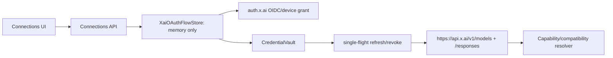

# xAI device OAuth independente do Grok Build — plano de implementação

> **Pré-requisito:** executar somente depois do plano `2026-08-10-provider-connections-foundation.md` estar integrado e verde. Esta entrega adiciona OAuth xAI device-code gerenciado pelo Sentinel; ela não executa, instala, importa sessão ou chama o Grok Build CLI.

## Objetivo

Entregar uma Connection `xai-oauth` para conta xAI/Grok por RFC 8628 device code, usando o cliente OAuth público Grok-CLI que OpenCode e Hermes usam, sem dependência do binário Grok Build. O Sentinel abre a URL de verificação no desktop, faz polling, guarda/renova/revoga tokens exclusivamente no `CredentialVault`, descobre modelos e envia Responses com bearer em memória diretamente a `https://api.x.ai/v1`.

A rota xAI API key continua distinta: `XAI_API_KEY` não é token OAuth e não participa deste fluxo.

## Preset v1 e trade-off explícito

OpenCode `packages/opencode/src/plugin/xai.ts` no commit `b9f3b38` declara o cliente público Grok-CLI `b1a00492-073a-47ea-816f-4c329264a828`, os scopes `openid profile email offline_access grok-cli:access api:access`, device code via OIDC e injection do bearer na Responses API default `https://api.x.ai/v1`. Hermes usa a mesma família de client/flow. O Sentinel adota exatamente esse contrato como preset imutável de backend:

```ts
const XAI_PUBLIC_OAUTH_PRESET = {
  issuer: "https://auth.x.ai",
  clientId: "b1a00492-073a-47ea-816f-4c329264a828",
  scopes: "openid profile email offline_access grok-cli:access api:access",
  responsesBaseUrl: "https://api.x.ai/v1",
  allowedOrigins: ["https://auth.x.ai", "https://api.x.ai"],
} as const;
```

O consent screen pode chamar o client de “Grok Build”; a UI explica que é o client público compartilhado e que o Sentinel não executa, instala ou lê o Grok Build CLI. O trade-off v1 é acompanhar a disponibilidade e a política de entitlement desse client. Falha de login, refresh, catálogo ou `403` de assinatura deixa a conexão `expired`/`degraded`; não existe fallback silencioso para CLI ou API key.

O v1 não implementa browser authorization-code/loopback, PKCE, client registration, upstream OAuth alternativo, hosts customizáveis nem endpoint vindo da UI. Device code é o caminho browser-friendly: o desktop abre `verification_uri_complete` quando disponível, o usuário aprova no browser e o Sentinel faz polling local.

## Arquitetura



### Server-only contracts

```ts
interface XaiPublicOAuthPreset {
  issuer: "https://auth.x.ai";
  clientId: "b1a00492-073a-47ea-816f-4c329264a828";
  scopes: "openid profile email offline_access grok-cli:access api:access";
  responsesBaseUrl: "https://api.x.ai/v1";
  allowedOrigins: readonly ["https://auth.x.ai", "https://api.x.ai"];
}

interface XaiOAuthSecretBundle {
  accessToken: string;
  refreshToken: string;
  idToken?: string;
  expiresAt: string | null;
  tokenEndpoint: string;
}

interface XaiOAuthFlowPublic {
  id: string;
  mode: "device-code";
  status: "pending-device" | "exchanging" | "completed" | "cancelled" | "expired" | "denied" | "failed";
  expiresAt: string;
  verificationUri: string;
  userCode: string;
  safeErrorCode?: string;
}
```

`XaiOAuthFlowStore` mantém somente em memória `device_code`, deadline, interval e `AbortController`; a UI recebe `flowId`, URL/código públicos e estado. Access/refresh/id token, erro bruto e header nunca atravessam DTO, SQLite, SSE, analytics, manifest ou log.

## File map

### Shared API-safe types

- Modify `packages/shared/src/index.ts`: route ID `xai-oauth`, DTO device-flow sem segredo e safe errors `oauth_flow_expired`, `oauth_access_denied`, `oauth_metadata_invalid`.

### API

- Create `apps/api/src/connections/xai-public-oauth-preset.ts`: único preset imutável e validador de issuer/origins; sem configuração da UI/env.
- Create `apps/api/src/connections/xai-oauth-metadata.ts`: OIDC discovery, pinning em `auth.x.ai` e validação de token/device/revocation endpoints.
- Create `apps/api/src/connections/xai-oauth-flow-store.ts`: tempo de vida limitado, dados privados e cancelamento.
- Create `apps/api/src/connections/xai-oauth-flow.ts`: request device code, abrir `verification_uri_complete`, polling/cancelamento e troca de token.
- Create `apps/api/src/connections/xai-oauth-credentials.ts`: vault-only bundle, refresh single-flight/rotation e revoke.
- Create `apps/api/src/connections/xai-oauth-transport.ts`: Responses direto para o preset e bearer somente em memória.
- Create `apps/api/src/connections/xai-oauth-model-discovery.ts`: `GET /models` autenticado e probe Responses, sem lista fallback.
- Modify `apps/api/src/connections-service.ts`, `apps/api/src/connections-api.ts`, `apps/api/src/connections-store.ts` e a futura registry de Responses para registrar a rota e persistir somente `credential_ref`/status.

### Tests

- Create `apps/api/src/connections/xai-public-oauth-preset.test.ts`
- Create `apps/api/src/connections/xai-oauth-metadata.test.ts`
- Create `apps/api/src/connections/xai-oauth-flow-store.test.ts`
- Create `apps/api/src/connections/xai-oauth-flow.test.ts`
- Create `apps/api/src/connections/xai-oauth-credentials.test.ts`
- Create `apps/api/src/connections/xai-oauth-transport.test.ts`
- Create `apps/api/src/connections/xai-oauth-model-discovery.test.ts`
- Extend foundation tests `connections-api.test.ts`, `connections-service.test.ts`, `connections-store.test.ts`, `credential-vault.test.ts`, `redaction.test.ts` and adapter/resolver tests.

### Web (somente depois do backend verde)

- Modify `apps/web/src/api.ts`: start/status/cancel/disconnect seguros.
- Create `apps/web/src/components/connections/XaiOAuthDevicePanel.tsx`: URL, código, expiração, copy/open/cancel e aviso do client compartilhado.
- Modify `apps/web/src/components/connections/ConnectionEditorSheet.tsx`: separar `Grok Build local`, `OAuth xAI pelo Sentinel` e `xAI API`.
- Modify `apps/web/src/i18n.tsx`; create `apps/web/src/lib/xai-oauth-flow.ts` e teste puro correspondente.

O futuro trabalho web usa `frontend-design`, os componentes Shadcn/Radix existentes, Test Bench e visual QA em `1600×1000`, `1024×768`, `820×1180`, `390×844` e `344×882`. Não criar CSS global manual nem tocar em `apps/web/.impeccable/`.

## TDD delivery slices

Todos os comandos usam Node 24. Cada slice começa com teste RED observado, recebe implementação mínima e termina GREEN antes do próximo slice. Não escrever runtime antes do teste correspondente.

### 1. Preset público imutável

1. Criar `xai-public-oauth-preset.test.ts`: valores exatos de client, scopes, issuer, Responses base e duas origins; assertar que request/DTO não aceita override de UI, env, token ou model row.
2. RED:

   ```bash
   PATH=/Users/marcos/.nvm/versions/node/v24.17.0/bin:$PATH pnpm --filter @csb/api exec tsx --test src/connections/xai-public-oauth-preset.test.ts
   ```

3. Implementar somente o preset e seu validador. Não criar registro dinâmico, tela de config ou fallback de CLI.

### 2. Metadata OIDC pinado

1. Criar teste com servidor OIDC fake: aceitar token/device/revoke HTTPS em `auth.x.ai`; rejeitar issuer, redirect, endpoint ou grant inválido.
2. RED e GREEN:

   ```bash
   PATH=/Users/marcos/.nvm/versions/node/v24.17.0/bin:$PATH pnpm --filter @csb/api exec tsx --test src/connections/xai-oauth-metadata.test.ts
   ```

3. Implementar discovery com limite de bytes/timeout e erro seguro `oauth_metadata_invalid`; metadata descobre endpoints, nunca substitui o preset.

### 3. Device code sem CLI

1. Escrever flow tests: POST com client/scopes do preset; DTO público contém somente URI/user code/expiry; Sentinel tenta abrir `verification_uri_complete`; o flow não executa processo/CLI.
2. Cobrir `authorization_pending`, `slow_down`, deny, expiry, erro de rede e `AbortSignal` de cancelamento/fechamento.
3. RED e GREEN:

   ```bash
   PATH=/Users/marcos/.nvm/versions/node/v24.17.0/bin:$PATH pnpm --filter @csb/api exec tsx --test src/connections/xai-oauth-flow-store.test.ts src/connections/xai-oauth-flow.test.ts
   ```

4. Implementar `XaiOAuthFlowStore` limitado e polling por `interval`; nunca expor/persistir `device_code`.

### 4. Vault, refresh rotation e revoke

1. Escrever testes com vault fake: tokens não aparecem em API/SQLite/SSE; expiração concorrente faz uma refresh; refresh token devolvido substitui o anterior; erro de transporte não repete refresh rotacionado; `invalid_grant` marca `expired`.
2. Testar disconnect: abortar flow, usar endpoint de revogação descoberto, registrar apenas `revoked`/`revoke_pending`/`local_removed` e limpar bundle local.
3. RED e GREEN:

   ```bash
   PATH=/Users/marcos/.nvm/versions/node/v24.17.0/bin:$PATH pnpm --filter @csb/api exec tsx --test src/connections/xai-oauth-credentials.test.ts src/credential-vault.test.ts src/redaction.test.ts
   ```

4. Registrar todos os tokens no redactor antes de qualquer evento/erro.

### 5. Responses, modelos, probe e entitlement

1. Escrever tests que permitem apenas `https://api.x.ai/v1/models` e `/responses`, com bearer em memória e sem URL user-configurable; rejeitar redirect/origin diferente.
2. Cobrir catálogo normal/vazio/modelo removido e `403` pós-login. `403` vira `model_access_denied`/entitlement seguro, não `credential_rejected`; sem catálogo válido, não há `ready` nem lista estática.
3. RED e GREEN:

   ```bash
   PATH=/Users/marcos/.nvm/versions/node/v24.17.0/bin:$PATH pnpm --filter @csb/api exec tsx --test src/connections/xai-oauth-transport.test.ts src/connections/xai-oauth-model-discovery.test.ts
   ```

4. Implementar o adapter `xai-oauth-responses` e probe barato. A API-key xAI permanece em adapter/credencial separado.

### 6. API, resolver e UI device-only

1. Testes API para start/status/cancel/disconnect: CSRF, `Cache-Control: no-store`, nenhum token/device code em JSON e status tipado.
2. Testes do resolver: OAuth pronto é elegível para Mantis/VulnHunter somente quando o runner Responses explicitamente suportar; nunca ativa Codex Security por acidente.
3. RED e GREEN:

   ```bash
   PATH=/Users/marcos/.nvm/versions/node/v24.17.0/bin:$PATH pnpm --filter @csb/api exec tsx --test src/connections-api.test.ts src/connections-service.test.ts src/scanner-adapters.test.ts
   ```

4. Depois, escrever RED web para URL/código/cancelamento/expiração/aviso “consentimento pode mencionar Grok Build”; implementar somente o painel device-code e executar:

   ```bash
   PATH=/Users/marcos/.nvm/versions/node/v24.17.0/bin:$PATH pnpm --filter @csb/web exec vitest run src/lib/xai-oauth-flow.test.ts
   PATH=/Users/marcos/.nvm/versions/node/v24.17.0/bin:$PATH pnpm --filter @csb/web run typecheck
   ```

## Verificação final e limites

```bash
PATH=/Users/marcos/.nvm/versions/node/v24.17.0/bin:$PATH pnpm --filter @csb/api exec tsx --test src/connections/*.test.ts src/credential-vault.test.ts src/redaction.test.ts src/scanner-adapters.test.ts
PATH=/Users/marcos/.nvm/versions/node/v24.17.0/bin:$PATH pnpm typecheck
PATH=/Users/marcos/.nvm/versions/node/v24.17.0/bin:$PATH pnpm test
git diff --check
```

Teste real de conta só ocorre com autorização explícita, sem registrar payload/tokens, e valida uma jornada device, refresh, modelo/probe, 403 de entitlement quando aplicável e disconnect/revoke. Não há implementação de runtime/UI nesta sprint documental.

Fora de escopo: browser authorization-code/loopback, PKCE, registro OAuth próprio/dinâmico, importação ou execução de Grok Build, hosts OAuth customizados, multiusuário e fallback automático entre OAuth/API key/CLI.
