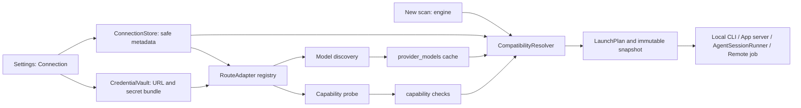

# Provider Authentication, Dynamic Model Discovery, and Engine Selection Implementation Plan

> **For agentic workers:** REQUIRED SUB-SKILL: Use superpowers:subagent-driven-development (recommended) or superpowers:executing-plans to implement this plan task-by-task. Steps use checkbox (`- [ ]`) syntax for tracking.

**Goal:** Add real provider authentication journeys, runtime/API model discovery, capability probes, and a safe `scanner × connection × model` selection path for Sentinel.

**Architecture:** The existing Connections foundation remains the sole owner of safe metadata while `CredentialVault` owns every URL and credential. Route adapters separately implement local runtimes, managed OAuth/app-server sessions, HTTP inference, or remote jobs; they produce a normalized model catalog and probe report. The resolver consumes those reported facts plus scanner requirements, then selects a runner without treating a generic chat endpoint as an agent.

**Tech Stack:** Node.js 24, TypeScript, Hono, better-sqlite3, keytar-backed `CredentialVault`, React 19, React Router, Shadcn/Radix, Tailwind 4, `tsx --test`, pnpm 11.5.2.

## Global Constraints

- Execute only after `docs/superpowers/plans/2026-08-10-provider-connections-foundation.md` is fully integrated and green, including native vault and global redaction.
- Runtime is `node >=24 <25` and package manager is `pnpm@11.5.2`; every command below pins Node 24 with `env PATH=/Users/marcos/.nvm/versions/node/v24.17.0/bin:/opt/homebrew/bin:/usr/bin:/bin`.
- `provider`, `routeKind`, `transport`, `authentication`, `wire protocol`, and `runner` are separate. A provider logo is never a capability decision.
- No model ID, fallback model, or price may be hardcoded in frontend or adapter registries. Models come only from the selected upstream API/runtime. `runtime-default` is allowed only when that upstream exposes no programmatic catalog and can itself execute without a supplied model.
- API keys, access/refresh/device tokens, complete custom/discovery URLs, and custom-header values stay in `CredentialVault`, never SQLite, SSE, logs, manifests, command display, or HTTP read DTOs. Use `Cache-Control: no-store` for every Connections response.
- OpenAI must expose three distinct routes: `openai-codex-local`, `openai-chatgpt-app-server`, and `openai-api`.
- xAI must expose three distinct routes: `xai-grok-build-local`, `xai-oauth`, and `xai-api`. `xai-oauth` is Sentinel-managed RFC 8628 device OAuth and does not install, invoke, read, or import Grok Build CLI state.
- Claude has `claude-code-local` and `anthropic-api`; Cursor has only the real `cursor-agent-local` and `cursor-background-agents` routes. Do not create a fictional Cursor HTTP inference adapter.
- Custom OpenAI-compatible and Anthropic-compatible connections accept base URL, optional discovery URL, API key, and custom headers write-only through the vault.
- MiniMax Token Plan uses its Token Plan Anthropic base `https://api.minimax.io/anthropic`; Xiaomi MiMo Token Plan requires the regional Token Plan base supplied by the subscription page, never the pay-as-you-go base. Both are protocol presets, not model catalogs.
- Gemini API and DeepSeek API are credential/protocol presets, not model catalogs. Their adapters discover the authenticated account's current models from the official Models APIs; neither registry nor UI contains Gemini or DeepSeek model IDs. `gemini-api` executes through Google's official OpenAI-compatible Chat Completions endpoint and `openai-chat-session`, but only a complete probe of the selected discovered model may enable an agent runner.
- OpenRouter is an HTTP preset; OpenCode is an optional future runtime extension point, not a credential vault; FreeBuf remains absent from selectable routes until it publishes a compatible public API contract.
- Mantis and VulnHunter may use HTTP only through `AgentSessionRunner` after a successful tool/artifact capability probe. A plain Chat Completions response has no implied filesystem tools, artifact writer, sandbox, or cancellation.
- Preserve current Codex Security behavior. It is selectable only where the installed Codex Security contract explicitly supports that route; custom providers remain unavailable with a stable reason.
- Keep runs reproducible: `scan_connection_snapshots` are immutable and a scan never silently changes connection/model. Missing usage/cost is `null`, never zero.
- Do not touch the pre-existing untracked `apps/web/.impeccable/` directory. Use existing Shadcn/Radix components and Test Bench composition; do not add global handwritten CSS.

## Authoritative contracts checked on 2026-08-10

| Route | Implementation contract | Planning consequence |
| --- | --- | --- |
| OpenAI ChatGPT | Codex app-server documents `account/read`, `account/login/start` browser and `chatgptDeviceCode` flows, cancellation notifications, and `model/list`. | Sentinel talks JSON-RPC to the local app-server; Codex owns/persists/refreshes its ChatGPT credential. Sentinel never receives a ChatGPT access token. |
| OpenAI API | `GET /v1/models` returns models accessible to the authenticated API key. | Use a vault-sourced bearer header and normalize the returned catalog; no UI fallback model. |
| xAI | xAI documents `grok models` for Grok Build and authenticated model APIs. The approved xAI plan pins OAuth to `auth.x.ai` and inference to `api.x.ai`. | Local Grok Build, independent device OAuth, and xAI API are separate adapters and rows. |
| Claude | Claude Code documents local account/Console authentication and a CLI with explicit model selection. | Preserve the CLI credential in Claude Code; do not reinterpret Claude Max/Pro as an Anthropic Console API key. |
| Cursor | Cursor documents `cursor-agent login`, `status`, `logout`, and API-key CLI invocation; Background Agents is a separate GitHub-backed remote jobs API. | Probe/run the local CLI or create remote jobs. Never offer `cursor /v1/chat/completions`. |
| OpenRouter | `GET /api/v1/models` exposes model metadata/pricing and supported parameters. | Normalize its live catalog and use reported support as an input to the probe, not as a bypass for the probe. |
| Gemini | Gemini documents authenticated `models.list` at `GET https://generativelanguage.googleapis.com/v1beta/models`, plus an official OpenAI-compatible `.../v1beta/openai/chat/completions` endpoint with function calling. | Discover without a static list; execute with `openai-chat-session`; treat function calling as a wire contract, not proof that the selected model completed Sentinel's tool/artifact loop. |
| DeepSeek | DeepSeek documents an authenticated List Models API. | Use the fixed official API preset and normalize only returned rows; never ship a DeepSeek model list. |
| MiniMax/MiMo | MiniMax documents its dedicated Token Plan key/base; MiMo documents separate OpenAI- and Anthropic-compatible Token Plan regional bases and says the subscription page wins. | Persist endpoint/key only in the vault; discover with the configured protocol endpoint or keep the connection not-ready when no upstream catalog is exposed. |

The mutable upstream contracts above must be rechecked immediately before implementation. Primary references: [Codex app-server](https://developers.openai.com/codex/app-server), [OpenAI Models API](https://platform.openai.com/docs/api-reference/models/object), [xAI CLI](https://docs.x.ai/build/cli/reference), [xAI Models API](https://docs.x.ai/developers/rest-api-reference/inference/models), [Claude Code setup](https://docs.anthropic.com/en/docs/claude-code/getting-started), [Cursor authentication](https://docs.cursor.com/en/cli/reference/authentication), [Cursor Background Agents API](https://docs.cursor.com/background-agent/api/overview), [OpenRouter Models API](https://openrouter.ai/docs/api/api-reference/models/get-models), [Gemini Models API](https://ai.google.dev/api/models), [Gemini OpenAI compatibility](https://ai.google.dev/gemini-api/docs/openai), [DeepSeek List Models API](https://api-docs.deepseek.com/api/list-models), [MiniMax Token Plan](https://platform.minimax.io/docs/token-plan/quickstart), and [MiMo Token Plan integration](https://mimo.mi.com/docs/en-US/quick-start/faq/api-integration).

## Route and selection boundary



The registry contains route manifests, not model manifests:

```ts
export const routeKinds = [
  "openai-codex-local", "openai-chatgpt-app-server", "openai-api",
  "xai-grok-build-local", "xai-oauth", "xai-api",
  "claude-code-local", "anthropic-api",
  "cursor-agent-local", "cursor-background-agents",
  "openrouter-api", "gemini-api", "deepseek-api",
  "minimax-token-plan", "mimo-token-plan",
  "custom-openai-compatible", "custom-anthropic-compatible",
] as const;
```

The code must not add `models`, `defaultModel`, or a provider-specific model array to this manifest. `runtime-default` is valid only for the documented Claude Code no-catalog case; HTTP routes without an accessible catalog remain `degraded` with `model_discovery_unsupported` rather than fabricating a model ID.

## File Structure

### Shared public contracts and persistence

- Modify `packages/shared/src/index.ts`: model, capability, compatibility, selected connection, route-safe auth-flow DTOs, and scan snapshot DTOs.
- Modify `apps/api/src/connections-store.ts`: model catalog, probe report, and immutable run snapshot tables/methods created by foundation.
- Modify `apps/api/src/connections-store.test.ts`: persistence and secret-absence coverage.
- Modify `apps/api/src/connections-service.ts`: invokes adapters, updates status, and returns safe DTOs.
- Modify `apps/api/src/connections-api.ts`: model/probe/auth endpoints and no-store contracts.

### Runtime and provider adapters

- Create `apps/api/src/connections/route-adapter.ts`: narrow adapter contracts and result/error types.
- Create `apps/api/src/connections/route-registry.ts`: route manifest registration with no model values.
- Create `apps/api/src/connections/runtime-command.ts`: argv-only local runtime execution, bounded output, timeout, and redaction boundary.
- Create `apps/api/src/connections/codex-app-server-bridge.ts`: JSON-RPC transport, `account/*` and `model/list` façade.
- Create `apps/api/src/connections/local-runtime-adapters.ts`: Codex local, Grok Build, Claude Code, and Cursor Agent status/catalog behavior.
- Create `apps/api/src/connections/http-model-discovery.ts`: safe HTTP catalog fetch/pagination/normalization.
- Create `apps/api/src/connections/http-route-adapters.ts`: OpenAI/xAI/Anthropic/OpenRouter/Gemini/DeepSeek/Token Plan/custom route configuration and probe candidates.
- Create `apps/api/src/connections/cursor-background-agents-adapter.ts`: Background Agents job probe and remote-job boundary only.
- Create `apps/api/src/connections/remote-agent-job-runner.ts`: confirmed remote repository/branch job contract used only by Background Agents.
- Create `apps/api/src/connections/xai-oauth-adapter.ts`: registration seam for the independently implemented approved xAI device OAuth modules.

### Sentinel API agent runtime

- Create `apps/api/src/agent/session-types.ts`: `AgentSessionRunner`, normalized events, and immutable session specification.
- Create `apps/api/src/agent/workspace-tool-host.ts`: read-only snapshot tools and artifact-only output.
- Create `apps/api/src/agent/openai-responses-session.ts`: Responses tool loop.
- Create `apps/api/src/agent/openai-chat-session.ts`: Chat Completions tool loop.
- Create `apps/api/src/agent/anthropic-messages-session.ts`: Messages tool loop.
- Create `apps/api/src/agent/session-runner.ts`: selects only probed wire adapters and converts events to Sentinel run events.
- Create focused tests beside each new API module under `apps/api/src/**.test.ts`.

### Resolver and scan hand-off

- Create `apps/api/src/connections/compatibility-resolver.ts`: deterministic `engine × connection × model` decision and reasons.
- Create `apps/api/src/connections/launch-plan.ts`: reads safe metadata plus vault only at launch and chooses `LocalCliRunner`, `CodexAppServerRunner`, `AgentSessionRunner`, or `RemoteAgentJobRunner`.
- Modify `apps/api/src/scanners/catalog.ts`: replaces fixed authentication/model capability arrays with resolver-backed availability.
- Modify `apps/api/src/scanners/launch.ts`: delegates to `LaunchPlan`; it never writes a vault value into a run config or display command.
- Modify `apps/api/src/runner.ts`, `apps/api/src/db.ts`, and `packages/shared/src/index.ts`: accept/persist the selection and immutable snapshot; keep legacy runs readable.
- Modify `apps/api/src/app.ts`: passes `ConnectionsService` to scan creation with the existing local-origin/CSRF boundary.

### Web

- Modify `apps/web/src/api.ts`: safe model refresh, test/probe, managed auth, compatibility, and selection calls.
- Create `apps/web/src/lib/connections-models.ts` and `apps/web/src/lib/scan-connection-selection.ts`: pure catalog and resolver display helpers with tests.
- Modify `apps/web/src/components/connections/ConnectionEditorSheet.tsx`: route-specific write-only auth fields and discovery/probe phase.
- Create `apps/web/src/components/connections/ConnectionModelPanel.tsx`, `ConnectionCapabilityPanel.tsx`, and `ConnectionAuthPanel.tsx`.
- Modify `apps/web/src/pages/ConnectionsPage.tsx` and `apps/web/src/i18n.tsx`: route cards, status/reconnect/refresh/probe, and all EN/PT-BR/ES/DE/FR strings.
- Modify `apps/web/src/pages/NewScanPage.tsx`: engine first, eligible connection second, discovered/runtime-default model third, and clear disabled reasons.

## Dependency and parallel-delivery schedule

| Sprint | Tasks | Can run in parallel | Completion gate |
| --- | --- | --- | --- |
| 0 | Foundation acceptance + xAI OAuth plan ownership | xAI device-OAuth plan may execute independently after foundation | vault/redaction and all foundation tests green; xAI route has no CLI dependency |
| 1 | Task 1 — contracts/store and recursive API test runner | none | safe schema/public DTO tests green and nested connection/agent canaries execute |
| 2a | Task 2 — local/app-server adapters; Task 3 — HTTP discovery adapters | yes; Task 2 exclusively owns registry/service/API while Task 3 owns only HTTP adapter files | no static model data; fake runtime/HTTP tests green in disjoint worktrees |
| 2b | Task 2 owner serially integrates Task 3 adapters | no | registry/service/API registration plus both Task 2/3 suites green |
| 3 | Task 4 — auth orchestration/xAI seam; Task 5 — `AgentSessionRunner` | yes after their Sprint-2 inputs | all secrets redacted; tool host escape tests green |
| 4 | Task 6 — compatibility, snapshots, launch integration | no | impossible pairs blocked before a child/process/request starts |
| 5 | Task 7 — Connections UI; Task 8 — New Scan selector | Task 7 can begin route display after Task 4; Task 8 waits for Task 6 | keyboard/API tests plus five viewport captures green |
| 6 | final integration and authorized live probes | none | Node 24 suite, typecheck, visual QA, and no secret artefact check green |

No task may make a real account request, browser login, or remote Cursor job without explicit authorization. Deterministic fakes are the normal test path.

---

### Task 1: Extend the safe connection contract, model cache, probes, and run snapshots

**Files:**
- Modify: `apps/api/package.json`
- Create: `apps/api/scripts/run-tests.mjs`
- Create: `apps/api/src/connections/test-discovery.test.ts`
- Create: `apps/api/src/agent/test-discovery.test.ts`
- Create: `apps/api/src/connections/route-adapter.ts`
- Modify: `packages/shared/src/index.ts`
- Modify: `apps/api/src/connections-store.ts`
- Modify: `apps/api/src/connections-store.test.ts`
- Modify: `apps/api/src/connections-service.ts`
- Modify: `apps/api/src/connections-service.test.ts`

**Consumes:** foundation `ProviderConnection`, `StoredProviderConnection`, `ConnectionStore`, `CredentialVault`, and redaction registry.

**Produces:** `ProviderModel`, `CapabilityReport`, `ConnectionCompatibility`, `ScanConnectionSelection`, `ScanConnectionSnapshot`, the shared `RouteAdapter` interface, and safe store operations consumed by every later task.

- [ ] **Step 1: Write RED persistence/DTO tests before adding fields**

```ts
test("model rows and snapshots never serialize a vault bundle", () => {
  const db = new Database(":memory:");
  ensureConnectionSchema(db);
  const store = new ConnectionStore(db);
  store.replaceModels("conn-openrouter", [{
    connectionId: "conn-openrouter", id: "vendor/model-a", displayName: "Model A",
    contextWindow: 128_000, capabilities: { tools: "unknown", artifactOutput: "unknown", structuredOutput: "unknown", boundedExecution: "unknown", osIsolation: "unknown", streaming: "unknown", usage: "unknown", cancellation: "unknown" },
    pricing: null, discoveredAt: "2026-08-11T00:00:00.000Z", source: "provider-api",
  }]);
  store.writeSnapshot({ scanId: "scan-a", connectionId: "conn-openrouter", routeKind: "openrouter-api", modelSelectionMode: "catalog", modelId: "vendor/model-a", capabilityCheckId: "check-a", capturedAt: "2026-08-11T00:00:00.000Z" });
  const inspected = JSON.stringify({
    schema: db.prepare("SELECT name, sql FROM sqlite_master WHERE type = 'table' ORDER BY name").all(),
    models: db.prepare("SELECT connection_id, model_id, display_name, discovered_at, source FROM provider_models ORDER BY connection_id, model_id").all(),
    snapshots: db.prepare("SELECT scan_id, connection_id, route_kind, model_selection_mode, model_id, capability_check_id, captured_at FROM scan_connection_snapshots ORDER BY scan_id").all(),
    snapshotDto: store.getSnapshot("scan-a"),
  });
  assert.equal(inspected.includes("sk-secret"), false);
  assert.equal(inspected.includes("https://private.example/v1"), false);
  assert.equal(store.getSnapshot("scan-a")?.modelId, "vendor/model-a");
});

test("runtime-default is rejected for an HTTP connection", () => {
  assert.throws(() => validateScanConnectionSelection({
    connectionId: "conn-http", modelSelectionMode: "runtime-default", modelId: null,
  }, { transport: "http-inference", supportsRuntimeDefault: false }));
});
```

Add one named canary in each nested directory:

```ts
test("connections nested test canary", () => assert.equal(true, true));
test("agent nested test canary", () => assert.equal(true, true));
```

- [ ] **Step 2: Verify RED**

Run:

```bash
env PATH=/Users/marcos/.nvm/versions/node/v24.17.0/bin:/opt/homebrew/bin:/usr/bin:/bin pnpm --filter @csb/api exec tsx --test src/connections-store.test.ts src/connections-service.test.ts
```

Expected: FAIL because the model/probe/snapshot methods and selection validator do not exist.

- [ ] **Step 3: Make the package test command recursively execute nested API tests**

Create `apps/api/scripts/run-tests.mjs` to recursively enumerate every `src/**/*.test.ts` with `readdir({ recursive: true })`, sort the absolute file paths, then `spawn(process.execPath, ["--import", "tsx", "--test", ...files], { stdio: "inherit" })`. Set the API package's `test` script to `node scripts/run-tests.mjs`; do not rely on a shell glob.

Run:

```bash
env PATH=/Users/marcos/.nvm/versions/node/v24.17.0/bin:/opt/homebrew/bin:/usr/bin:/bin pnpm --filter @csb/api test
```

Expected: output contains both `connections nested test canary` and `agent nested test canary`. If either is absent, stop: later task gates are not trustworthy.

- [ ] **Step 4: Add closed shared types and write-only-safe persistence**

Add the shared contract without `credentialRef`, endpoint, or header fields:

```ts
export type CapabilityState = "supported" | "unsupported" | "unknown";
export interface ModelCapabilities {
  tools: CapabilityState; artifactOutput: CapabilityState; structuredOutput: CapabilityState;
  boundedExecution: CapabilityState; osIsolation: CapabilityState; streaming: CapabilityState;
  usage: CapabilityState; cancellation: CapabilityState;
}
export interface ProviderModel {
  connectionId: string; id: string; displayName: string; contextWindow: number | null;
  capabilities: ModelCapabilities; pricing: ModelPricing | null; discoveredAt: string;
  source: "provider-api" | "runtime";
}
export interface ScanConnectionSelection {
  connectionId: string; modelSelectionMode: "catalog" | "runtime-default"; modelId: string | null;
}
export interface ScanConnectionSnapshot extends ScanConnectionSelection {
  scanId: string; routeKind: string; capabilityCheckId: string | null; capturedAt: string;
}
```

Create idempotent tables `provider_models`, `connection_capability_checks`, and `scan_connection_snapshots`. The model table stores only normalized fields; its unique key is `(connection_id, model_id)`. `replaceModels()` must be one transaction: replace rows, set `last_model_sync_at`, and mark the catalog stale only on a failed refresh. `deleteConnection()` may delete its current models/checks but must not delete snapshots.

Create the protocol-independent `RouteAdapter` interface consumed by both parallel Sprint 2 tasks here; it contains inspection/auth/discovery/probe methods and no registry, service, API, provider URL, or model data.

- [ ] **Step 5: Add service-level invariants**

Implement `validateScanConnectionSelection(selection, connection)` with these exact rules: catalog mode requires a live row owned by that connection; runtime-default requires `modelId === null`, `transport !== "http-inference"`, and an adapter fact `supportsRuntimeDefault === true`; no caller can create a `ProviderModel` through HTTP mutation. Return safe codes `model_not_found`, `model_catalog_stale`, `model_discovery_unsupported`, and `invalid_model_selection`.

- [ ] **Step 6: Run focused GREEN and regression tests**

Run:

```bash
env PATH=/Users/marcos/.nvm/versions/node/v24.17.0/bin:/opt/homebrew/bin:/usr/bin:/bin pnpm --filter @csb/api exec tsx --test src/connections-store.test.ts src/connections-service.test.ts src/connections-api.test.ts src/credential-vault.test.ts
env PATH=/Users/marcos/.nvm/versions/node/v24.17.0/bin:/opt/homebrew/bin:/usr/bin:/bin pnpm --filter @csb/api run typecheck
```

Expected: PASS. The explicit `sqlite_master` inspection, selected safe table rows, snapshot DTO, and each GET DTO contain neither endpoint nor secret data; the package test output includes both nested canaries.

- [ ] **Step 7: Commit this independently reviewable slice**

```bash
git add apps/api/package.json apps/api/scripts/run-tests.mjs apps/api/src/connections/test-discovery.test.ts apps/api/src/agent/test-discovery.test.ts apps/api/src/connections/route-adapter.ts packages/shared/src/index.ts apps/api/src/connections-store.ts apps/api/src/connections-store.test.ts apps/api/src/connections-service.ts apps/api/src/connections-service.test.ts
git commit -m "feat: persist connection model and capability snapshots"
```

---

### Task 2: Build local-runtime and official Codex app-server adapters

**Files:**
- Create: `apps/api/src/connections/route-registry.ts`
- Create: `apps/api/src/connections/runtime-command.ts`
- Create: `apps/api/src/connections/codex-app-server-bridge.ts`
- Create: `apps/api/src/connections/local-runtime-adapters.ts`
- Create: `apps/api/src/connections/local-runtime-adapters.test.ts`
- Create: `apps/api/src/connections/codex-app-server-bridge.test.ts`
- Modify: `apps/api/src/connections-service.ts`
- Modify: `apps/api/src/connections-service.test.ts`
- Modify: `apps/api/src/connections-api.ts`
- Modify: `apps/api/src/connections-api.test.ts`

**Consumes:** Task 1 types and shared `RouteAdapter`; foundation vault/redactor.

**Produces:** verified routes for Codex local/ChatGPT app-server, Grok Build local, Claude Code local, and Cursor Agent local. Task 4 consumes their auth flows; Task 6 consumes their catalog/probe facts.

- [ ] **Step 1: Write RED bridge and argv-only command tests**

```ts
test("Codex device login forwards only safe flow fields and Codex owns the credential", async () => {
  const rpc = new FakeJsonRpc([
    { method: "account/login/start", result: { type: "chatgptDeviceCode", loginId: "login-1", verificationUrl: "https://auth.openai.com/codex/device", userCode: "ABCD-1234" } },
  ]);
  const bridge = new CodexAppServerBridge(rpc);
  assert.deepEqual(await bridge.startDeviceLogin(), {
    loginId: "login-1", verificationUrl: "https://auth.openai.com/codex/device", userCode: "ABCD-1234",
  });
  assert.equal(rpc.requests[0]?.params.type, "chatgptDeviceCode");
  assert.equal(JSON.stringify(rpc.requests).includes("accessToken"), false);
});

test("Grok catalog uses JSON only when runtime help advertises it", async () => {
  const calls: string[][] = [];
  const adapter = createLocalRuntimeAdapter({ execFile: async (bin, args) => {
    calls.push([bin, ...args]);
    return args.at(-1) === "--help" ? { stdout: "Usage: grok models", stderr: "" } : { stdout: "human table", stderr: "" };
  } });
  const result = await adapter.discoverModels(connection("xai-grok-build-local"));
  assert.deepEqual(calls, [["grok", "models", "--help"], ["grok", "models"]]);
  assert.equal(result.safeError?.code, "model_discovery_unsupported");
});
```

- [ ] **Step 2: Verify RED**

Run:

```bash
env PATH=/Users/marcos/.nvm/versions/node/v24.17.0/bin:/opt/homebrew/bin:/usr/bin:/bin pnpm --filter @csb/api exec tsx --test src/connections/codex-app-server-bridge.test.ts src/connections/local-runtime-adapters.test.ts
```

Expected: FAIL because the bridge and adapter registry do not exist.

- [ ] **Step 3: Implement against Task 1's exact route-adapter boundary**

```ts
export interface RouteAdapter {
  readonly routeKind: string;
  readonly transport: ConnectionTransport;
  readonly protocol: ProviderProtocol;
  inspect(connection: StoredProviderConnection): Promise<RouteInspection>;
  startAuth?(connection: StoredProviderConnection, mode: "browser-oauth" | "device-code"): Promise<SafeAuthFlow>;
  cancelAuth?(connection: StoredProviderConnection, flowId: string): Promise<void>;
  discoverModels(connection: StoredProviderConnection): Promise<DiscoveryResult>;
  probe(connection: StoredProviderConnection, selection: ScanConnectionSelection): Promise<CapabilityReport>;
}
```

`runtime-command.ts` uses `execFile`, explicit `cwd`, a 20-second discovery timeout, a 2 MiB output cap, and `redactText()` before any retained diagnostic. It receives `string[]` argv only; reject command strings, shell mode, arbitrary `--config`, and a `cwd` outside Sentinel's approved local repository/runtime boundary.

- [ ] **Step 4: Implement the real local/app-server routes**

Implement the following fixed route behavior in `route-registry.ts`; this is a route contract, not a model catalog:

| Route | Auth/inspection | Dynamic model discovery | Probe limitation |
| --- | --- | --- | --- |
| `openai-codex-local` | app-server `account/read` observes an existing Codex account | app-server `model/list` with pagination | app-server facts only; no exported token |
| `openai-chatgpt-app-server` | app-server `account/login/start` with `chatgpt` or `chatgptDeviceCode`, status from notifications, cancel by `loginId` | app-server `model/list` | Codex owns OAuth persistence/refresh |
| `xai-grok-build-local` | `grok` presence plus supported status/login command; never read state files | first run `grok models --help`; use `grok models --json` only when that installed runtime advertises it, otherwise run documented `grok models` as an availability check and return `model_discovery_unsupported` without parsing its human output | preview unless OS sandbox gate passes |
| `claude-code-local` | `claude` presence and official local status/login journey; never read its credential files | only runtime-reported catalog; otherwise emit `runtime-default`, not a guessed Claude ID | preview until read-only sandbox/artifact contract is proven |
| `cursor-agent-local` | `cursor-agent status`; explicit user action can launch `cursor-agent login`; API key, if chosen, is injected only into that child environment | supported `cursor-agent` catalog command only; no `--model` inference | preview until isolation gate passes |

`CodexAppServerBridge` must implement the documented JSON-RPC methods: `account/read`, `account/login/start` (`chatgpt` and `chatgptDeviceCode`), `account/login/cancel`, notification-driven `account/login/completed`/`account/updated`, and paginated `model/list`. Store only `loginId`, safe status, plan label, and sync timestamp in SQLite; `authUrl`, verification URL, and device code are ephemeral flow DTO fields and no-store responses.

- [ ] **Step 5: Add failure and default-mode tests**

Cover missing binary, unsupported runtime version, stale app-server, a model-list cursor, a removed model, account expiry, cancellation, the Claude no-programmatic-catalog case, Grok help without JSON, and Grok help that explicitly advertises JSON. Assert that the latter calls `grok models --json`; the former never parses table text or guesses a model ID. Assert that `runtime-default` provides `modelId: null`, does not render a model select option, and can only be selected by the Claude local route after its adapter says so.

- [ ] **Step 6: Run GREEN and commit**

Run:

```bash
env PATH=/Users/marcos/.nvm/versions/node/v24.17.0/bin:/opt/homebrew/bin:/usr/bin:/bin pnpm --filter @csb/api exec tsx --test src/connections/codex-app-server-bridge.test.ts src/connections/local-runtime-adapters.test.ts src/redaction.test.ts
env PATH=/Users/marcos/.nvm/versions/node/v24.17.0/bin:/opt/homebrew/bin:/usr/bin:/bin pnpm --filter @csb/api run typecheck
git add apps/api/src/connections/route-registry.ts apps/api/src/connections/runtime-command.ts apps/api/src/connections/codex-app-server-bridge.ts apps/api/src/connections/local-runtime-adapters.ts apps/api/src/connections/codex-app-server-bridge.test.ts apps/api/src/connections/local-runtime-adapters.test.ts apps/api/src/connections-service.ts apps/api/src/connections-service.test.ts apps/api/src/connections-api.ts apps/api/src/connections-api.test.ts
git commit -m "feat: add local and app-server connection adapters"
```

Expected: PASS. No test fixture needs an actual Codex, Claude, Cursor, or Grok credential.

- [ ] **Step 7: After Task 3 review, serially register its HTTP adapters**

Only the Task 2 owner performs this integration after both disjoint commits are reviewed: import/register `registerHttpRouteAdapters()` in `route-registry.ts`, wire discovery/probe through `connections-service.ts` and `connections-api.ts`, then run both Task 2 and Task 3 focused suites plus the package-level recursive test gate.

```bash
env PATH=/Users/marcos/.nvm/versions/node/v24.17.0/bin:/opt/homebrew/bin:/usr/bin:/bin pnpm --filter @csb/api exec tsx --test src/connections/local-runtime-adapters.test.ts src/connections/codex-app-server-bridge.test.ts src/connections/http-model-discovery.test.ts src/connections/http-route-adapters.test.ts src/connections-service.test.ts src/connections-api.test.ts
env PATH=/Users/marcos/.nvm/versions/node/v24.17.0/bin:/opt/homebrew/bin:/usr/bin:/bin pnpm --filter @csb/api test
git add apps/api/src/connections/route-registry.ts apps/api/src/connections-service.ts apps/api/src/connections-service.test.ts apps/api/src/connections-api.ts apps/api/src/connections-api.test.ts
git commit -m "feat: register live HTTP provider routes"
```

---

### Task 3: Add vault-backed HTTP discovery and capability probes without static models

**Files:**
- Create: `apps/api/src/connections/http-model-discovery.ts`
- Create: `apps/api/src/connections/http-route-adapters.ts`
- Create: `apps/api/src/connections/http-model-discovery.test.ts`
- Create: `apps/api/src/connections/http-route-adapters.test.ts`

**Consumes:** Task 1's shared types/`RouteAdapter` and the vault. Runs in a parallel worktree with Task 2 and owns only these four HTTP files; Task 2's owner performs the later serial registry/service/API integration.

**Produces:** OpenAI/xAI/Anthropic/OpenRouter/Gemini/DeepSeek/Token Plan/custom HTTP discovery and `CapabilityReport` inputs for Task 5/6.

- [ ] **Step 1: Write RED fake-HTTP tests for catalog semantics**

```ts
test("normalizes only models returned by the authenticated endpoint", async () => {
  const transport = fakeFetch({
    "GET https://gateway.example/v1/models": json(200, { data: [{ id: "team/model-a", owned_by: "team" }] }),
  });
  const result = await discoverOpenAiModels({ baseUrl: "https://gateway.example/v1", headers: { Authorization: "Bearer secret" } }, transport);
  assert.deepEqual(result.models.map((model) => model.id), ["team/model-a"]);
  assert.equal(JSON.stringify(result).includes("secret"), false);
});

test("failed refresh preserves stale rows and never supplies a fallback model", async () => {
  const result = await refreshConnectionModels(connection("custom-openai-compatible"), failingFetch(403));
  assert.equal(result.status, "stale");
  assert.equal(result.models.length, 0);
  assert.equal(result.safeError.code, "endpoint_access_denied");
});

test("Gemini and DeepSeek presets discover only live authenticated catalogs", async () => {
  const gemini = await discoverModels(connection("gemini-api"), fakeGeminiPages());
  const deepseek = await discoverModels(connection("deepseek-api"), fakeDeepSeekModels());
  assert.deepEqual(gemini.models.map((model) => model.id), ["account-visible"]);
  assert.deepEqual(deepseek.models.map((model) => model.id), ["account-visible"]);
  assert.equal(JSON.stringify([gemini, deepseek]).includes("fallbackModel"), false);
});

test("Gemini preset exposes the official OpenAI chat wire path without inferring agent capability", async () => {
  const route = await inspectHttpRoute(connection("gemini-api"), fakeVault("gemini-secret"));
  assert.equal(route.protocol, "openai-chat");
  assert.equal(route.inferencePath, "/v1beta/openai/chat/completions");
  assert.equal(route.capabilities.tools, "unknown");
  assert.equal(route.capabilities.structuredOutput, "unknown");
  assert.equal(JSON.stringify(route).includes("gemini-secret"), false);
});
```

- [ ] **Step 2: Verify RED**

Run:

```bash
env PATH=/Users/marcos/.nvm/versions/node/v24.17.0/bin:/opt/homebrew/bin:/usr/bin:/bin pnpm --filter @csb/api exec tsx --test src/connections/http-model-discovery.test.ts src/connections/http-route-adapters.test.ts
```

Expected: FAIL because no HTTP discovery adapter exists.

- [ ] **Step 3: Implement safe HTTP fetch and protocol normalizers**

`http-model-discovery.ts` takes `ConnectionSecretBundle` only inside its function boundary, registers all values with the existing redactor, turns off redirects, applies an 8-second timeout/1 MiB response cap, accepts HTTPS by default (HTTP only if the local-only custom route has an explicit `allowInsecureLocalhost` safe boolean), and returns a `SafeProviderError` without URL/header/body. It must normalize OpenAI-style `{data:[...]}`, xAI-style `{data:[...]}` or `{models:[...]}`, Anthropic page data, Gemini `{models:[...], nextPageToken}`, and OpenRouter data. For Gemini, store the API-returned `baseModelId` as `ProviderModel.id` because Google's Models contract identifies it as the value passed to generation requests; never invent or bundle that value. Cursor Background Agents must not import this module.

Implement these endpoint strategies:

| Route family | Credential/protocol | Discovery rule |
| --- | --- | --- |
| `openai-api`, `custom-openai-compatible` | bearer/custom headers; OpenAI Responses or Chat | `discoveryUrl` when supplied, else `baseUrl + "/models"`; page through documented cursor fields only |
| `xai-api` | `Authorization: Bearer` | fixed official `https://api.x.ai/v1/models`; do not accept a custom host |
| `anthropic-api`, `custom-anthropic-compatible` | `x-api-key` plus protocol version/custom headers | configured official/custom models discovery URL; if not exposed, return `model_discovery_unsupported` and remain non-ready |
| `openrouter-api` | bearer | fixed `https://openrouter.ai/api/v1/models`; retain returned pricing/capability metadata as unverified hints |
| `gemini-api` | vault API key; native Models API for discovery and official OpenAI-compatible Chat Completions for execution | discover with fixed `GET https://generativelanguage.googleapis.com/v1beta/models` plus `x-goog-api-key` and `nextPageToken`; normalize the returned `baseModelId`, then execute only that selected value at `https://generativelanguage.googleapis.com/v1beta/openai/chat/completions` with bearer auth through `openai-chat-session`; no preset model IDs or inferred capability |
| `deepseek-api` | vault API key; official OpenAI-compatible protocol | fixed official DeepSeek base and documented List Models endpoint; normalize only returned rows; no preset model IDs |
| `minimax-token-plan` | Token Plan key and Anthropic-compatible base `https://api.minimax.io/anthropic` | call the Token Plan's documented discovery endpoint if available; otherwise stay non-ready rather than insert a MiniMax model name |
| `mimo-token-plan` | Token Plan key and a user-copied regional Token Plan base/protocol | try the matching protocol's models discovery endpoint; preserve the exact subscription-provided base in the vault; remain non-ready if it cannot list models |

Headers and all URLs remain inside the vault; `ConnectionDisplay` exposes only `endpointConfigured: true` and `endpointKind: "preset" | "custom"`.

- [ ] **Step 4: Implement explicit low-cost probes**

`probe()` targets only the selected catalog row and returns measured facts, not a provider guess. It must separately record `tools`, `artifactOutput`, `structuredOutput`, `boundedExecution`, `streaming`, `usage`, `cancellation`, `contextWindow`, and `pricing`. A `401` is `credential_rejected`, `403` is `endpoint_access_denied` or `model_access_denied`, `429` is `rate_limited`, and a malformed wire response is `protocol_unsupported`. Every unknown remains `unknown`.

For `gemini-api`, route inspection only registers an `openai-chat` candidate. The user-triggered probe must call Google's official OpenAI-compatible endpoint with the exact selected catalog model and Task 5's `openai-chat-session`; it is successful only when the real response sequence requests a workspace tool, consumes its result, requests `results.write`, produces the artifact, and returns the required structured result while all configured turn/tool/byte/time limits remain enforced. Any missing stage, malformed tool arguments, limit breach, refusal, timeout, or upstream error records the affected facts as `unknown`/`unsupported` and keeps Mantis/VulnHunter blocked. DeepSeek's OpenAI-compatible route follows the same measured rule; neither provider name nor documented function-calling support sets a fact to `supported`.

- [ ] **Step 5: Cover pagination, ACL, stale behavior, and URL isolation**

Add tests for empty but valid catalog, paged result, catalog refresh after model removal, 401/403/429, timeout, provider-reported pricing, custom header redaction, a URL containing query secrets, OpenRouter tool metadata, Gemini `nextPageToken`, Gemini's fixed OpenAI-compatible chat path with all agent facts initially `unknown`, DeepSeek List Models, and MiniMax/MiMo discovery missing. Assert Gemini/DeepSeek fixtures contain no registry-provided model, and a model from `conn-a` cannot be selected by `conn-b`.

- [ ] **Step 6: Run GREEN and commit**

Run:

```bash
env PATH=/Users/marcos/.nvm/versions/node/v24.17.0/bin:/opt/homebrew/bin:/usr/bin:/bin pnpm --filter @csb/api exec tsx --test src/connections/http-model-discovery.test.ts src/connections/http-route-adapters.test.ts src/connections-service.test.ts src/redaction.test.ts
env PATH=/Users/marcos/.nvm/versions/node/v24.17.0/bin:/opt/homebrew/bin:/usr/bin:/bin pnpm --filter @csb/api run typecheck
git add apps/api/src/connections/http-model-discovery.ts apps/api/src/connections/http-route-adapters.ts apps/api/src/connections/http-model-discovery.test.ts apps/api/src/connections/http-route-adapters.test.ts
git commit -m "feat: discover provider models through live adapters"
```

---

### Task 4: Orchestrate auth journeys and the confirmed Cursor remote-job route

**Files:**
- Create: `apps/api/src/connections/auth-flow-service.ts`
- Create: `apps/api/src/connections/auth-flow-service.test.ts`
- Create: `apps/api/src/connections/xai-oauth-adapter.ts`
- Create: `apps/api/src/connections/cursor-background-agents-adapter.ts`
- Create: `apps/api/src/connections/cursor-background-agents-adapter.test.ts`
- Create: `apps/api/src/connections/remote-agent-job-runner.ts`
- Create: `apps/api/src/connections/remote-agent-job-runner.test.ts`
- Modify: `apps/api/src/connections-service.ts`
- Modify: `apps/api/src/connections-api.ts`
- Modify: `apps/api/src/connections/route-registry.ts`
- Modify: `apps/web/src/api.ts`
- Modify: `apps/web/src/components/connections/ConnectionEditorSheet.tsx`

**Consumes:** Tasks 1–3 and the completed `2026-08-10-xai-independent-oauth.md` delivery.

**Produces:** start/status/cancel/disconnect behavior that preserves each runtime's credential authority, plus the concrete `RemoteAgentJobRunner` consumed by Task 6. Task 7 renders it.

- [ ] **Step 1: Write RED auth-flow isolation tests**

```ts
test("OpenAI device flow delegates to Codex app-server and returns no token", async () => {
  const response = await app.request("/connections/conn-openai/auth/start", {
    method: "POST", headers: csrfHeaders(), body: JSON.stringify({ mode: "device-code" }),
  });
  const payload = await response.json();
  assert.equal(payload.flow.userCode, "ABCD-1234");
  assert.equal(JSON.stringify(payload).includes("accessToken"), false);
  assert.equal(response.headers.get("Cache-Control"), "no-store");
});

test("xAI OAuth adapter cannot execute or inspect Grok Build", async () => {
  const adapter = createXaiOAuthAdapter({ flow: fakeXaiFlow() });
  await adapter.startAuth(connection("xai-oauth"), "device-code");
  assert.equal(fakeXaiFlow().executedCommands.length, 0);
  assert.equal(fakeXaiFlow().readPaths.length, 0);
});

test("Cursor Background refuses an unconfirmed repository or branch", async () => {
  await assert.rejects(cursorJobs.create({ connectionId: "cursor-bg", repositoryUrl: "https://github.com/acme/repo", branch: "main", confirmed: false, instructions: "review", signal }), {
    code: "remote_repository_confirmation_required",
  });
  assert.equal(fakeCursorApi.calls.length, 0);
});

test("Cursor Background reads its API key from the vault only at job creation", async () => {
  await cursorJobs.create({ connectionId: "cursor-bg", repositoryUrl: "https://github.com/acme/repo", branch: "review", confirmed: true, instructions: "review", signal });
  assert.equal(fakeVault.readCalls[0], "cursor-bg");
  assert.equal(JSON.stringify(fakeCursorApi.safeCalls).includes("cursor-secret"), false);
});
```

- [ ] **Step 2: Verify RED**

Run:

```bash
env PATH=/Users/marcos/.nvm/versions/node/v24.17.0/bin:/opt/homebrew/bin:/usr/bin:/bin pnpm --filter @csb/api exec tsx --test src/connections/auth-flow-service.test.ts src/connections/xai-oauth-flow.test.ts src/connections/cursor-background-agents-adapter.test.ts src/connections/remote-agent-job-runner.test.ts
```

Expected: FAIL because the auth orchestrator, xAI registration seam, Cursor Background adapter, and remote-job runner do not exist.

- [ ] **Step 3: Implement the flow service without taking credential custody**

```ts
export interface AuthFlowService {
  start(connectionId: string, mode: "browser-oauth" | "device-code"): Promise<SafeAuthFlow>;
  get(connectionId: string, flowId: string): Promise<SafeAuthFlow>;
  cancel(connectionId: string, flowId: string): Promise<void>;
  disconnect(connectionId: string): Promise<DisconnectResult>;
}
```

OpenAI calls only the Codex app-server adapter: browser uses `type: "chatgpt"`, device uses `type: "chatgptDeviceCode"`, and completion comes from the documented notification. The app-server—not Sentinel vault—owns those tokens. Local CLI cards may offer their documented login command only after explicit user activation; their connection becomes ready from a later `status`/catalog probe, never from a parsed credential file.

For `xai-oauth`, import only the previously approved `XaiOAuthFlowStore`, preset, credentials, and transport interface. Its adapter receives the connection id and safe flow DTO and invokes no `grok` process. It keeps its existing exact OIDC origin/path pinning, single-flight refresh, revoke, deadline/backoff, and bearer-in-memory rules. Do not reimplement or weaken that plan here.

Cursor Background Agents accepts only its API key in the vault and has no browser/device inference auth flow. Implement its adapter and runner before Task 6 with this closed boundary:

```ts
export interface RemoteAgentJobRunner {
  create(input: { connectionId: string; repositoryUrl: string; branch: string; confirmed: boolean; instructions: string; signal: AbortSignal }): Promise<{ remoteJobId: string; status: "queued" | "running" }>;
  status(remoteJobId: string): Promise<RemoteAgentStatus>;
  cancel(remoteJobId: string): Promise<{ remote: boolean }>;
}
```

Reject a missing repository URL, missing branch, or `confirmed !== true` before vault or network access. Read the Background Agents API key from `CredentialVault` only inside `create`/status/cancel request scope, send it in memory, and persist/log only safe remote job id/status. Tests use a deterministic fake API and cover create, status, cancel, vault deletion, and the no-call confirmation gate. Model discovery comes only from an upstream catalog if Background Agents documents one; otherwise expose `runtime-default` only when the remote jobs API itself selects its runtime default—never insert a Cursor model ID.

- [ ] **Step 4: Add response/revoke safety coverage**

Cover cancellation/deadline, reconnect after expiry, app-server browser/device completion, vault unavailability, stale prior credential on failed new auth, xAI revoke outcomes, Cursor Background create/status/cancel, repository/branch confirmation, and API key deletion. Confirm no endpoint body exposes a raw error, bearer, device code, full URL, repository credential, or header value.

- [ ] **Step 5: Run GREEN and commit**

Run:

```bash
env PATH=/Users/marcos/.nvm/versions/node/v24.17.0/bin:/opt/homebrew/bin:/usr/bin:/bin pnpm --filter @csb/api exec tsx --test src/connections/auth-flow-service.test.ts src/connections/xai-oauth-*.test.ts src/connections/cursor-background-agents-adapter.test.ts src/connections/remote-agent-job-runner.test.ts src/connections-api.test.ts src/redaction.test.ts
env PATH=/Users/marcos/.nvm/versions/node/v24.17.0/bin:/opt/homebrew/bin:/usr/bin:/bin pnpm --filter @csb/api run typecheck
git add apps/api/src/connections/auth-flow-service.ts apps/api/src/connections/auth-flow-service.test.ts apps/api/src/connections/xai-oauth-adapter.ts apps/api/src/connections/cursor-background-agents-adapter.ts apps/api/src/connections/cursor-background-agents-adapter.test.ts apps/api/src/connections/remote-agent-job-runner.ts apps/api/src/connections/remote-agent-job-runner.test.ts apps/api/src/connections-service.ts apps/api/src/connections-api.ts apps/api/src/connections/route-registry.ts apps/web/src/api.ts apps/web/src/components/connections/ConnectionEditorSheet.tsx
git commit -m "feat: orchestrate provider authentication flows"
```

---

### Task 5: Implement the constrained Sentinel `AgentSessionRunner`

**Files:**
- Create: `apps/api/src/agent/session-types.ts`
- Create: `apps/api/src/agent/workspace-tool-host.ts`
- Create: `apps/api/src/agent/openai-responses-session.ts`
- Create: `apps/api/src/agent/openai-chat-session.ts`
- Create: `apps/api/src/agent/anthropic-messages-session.ts`
- Create: `apps/api/src/agent/session-runner.ts`
- Create: `apps/api/src/agent/session-runner.test.ts`
- Create: `apps/api/src/agent/workspace-tool-host.test.ts`

**Consumes:** Task 3 HTTP route adapters and Task 1 probe types. Runs in parallel with Task 4.

**Produces:** only a tool/artifact-capable runner for Mantis/VulnHunter. Task 6 gates it before launch.

- [ ] **Step 1: Write RED tool-host and protocol-loop tests**

```ts
test("workspace tools are read-only and artifact output stays under the run directory", async () => {
  const host = await createWorkspaceToolHost({ snapshotRoot: fixtureRepo, artifactRoot: fixtureArtifacts });
  await assert.rejects(host.call("workspace.read", { path: "../outside.txt" }), { code: "tool_path_denied" });
  await assert.rejects(host.call("workspace.read", { path: "escape-link.txt" }), { code: "tool_path_denied" });
  await host.call("results.write", { path: "report.json", content: "{}" });
  assert.equal(fs.existsSync(path.join(fixtureArtifacts, "report.json")), true);
});

test("chat completion without a measured tool call cannot create an agent session", async () => {
  await assert.rejects(createAgentSession({ probe: capability({ tools: "unsupported" }), protocol: "openai-chat" }), {
    code: "runner_capability_missing",
  });
});

test("an infinite valid tool transcript stops exactly at the configured limit", async () => {
  const upstream = fakeTranscriptThatAlwaysRequestsANewValidTool();
  const session = await createAgentSession({ ...boundedSessionSpec(), limits: { ...DEFAULT_AGENT_LIMITS, maxModelTurns: 3, maxToolCalls: 2 } }, upstream);
  await assert.rejects(collect(session.run()), { code: "agent_tool_limit" });
  assert.equal(upstream.modelCalls, 2);
  assert.equal(upstream.toolCalls, 2);
});

test("Gemini OpenAI chat probe supports an agent session only after the complete artifact loop", async () => {
  const selected = discoveredModel("account-visible");
  const upstream = fakeGeminiOpenAiChat([
    toolCall("workspace.read", { path: "src/index.ts" }),
    toolCall("results.write", { path: "probe-result.json", content: structuredProbeResult() }),
    finalStructuredResult(),
  ]);
  const report = await probeOpenAiChatSession(geminiRoute(), selected, boundedSessionSpec(), upstream);
  assert.equal(upstream.requests[0]?.url, "https://generativelanguage.googleapis.com/v1beta/openai/chat/completions");
  assert.deepEqual(pickAgentFacts(report), {
    tools: "supported", artifactOutput: "supported", structuredOutput: "supported", boundedExecution: "supported",
  });
  assert.equal(upstream.modelIds.every((id) => id === selected.id), true);
});

test("an incomplete Gemini tool transcript preserves unknown facts", async () => {
  const report = await probeOpenAiChatSession(geminiRoute(), discoveredModel("account-visible"), boundedSessionSpec(), fakeGeminiOpenAiChat([finalTextOnly()]));
  assert.deepEqual(pickAgentFacts(report), {
    tools: "unknown", artifactOutput: "unknown", structuredOutput: "unknown", boundedExecution: "supported",
  });
});
```

- [ ] **Step 2: Verify RED**

Run:

```bash
env PATH=/Users/marcos/.nvm/versions/node/v24.17.0/bin:/opt/homebrew/bin:/usr/bin:/bin pnpm --filter @csb/api exec tsx --test src/agent/workspace-tool-host.test.ts src/agent/session-runner.test.ts
```

Expected: FAIL because no Agent Session runner exists.

- [ ] **Step 3: Define a small, protocol-independent session contract**

```ts
export interface AgentSessionRunner {
  probe(input: ProbeInput): Promise<CapabilityReport>;
  createSession(input: SessionSpec): Promise<AgentSession>;
}
export interface AgentSession {
  run(): AsyncIterable<AgentEvent>;
  cancel(): Promise<{ remote: boolean }>;
}
export interface AgentSessionLimits {
  maxModelTurns: number;
  maxToolCalls: number;
  maxInputBytes: number;
  maxOutputBytes: number;
  timeoutMs: number;
}
export type WorkspaceToolName = "workspace.list" | "workspace.read" | "workspace.search" | "results.write";
```

`SessionSpec` contains only snapshot root, artifact root, selected connection/model, bounded instructions, `limits: AgentSessionLimits`, and an `AbortSignal`. It contains no shell command, arbitrary URL, arbitrary tool schema, writable source path, or network proxy. Validate every limit as a positive bounded integer before any upstream request. Start with explicit product defaults—`maxModelTurns: 32`, `maxToolCalls: 96`, `maxInputBytes: 67_108_864`, `maxOutputBytes: 16_777_216`, and `timeoutMs: 5_400_000`—which are safety budgets, not model data.

- [ ] **Step 4: Implement the tool host and three wire adapters**

Canonicalize every requested path against the snapshot root; reject absolute paths, `..`, NUL bytes, and symlinks resolving outside it. `workspace.list`, `workspace.read`, and `workspace.search` are read-only and size/recursion bounded. `results.write` allows only a normalized relative artifact path below the per-run artifact directory; no overwrite outside that root. There is no shell, edit, execute-code, browser, or extra-network tool.

The OpenAI Responses, Chat Completions, and Anthropic Messages adapters each translate the same four tool definitions to their documented wire format, loop only while the model returns a requested tool call, and emit normalized `tool`, `artifact`, `usage`, `completion`, `failure`, and `cancellation` events. `openai-chat-session` also accepts the fixed `gemini-api` OpenAI-compatible endpoint from Task 3; it sends the selected discovered model unchanged and contains no Gemini model table or provider-capability shortcut.

Before every next model request and tool invocation, atomically check turn, tool-call, cumulative input/output byte, deadline, and abort limits so no N+1 call escapes. Fail with stable safe codes `agent_turn_limit`, `agent_tool_limit`, `agent_input_byte_limit`, `agent_output_byte_limit`, or `agent_time_limit`, then cancel in-flight work. A successful agent probe requires the observed end-to-end sequence `workspace tool → tool result → results.write → artifact event → structured completion`; only that measured sequence may set `tools`, `artifactOutput`, and `structuredOutput` to `supported`. Runner limit enforcement sets `boundedExecution`; it does not make the other facts supported. Usage fields absent from an upstream event remain `null`. On `AbortSignal`, stop issuing new model/tool calls, request documented remote cancellation where available, and report whether cancellation is local-only.

- [ ] **Step 5: Add protocol-specific GREEN tests**

Use deterministic fake HTTP transcripts: one valid tool loop and artifact for each protocol; Gemini OpenAI-compatible complete and incomplete probes; duplicate call id; invalid function arguments; model text with no artifact; malformed streamed frame; usage with cache/reasoning; cancellation during a tool result; plain chat completions with no tools; an endless sequence of unique valid tool calls; input/output byte overflow; and deadline expiry. Assert Gemini requests use only the selected discovered model and fixed official path, an incomplete probe leaves agent facts unknown, and the endless transcript stops exactly at the configured turn/tool limit with no N+1 upstream or tool call. Plain chat without tools must never enter the loop.

- [ ] **Step 6: Run GREEN and commit**

Run:

```bash
env PATH=/Users/marcos/.nvm/versions/node/v24.17.0/bin:/opt/homebrew/bin:/usr/bin:/bin pnpm --filter @csb/api exec tsx --test src/agent/workspace-tool-host.test.ts src/agent/session-runner.test.ts src/redaction.test.ts
env PATH=/Users/marcos/.nvm/versions/node/v24.17.0/bin:/opt/homebrew/bin:/usr/bin:/bin pnpm --filter @csb/api run typecheck
git add apps/api/src/agent
git commit -m "feat: add constrained provider agent session runner"
```

---

### Task 6: Resolve compatibility before launch and persist immutable evidence

**Files:**
- Create: `apps/api/src/connections/compatibility-resolver.ts`
- Create: `apps/api/src/connections/launch-plan.ts`
- Create: `apps/api/src/connections/compatibility-resolver.test.ts`
- Create: `apps/api/src/connections/launch-plan.test.ts`
- Modify: `packages/shared/src/index.ts`
- Modify: `apps/api/src/scanners/catalog.ts`
- Modify: `apps/api/src/scanners/launch.ts`
- Modify: `apps/api/src/runner.ts`
- Modify: `apps/api/src/db.ts`
- Modify: `apps/api/src/app.ts`
- Modify: `apps/api/src/scanner-adapters.test.ts`

**Consumes:** Tasks 1–5 and approved xAI route.

**Produces:** the only legal `StartScanRequest` path and scan snapshot consumed by UI/compare/history.

- [ ] **Step 1: Write RED resolver and start-scan tests**

```ts
test("Mantis blocks a selected HTTP model until a tool/artifact probe is supported", () => {
  const decision = resolveCompatibility({ engine: "mantis", connection: httpConnection(), model: model("model-a"), probe: capability({ tools: "unknown", structuredOutput: "supported" }) });
  assert.deepEqual(decision, { eligible: false, reasons: ["agent_tools_unproven"] });
});

test("scan start rejects a model owned by another connection before a child is spawned", async () => {
  await assert.rejects(startScan({ repositoryPath: fixtureRepo, engine: "vulnhunter", connectionId: "conn-a", modelSelectionMode: "catalog", modelId: "model-from-conn-b" }), { code: "model_not_found" });
  assert.equal(fakeSpawner.calls.length, 0);
});

test("Gemini remains blocked when its selected-model artifact probe is incomplete", () => {
  const decision = resolveCompatibility({
    engine: "mantis", connection: connection("gemini-api"), model: discoveredModel("account-visible"),
    probe: selectedModelProbe({ tools: "unknown", artifactOutput: "unknown", structuredOutput: "unknown", boundedExecution: "supported", cancellation: "supported", osIsolation: "supported" }),
  });
  assert.deepEqual(decision, { eligible: false, reasons: ["agent_tools_unproven", "artifact_output_missing", "structured_result_unproven"] });
});

test("Gemini selects openai-chat-session only after a complete current probe of that model", () => {
  const model = discoveredModel("account-visible");
  const decision = resolveCompatibility({
    engine: "mantis", connection: connection("gemini-api"), model,
    probe: selectedModelProbe({ modelId: model.id, protocol: "openai-chat", tools: "supported", artifactOutput: "supported", structuredOutput: "supported", boundedExecution: "supported", cancellation: "supported", osIsolation: "supported" }),
  });
  assert.deepEqual(decision, { eligible: true, reasons: [], runnerKind: "agent-session", protocol: "openai-chat" });
});
```

- [ ] **Step 2: Verify RED**

Run:

```bash
env PATH=/Users/marcos/.nvm/versions/node/v24.17.0/bin:/opt/homebrew/bin:/usr/bin:/bin pnpm --filter @csb/api exec tsx --test src/connections/compatibility-resolver.test.ts src/connections/launch-plan.test.ts src/scanner-adapters.test.ts
```

Expected: FAIL because fixed scanner auth/model arrays still drive launch.

- [ ] **Step 3: Implement explicit requirements and stable reasons**

```ts
export interface EngineRequirement {
  engine: ScannerEngine;
  allowedRunnerKinds: readonly RunnerKind[];
  requires: Partial<ModelCapabilities>;
  acceptedRouteKinds: readonly string[] | "installed-contract";
}
```

Use these exact decisions:

| Engine | Allowed route condition | Block examples |
| --- | --- | --- |
| Codex Security | only `installed-contract` routes verified against its installed official wrapper; no arbitrary custom provider | `codex_security_provider_unsupported`, `runtime_missing` |
| Mantis | `codex-app-server`, approved local CLI runner, or `AgentSessionRunner` with supported tools, artifact output, structured result, cancellation fact, and OS isolation fact | `agent_tools_unproven`, `artifact_output_missing`, `sandbox_unverified` |
| VulnHunter | same agent requirements plus read-only snapshot and explicit static-analysis profile | `snapshot_read_only_required`, `runner_capability_missing` |
| Cursor Background Agents | remote job only, explicit GitHub repository/branch confirmation; not a local snapshot substitute | `remote_repository_confirmation_required` |

For `gemini-api`, the only candidate runner is Task 5's `openai-chat-session`. Eligibility additionally requires a fresh persisted probe for the exact selected `connectionId + modelId + protocol` with `tools`, `artifactOutput`, `structuredOutput`, `boundedExecution`, cancellation, and OS-isolation facts supported. A mismatched/stale report, `unknown`, refusal, incomplete transcript, or probe failure remains blocked; Google's provider-level function-calling documentation is never converted into a model capability fact.

The resolver may show `unknown` capability as a reason but never treats it as supported. It returns a stable `ConnectionCompatibility` response for the frontend; it does not trust a client-submitted capability flag.

- [ ] **Step 4: Replace the legacy request/launch defaulting**

Extend the shared request shape exactly:

```ts
export interface StartScanRequest {
  repositoryPath: string;
  engine: ScannerEngine;
  connectionId: string;
  modelSelectionMode: "catalog" | "runtime-default";
  modelId: string | null;
  effort?: EffortLevel | string;
  mode?: ScanMode;
  maxCostUsd?: number;
  paths?: string[];
  displayName?: string;
}
```

`LaunchPlan` resolves the connection and selected model server-side, validates compatibility and freshness, reads secret material from the vault only inside the selected adapter, creates a `ScanConnectionSnapshot`, and returns either a local child plan, app-server plan, AgentSession plan, or remote-job plan. A Gemini AgentSession plan binds the fixed official endpoint, `openai-chat-session`, the selected discovered model, and the persisted complete probe id; it cannot be created from route metadata alone. Delete the legacy `req.model || scanner.models[0] || "gpt-5.6-sol"` behavior. `ScannerLaunch.displayCommand` contains only command/route labels, never injected env or URL.

Add nullable snapshot columns/migration-safe tables so existing runs read normally. The run history displays `connectionId`/route/model snapshot metadata but never needs vault access after creation.

- [ ] **Step 5: Run GREEN regressions**

Run:

```bash
env PATH=/Users/marcos/.nvm/versions/node/v24.17.0/bin:/opt/homebrew/bin:/usr/bin:/bin pnpm --filter @csb/api exec tsx --test src/connections/compatibility-resolver.test.ts src/connections/launch-plan.test.ts src/scanner-adapters.test.ts src/runner-identity.test.ts src/db.test.ts
env PATH=/Users/marcos/.nvm/versions/node/v24.17.0/bin:/opt/homebrew/bin:/usr/bin:/bin pnpm --filter @csb/api run typecheck
```

Expected: PASS. Ineligible selections fail before filesystem mutation, network call, or child spawn.

- [ ] **Step 6: Commit**

```bash
git add packages/shared/src/index.ts apps/api/src/connections/compatibility-resolver.ts apps/api/src/connections/compatibility-resolver.test.ts apps/api/src/connections/launch-plan.ts apps/api/src/connections/launch-plan.test.ts apps/api/src/scanners/catalog.ts apps/api/src/scanners/launch.ts apps/api/src/runner.ts apps/api/src/db.ts apps/api/src/app.ts apps/api/src/scanner-adapters.test.ts
git commit -m "feat: select compatible connection and model for scans"
```

---

### Task 7: Finish Connections auth, catalog, and probe UI

**Files:**
- Modify: `apps/web/src/api.ts`
- Create: `apps/web/src/lib/connections-models.ts`
- Create: `apps/web/src/lib/connections-models.test.ts`
- Create: `apps/web/src/components/connections/ConnectionAuthPanel.tsx`
- Create: `apps/web/src/components/connections/ConnectionModelPanel.tsx`
- Create: `apps/web/src/components/connections/ConnectionCapabilityPanel.tsx`
- Modify: `apps/web/src/components/connections/ConnectionEditorSheet.tsx`
- Modify: `apps/web/src/pages/ConnectionsPage.tsx`
- Modify: `apps/web/src/i18n.tsx`

**Consumes:** Tasks 2–4; may be visually implemented in parallel with Task 6 only after shared DTOs are frozen.

**Produces:** keyboard-accessible Connections UI that never sees secrets and allows a user to complete the three-stage route/auth/discover/probe flow.

- [ ] **Step 1: Write RED pure UI-state tests**

```ts
test("catalog selection cannot fall back to an arbitrary model", () => {
  const state = applyCatalogResult(initialEditorState, { status: "ready", models: [{ id: "live-a", displayName: "Live A" }] });
  assert.equal(state.selectedModelId, "live-a");
  assert.equal(state.options.some((option) => option.id === "gpt-5.6-sol"), false);
});

test("xAI OAuth copy describes the shared client without implying CLI execution", () => {
  assert.match(connectionCopy("xai-oauth").notice, /nenhum Grok Build CLI será executado ou lido/i);
});

test("Gemini and DeepSeek cards contain no bundled model choices", () => {
  assert.deepEqual(connectionPreset("gemini-api").models, undefined);
  assert.deepEqual(connectionPreset("deepseek-api").models, undefined);
});
```

- [ ] **Step 2: Verify RED**

Run:

```bash
env PATH=/Users/marcos/.nvm/versions/node/v24.17.0/bin:/opt/homebrew/bin:/usr/bin:/bin pnpm --filter @csb/web exec tsx --test src/lib/connections-models.test.ts
```

Expected: FAIL because route-specific UI state helpers do not exist.

- [ ] **Step 3: Implement the connected Test Bench composition**

Use existing Shadcn `Sheet`, `Tabs`, `Select`, `Input`, `Button`, `Tooltip`, and status primitives. Keep three phases visible as a connected rail: `01 Route`, `02 Authenticate`, `03 Discover & probe`. The only write-only fields are API key, base/discovery URL, and custom headers; after save show a masked configured state, never a value.

Give every route a real label, not just provider branding: `Reuse local Codex`, `Connect ChatGPT through Sentinel`, `OpenAI API`, `Grok Build local`, `xAI/Grok OAuth managed by Sentinel`, `xAI API`, `Claude Code local`, `Anthropic Messages API`, `Cursor Agent local`, `Cursor Background Agents API`, `Google Gemini API`, and `DeepSeek API`. Gemini and DeepSeek accept an API key write-only and populate their model selector only after live discovery. Mark Background Agents as remote/GitHub job and xAI OAuth with the exact non-CLI notice. List `Runtime default` only when the API says it is valid. A stale catalog remains inspectable but the UI calls the API for revalidation before a scan can start.

- [ ] **Step 4: Add accessible failure/success states**

Associate input errors through `aria-describedby`, put auth/probe status in an announced live region, provide Copy/Open/Cancel device-flow actions, retain a finished auth state when the sheet closes, and use text plus color for ready/stale/expired/error. Add full EN, PT-BR, ES, DE, and FR keys—no English fallback keys.

- [ ] **Step 5: Run GREEN/typecheck and commit**

Run:

```bash
env PATH=/Users/marcos/.nvm/versions/node/v24.17.0/bin:/opt/homebrew/bin:/usr/bin:/bin pnpm --filter @csb/web exec tsx --test src/lib/connections-models.test.ts src/lib/connections.test.ts
env PATH=/Users/marcos/.nvm/versions/node/v24.17.0/bin:/opt/homebrew/bin:/usr/bin:/bin pnpm --filter @csb/web run typecheck
git add apps/web/src/api.ts apps/web/src/lib/connections-models.ts apps/web/src/lib/connections-models.test.ts apps/web/src/components/connections/ConnectionAuthPanel.tsx apps/web/src/components/connections/ConnectionModelPanel.tsx apps/web/src/components/connections/ConnectionCapabilityPanel.tsx apps/web/src/components/connections/ConnectionEditorSheet.tsx apps/web/src/pages/ConnectionsPage.tsx apps/web/src/i18n.tsx
git commit -m "feat: guide connection authentication and model discovery"
```

---

### Task 8: Replace New Scan's fixed auth/model picker with resolver-backed selection

**Files:**
- Create: `apps/web/src/lib/scan-connection-selection.ts`
- Create: `apps/web/src/lib/scan-connection-selection.test.ts`
- Modify: `apps/web/src/pages/NewScanPage.tsx`
- Modify: `apps/web/src/api.ts`
- Modify: `apps/web/src/i18n.tsx`
- Modify: `apps/web/src/pages/ScanDetailPage.tsx`

**Consumes:** Task 6 resolver and snapshots; should not be started before its response DTO is stable.

**Produces:** a scan form that sends `connectionId`, `modelSelectionMode`, and `modelId` rather than `provider`, legacy `authMode`, or an arbitrary fixed model.

- [ ] **Step 1: Write RED selection tests**

```ts
test("disabled connection renders its stable API reason and cannot produce a request", () => {
  const state = chooseConnection(selectionState(), { id: "conn-a", eligible: false, reasons: ["agent_tools_unproven"] });
  assert.equal(state.request, null);
  assert.deepEqual(state.blockingReasons, ["agent_tools_unproven"]);
});

test("runtime default sends null modelId", () => {
  const request = buildStartRequest(readyRuntimeDefaultState());
  assert.deepEqual(request.modelSelectionMode, "runtime-default");
  assert.equal(request.modelId, null);
});
```

- [ ] **Step 2: Verify RED**

Run:

```bash
env PATH=/Users/marcos/.nvm/versions/node/v24.17.0/bin:/opt/homebrew/bin:/usr/bin:/bin pnpm --filter @csb/web exec tsx --test src/lib/scan-connection-selection.test.ts
```

Expected: FAIL because the current form still derives options from the static scanner catalog.

- [ ] **Step 3: Implement engine → connection → model order**

After repository/engine selection, request the API compatibility response. Render candidates grouped `Ready`, `Needs probe`, and `Unavailable`; unavailable entries stay visible with a specific reason but cannot be selected. After connection selection, render only that connection's live/stale catalog or the single explicit runtime-default option. Refresh/revalidate before submit if stale. The form posts the Task 6 exact request and has no client-side provider/auth/model fallback.

The scan detail header reads its immutable snapshot so a later connection deletion still shows route/model/connection label. Telemetry/cost uses upstream-reported usage first, known pricing second, and `Unavailable` otherwise; it never turns lack of telemetry into `$0`.

- [ ] **Step 4: Run GREEN and full deterministic validation**

Run:

```bash
env PATH=/Users/marcos/.nvm/versions/node/v24.17.0/bin:/opt/homebrew/bin:/usr/bin:/bin pnpm --filter @csb/web exec tsx --test src/lib/scan-connection-selection.test.ts src/lib/telemetry.test.ts
env PATH=/Users/marcos/.nvm/versions/node/v24.17.0/bin:/opt/homebrew/bin:/usr/bin:/bin pnpm --filter @csb/web run typecheck
env PATH=/Users/marcos/.nvm/versions/node/v24.17.0/bin:/opt/homebrew/bin:/usr/bin:/bin pnpm test
git diff --check
```

Expected: PASS. The previous hardcoded `provider: "openai"` and default-model submission are gone.

- [ ] **Step 5: Perform the required visual/accessibility QA, then commit**

Use the local app with deterministic fake connections and inspect `/settings/connections` and `/scans/new` at `1600×1000`, `1024×768`, `820×1180`, `390×844`, and `344×882`. Validate no overlap, horizontal clipping, missing focus ring, inaccessible status-only color, unmasked secret, console error, or unreplaced translation key. Toggle `prefers-reduced-motion` and verify status motion stops. Save the bounded screenshots under the task's QA artefact directory; do not add them to source control.

```bash
git add apps/web/src/lib/scan-connection-selection.ts apps/web/src/lib/scan-connection-selection.test.ts apps/web/src/pages/NewScanPage.tsx apps/web/src/pages/ScanDetailPage.tsx apps/web/src/api.ts apps/web/src/i18n.tsx
git commit -m "feat: choose compatible connections when starting scans"
```

## Final integration gate

- [ ] Execute the approved xAI OAuth plan and this plan's Tasks 1–8 in dependency order; do not merge a partial auth flow.
- [ ] Run `pnpm --filter @csb/api test` first and retain output proving both `connections nested test canary` and `agent nested test canary` executed; then run every focused API/web test listed above, `pnpm typecheck`, root `pnpm test`, and `git diff --check` under Node 24.
- [ ] Assert via API responses, explicit `sqlite_master`/safe-row queries plus snapshot DTO serialization, SSE fixture, child display command, and activity log fixture that a token, API key, custom-header value, full custom URL, and device code are absent.
- [ ] Verify three OpenAI, three xAI, two Claude, two Cursor, Gemini API, and DeepSeek API route cards exist and that only their documented runner path is selectable; neither Gemini nor DeepSeek has a bundled model ID.
- [ ] Verify `gemini-api` routes execution through the fixed official OpenAI-compatible Chat Completions endpoint and `openai-chat-session`, always using the selected discovered model; no provider name or route manifest may set an agent capability to supported.
- [ ] Replay complete and incomplete Gemini probe transcripts: only `workspace tool → tool result → results.write → artifact → structured completion` under enforced limits produces an eligible report; `unknown`, failure, stale/mismatched model probe, or any missing stage keeps Mantis/VulnHunter blocked before the scan runner starts.
- [ ] Verify Cursor Background requires confirmed repository and branch before vault/network access, then uses only the Task 4 `RemoteAgentJobRunner` create/status/cancel contract.
- [ ] Verify a custom Chat Completions connection without an observed tool/artifact probe is visibly incompatible with Mantis/VulnHunter.
- [ ] Replay the endless valid-tool transcript and prove model-turn, tool-call, input/output-byte, and wall-time limits terminate safely without an N+1 call.
- [ ] Verify deletion/rotation of a connection does not mutate existing `scan_connection_snapshots` or historical cost/usage values.
- [ ] Before any live OAuth/provider probe, get explicit permission. If authorized, run the Gemini probe against the user's selected discovered model and persist support only after the full bounded artifact loop succeeds; if not authorized, leave the live gate pending and the route blocked. Report provider/route/time/result only—never account data, payload, model ID if sensitive, endpoint, or secret.

## Explicit non-goals

- No token extraction from Codex, Claude Code, Cursor Agent, or Grok Build stores.
- No generic Cursor inference HTTP adapter.
- No silent fallback among CLI, OAuth, API key, model, provider, or remote job.
- No FreeBuf card until public compatible API documentation exists.
- No OpenCode vault ownership; it remains a potential future runtime adapter behind the same route interface.
- No arbitrary shell, repository write, code execution, or extra-network tool for `AgentSessionRunner`.
- No multi-user/server deployment expansion in this delivery.
