# GitHub Remote Guardrails Implementation Plan

> **For agentic workers:** execute one task at a time with
> `subagent-driven-development` or `executing-plans`. Every task follows
> RED → minimal implementation → GREEN → review → commit.

**Goal:** Add private GitHub repositories as first-class Guardrails sources,
using a GitHub App and either Sentinel-managed immutable snapshots or an
autonomous GitHub Actions workflow, without weakening the existing local path.

**Approved design:**
`docs/superpowers/specs/2026-08-12-github-remote-guardrails-design.md`

**Architecture:** Repository identity, ref resolution, materialization,
execution, policy authority, evaluation, artifact validation and publication
are separate boundaries. Both executors resolve base/head/policy SHAs before
cost, call the same gate core and emit GateArtifact v2. GitHub App credentials
remain in the native vault. Only a validated final artifact can enter the
ledger or publish a Check.

**Tech stack:** TypeScript 5.8, Node.js 24, pnpm workspaces, Hono,
better-sqlite3, React 19, Shadcn/DaisyUI/Tailwind, GitHub REST API and Actions,
`node:test`, Playwright for final visual QA.

```mermaid
flowchart LR
  A["1. v2 contracts"] --> B["2. transactional storage"]
  B --> C["3. GitHub App"]
  C --> D["4. enrollment + frozen target"]
  D --> E["5. safe snapshots"]
  E --> F["6. Sentinel managed"]
  F --> G["7. Actions v2"]
  G --> H["8. reconciliation + Checks"]
  H --> I["9. enrollment UI"]
  I --> J["10. preflight + policy UI"]
  J --> K["11. real acceptance"]
```



## Global delivery rules

- Use Node `>=24 <25` for install, tests, typecheck and build.
- Do not enable a remote executor in the UI until its backend capability trace
  is genuinely ready.
- No unit or integration test may call GitHub, a scanner provider or a private
  repository. Use injected transports and bounded fixtures.
- GitHub tests may assert request path, headers and body, but never persist or
  print PEMs, JWTs, installation tokens or signed archive redirects.
- `repositoryPath` is public only for local enrollments. An ephemeral GitHub
  materialization path is internal process state and never enters REST, SSE,
  SQLite gate rows, GateArtifact or Check output.
- Policy and exceptions for PR/compare always come from the frozen base SHA.
- A v1, inaccessible, invalid, partial or incompatible baseline never creates
  `fixed`. A genuinely absent baseline produces `bootstrap/neutral`; a known
  but unusable baseline produces `action_required`.
- Compare/PR-files APIs are presentation enrichment only. Decision-grade diffs
  come from the complete frozen trees.
- Both executors use one GateArtifact v2 validator. No adapter may rebuild
  policy evaluation or lifecycle.
- `sentinel-managed` is the sole Check publisher for managed gates;
  `github-actions` is the sole publisher for Actions gates.
- External Actions and reusable workflows use real 40-character commit SHAs,
  never a tag or an invented placeholder.
- Frontend work must apply `frontend-design` before editing and reuse the
  existing Okami design system/components. Do not add bespoke global CSS.
- Every visual QA pass covers 390×844, 1024×768 and 1600×1000, five locales,
  keyboard/focus and reduced motion. Remove temporary Playwright/output
  artifacts afterwards according to `AGENTS.md`.
- Keep one logical commit per task. After each commit, confirm the next task
  starts from a clean tracked worktree.

## Task 0 — Contain the unsafe Actions v1 readiness

**Commit:** `security: contain legacy github guardrail workflow`

**Files:**

- Modify: `.github/workflows/security-change-gate.yml`
- Modify: `apps/gate-cli/src/workflow-contract.test.ts`
- Modify: `apps/api/src/github-status.ts`
- Modify: `apps/api/src/github-status.test.ts`

**RED**

- [ ] Add a workflow-contract test proving the current workflow cannot be
  reported ready when it lacks a v2 marker, comparable-baseline input, base
  policy checkout or immutable action pins.
- [ ] Add an API test proving legacy workflow detection returns
  `action_required`, not `ready`.
- [ ] Add a workflow test proving `bootstrap` remains neutral evidence but does
  not make the legacy required job look approved.
- [ ] Prove a workflow without the v2 contract marker cannot publish any Check
  and terminates with an explicit action-required/failing job. Sentinel status
  alone is not containment because branch protection sees the GitHub Check.

Run:

```bash
pnpm --filter @csb/gate-cli test
pnpm --filter @csb/api test
```

Expected RED: current v1 workflow/status still reports the legacy contract as
usable.

**Minimal implementation**

- [ ] Add an explicit v2 workflow contract marker understood by status checks.
- [ ] Mark the existing v1 capability as `action_required` until Task 7
  replaces it. Keep its artifact upload and neutral diagnostic intact, but
  disable Check publication and make the job non-approving.
- [ ] Do not add a GitHub App, remote enrollment or new artifact fields here.

**GREEN**

```bash
pnpm --filter @csb/gate-cli test
pnpm --filter @csb/api test
pnpm --filter @csb/api typecheck
git diff --check
```

## Task 1 — GateArtifact v2, target contracts and comparable baselines

**Commit:** `feat(gate): add remote artifact and baseline contracts`

**Files:**

- Modify: `packages/shared/src/index.ts`
- Modify: `packages/gate-core/src/artifact.ts`
- Modify: `packages/gate-core/src/artifact.test.ts`
- Create: `packages/gate-core/src/baseline.ts`
- Create: `packages/gate-core/src/baseline.test.ts`
- Create: `packages/gate-core/src/lineage.ts`
- Create: `packages/gate-core/src/lineage.test.ts`
- Modify: `packages/gate-core/src/evaluate.ts`
- Modify: `packages/gate-core/src/evaluate.test.ts`
- Modify: `packages/gate-core/src/index.ts`

**RED**

- [ ] Define tests for `RepositoryLocator`, `GateTarget`,
  `ResolvedGateTarget`, `GateExecutorKind` and the local/GitHub enrollment
  invariants.
- [ ] Add v2 round-trip tests for repository ID, sanitized locator, executor,
  human refs, full base/head/policy SHAs, policy source, effective lineage,
  coverage, snapshot identity, materializer version and optional workflow run.
- [ ] Prove v1 remains parseable for history but is not eligible as a v2
  baseline.
- [ ] Reject unknown fields, short SHAs, impossible policy source, host paths,
  incomplete coverage published as pass and unsafe strings.
- [ ] Model baseline selection as `absent | comparable | unavailable |
  incompatible`; only `comparable` reaches lifecycle classification.
- [ ] Prove executor differences alone do not break comparability, while repo,
  protected branch, effective scanner lineage, methodology, policy schema,
  canonical revision or complete coverage differences do.
- [ ] Prove `protectedBranches` affects publication eligibility: an off-policy
  preflight cannot publish a blocking required Check.

Run:

```bash
pnpm --filter @csb/gate-core test
```

Expected RED: v2 builders/parsers and comparability functions do not exist.

**Minimal implementation**

- [ ] Introduce an explicit `GateArtifactV1 | GateArtifactV2` union. Keep the
  existing v1 parser path; new builders emit only v2.
- [ ] Canonically hash effective engine/version/route/protocol/provider/model/
  effort/methodology/profile/recipe/source revision into `scanLineageHash`.
- [ ] Move baseline eligibility into the pure gate-core boundary.
- [ ] Ensure operational errors cannot be normalized into pass, fixed or a
  successful Check.

**GREEN**

```bash
pnpm --filter @csb/gate-core test
pnpm --filter @csb/gate-core typecheck
pnpm --filter @csb/shared typecheck
git diff --check
```

## Task 2 — Transactional SQLite migration and remote ledger

**Commit:** `feat(store): migrate guardrails for remote repositories`

**Files:**

- Create: `apps/api/src/guardrails-migrations.ts`
- Create: `apps/api/src/guardrails-migrations.test.ts`
- Modify: `apps/api/src/gate-store.ts`
- Modify: `apps/api/src/gate-store.test.ts`
- Modify: `apps/api/src/db.ts`

**RED**

- [ ] Build a legacy database fixture with local repositories, gates, events,
  cached baseline and publication attempts.
- [ ] Prove migration preserves every row while rebuilding
  `guardrail_repositories.repository_path` and `gate_runs.repository_path` as
  nullable.
- [ ] Force a failure mid-migration and prove the transaction rolls back with
  the legacy schema/data intact.
- [ ] Prove existing rows become `source=local`, `executor=sentinel-managed`
  and `artifactSchemaVersion=1` without auto-linking their Git remotes.
- [ ] Round-trip a GitHub enrollment and gate without persisting any temporary
  filesystem path.
- [ ] Round-trip GitHub connection/install/repository metadata,
  `materialization_leases` and validated Actions artifact metadata.
- [ ] Prove migration is idempotent and indexes/foreign keys survive restart.

Expected RED:

```bash
pnpm --filter @csb/api test
```

**Minimal implementation**

- [ ] Add a versioned Guardrails migration ledger.
- [ ] Rebuild both NOT NULL tables in one transaction; do not rely on a loose
  sequence of `ALTER TABLE` statements.
- [ ] Add metadata-only tables for GitHub App connections, installations,
  installation repositories, snapshot leases and Actions artifacts.
- [ ] Add executor, resolved SHAs, policy SHA, workflow run, summarized
  materialization state, lineage and artifact schema columns to gate runs.
- [ ] Keep PEMs/tokens out of all SQLite schemas.

**GREEN**

```bash
pnpm --filter @csb/api test
pnpm --filter @csb/api typecheck
pnpm typecheck
git diff --check
```

## Task 3 — GitHub App Manifest, native vault and authenticated client

**Commit:** `feat(github-app): add manifest and installation authentication`

**Files:**

- Create: `apps/api/src/credentials/system-github-app-credential-store.ts`
- Create: `apps/api/src/credentials/system-github-app-credential-store.test.ts`
- Create: `apps/api/src/github-app/github-app-store.ts`
- Create: `apps/api/src/github-app/github-app-store.test.ts`
- Create: `apps/api/src/github-app/manifest-flow.ts`
- Create: `apps/api/src/github-app/manifest-flow.test.ts`
- Create: `apps/api/src/github-app/github-app-client.ts`
- Create: `apps/api/src/github-app/github-app-client.test.ts`
- Create: `apps/api/src/github-app/github-app-service.ts`
- Create: `apps/api/src/github-app/github-app-service.test.ts`
- Create: `apps/api/src/github-app-api.ts`
- Create: `apps/api/src/github-app-api.test.ts`
- Modify: `apps/api/src/app.ts`
- Modify: `apps/api/src/config.ts`
- Modify: `apps/api/src/guardrails.test.ts`

**RED**

- [ ] Manifest state is high-entropy, single-use, expiring and rejects replay,
  denial and a callback for another flow.
- [ ] Start returns only `flowId` and an authorize URL; flow polling returns
  only `pending | completed | expired | denied | failed`.
- [ ] Callback ignores an `installation_id` supplied by redirect and obtains
  installations through authenticated App calls.
- [ ] Exchanging the code writes the PEM only to an isolated SCM credential
  store and stores only App metadata in SQLite.
- [ ] Installation JWT/token creation is time-bounded, repository-scoped and
  permission-scoped. Tokens are never serialized to events, errors or logs.
- [ ] Manifest payload requests exactly Metadata/Contents/Pull requests read,
  Checks write and Actions read/write. Missing permissions and additions such
  as Contents write or Workflows write fail the contract test.
- [ ] Host allowlist and injected HTTP transport reject unexpected archive/API
  destinations.
- [ ] Revoked connection/installation/repository yields the matching closed
  capability code before another GitHub operation.
- [ ] Cover all seven App routes from the approved spec.

**Minimal implementation**

- [ ] Create a dedicated GitHub App vault namespace; do not extend the model
  provider `ConnectionSecretBundle` with a PEM field.
- [ ] Keep the complete Manifest permission payload in one immutable constant
  consumed by the start flow and its exact contract test.
- [ ] Implement App JWT and short-lived installation token caching in memory,
  expiring conservatively before GitHub's expiry.
- [ ] Persist connection/App/installation/repository IDs and states only.
- [ ] Register PEM and transient token values with the global redactor while
  they are alive.
- [ ] DELETE connection removes the vault secret, invalidates new operations
  and preserves old artifacts as audit records.

**GREEN**

```bash
pnpm --filter @csb/api test
pnpm --filter @csb/api typecheck
git diff --check
```

## Task 4 — Authorized enrollment, target preview and protected policy

**Commit:** `feat(guardrails): enroll and resolve GitHub repositories`

**Files:**

- Create: `apps/api/src/guardrails/github-repository-service.ts`
- Create: `apps/api/src/guardrails/github-repository-service.test.ts`
- Create: `apps/api/src/guardrails/repository-source-adapter.ts`
- Create: `apps/api/src/guardrails/repository-source-adapter.test.ts`
- Create: `apps/api/src/guardrails/github-ref-resolver.ts`
- Create: `apps/api/src/guardrails/github-ref-resolver.test.ts`
- Create: `apps/api/src/guardrails/protected-policy-loader.ts`
- Create: `apps/api/src/guardrails/protected-policy-loader.test.ts`
- Create: `apps/api/src/guardrails/target-preview.ts`
- Create: `apps/api/src/guardrails/target-preview.test.ts`
- Modify: `apps/api/src/app.ts`
- Modify: `apps/api/src/guardrails.test.ts`
- Modify: `apps/api/src/gate-store.ts`
- Modify: `apps/api/src/github-status.ts`
- Modify: `apps/api/src/github-status.test.ts`

**RED**

- [ ] `POST /guardrails/repositories` accepts the discriminated local/GitHub
  body. Local requires path; GitHub forbids it.
- [ ] Remote enrollment accepts only connection/installation/repository IDs
  from an authorized list. Owner, name, default branch and stable key are
  derived server-side from repository ID.
- [ ] Reject URL outside `github.com`, a slug supplied as authority and a repo
  not present in the selected installation.
- [ ] Preserve existing local enrollment unchanged.
- [ ] GitHub capability status is resolved through the App connection,
  installation and repository authorization without `repositoryPath` or `gh`;
  local enrollments retain the existing optional `gh` adapter.
- [ ] PR resolution freezes GitHub `base.sha` and `head.sha`, never the merge
  test commit. Compare/protected branch resolve human refs once to full SHAs.
- [ ] Policy/exceptions for PR/compare come from `baseSha`; changes in head do
  not alter the effective decision. Missing file records `default`; malformed
  or future schema closes with a typed error.
- [ ] Add the missing read-only endpoint:
  `POST /guardrails/repositories/:repositoryKey/target-preview`. It returns
  frozen SHAs, policy source/SHA, executor capability, scan plan, budget
  semantics and publication eligibility without creating a gate or consuming
  scanner/provider resources.
- [ ] Re-resolving after a branch moves produces a new preview, while starting
  from an accepted preview uses its frozen target or rejects stale identity.

**Minimal implementation**

- [ ] Keep URL parsing as enrollment convenience only; store stable GitHub
  numeric IDs.
- [ ] Make `GateTarget` the only remote start input. Never accept `HEAD` as an
  implicit remote target.
- [ ] Reuse existing policy/exception parsers against bytes fetched by SHA.
- [ ] Apply `protectedBranches` to capability/publication eligibility.
- [ ] Return only sanitized capability codes and repository-relative paths.
- [ ] Branch status/readiness by `repository.source`; never run the legacy
  cwd-based GitHub probe for a remote enrollment.

**GREEN**

```bash
pnpm --filter @csb/api test
pnpm --filter @csb/gate-core test
pnpm --filter @csb/api typecheck
git diff --check
```

## Task 5 — Safe immutable snapshot materialization and tree diff

**Commit:** `feat(snapshot): materialize immutable GitHub trees safely`

**Files:**

- Create: `apps/api/src/guardrails/github-archive-client.ts`
- Create: `apps/api/src/guardrails/github-archive-client.test.ts`
- Create: `apps/api/src/guardrails/snapshot-materializer.ts`
- Create: `apps/api/src/guardrails/snapshot-materializer.test.ts`
- Create: `apps/api/src/guardrails/snapshot-changeset.ts`
- Create: `apps/api/src/guardrails/snapshot-changeset.test.ts`
- Create: `apps/api/src/guardrails/materialization-reconciler.ts`
- Create: `apps/api/src/guardrails/materialization-reconciler.test.ts`
- Modify: `apps/api/src/config.ts`
- Modify: `apps/api/src/gate-store.ts`
- Modify: `apps/api/package.json`
- Modify: `pnpm-lock.yaml`

**RED**

- [ ] Download base/head using full commit IDs; moving a branch after target
  resolution cannot change the scanned bytes.
- [ ] Follow private archive redirects only to approved GitHub hosts and never
  expose the redirect URL/token in diagnostics.
- [ ] Reject absolute paths, `..`, symlink escape, hardlinks, devices, FIFOs,
  duplicate paths and path-type collisions.
- [ ] Enforce 512 MiB compressed, 2 GiB extracted, 500,000 entries and 128 MiB
  per file with tiny injected limits in tests.
- [ ] Scanner traversal cannot follow symlinks; unsupported submodules/LFS are
  reflected in coverage and cannot produce a complete-coverage pass.
- [ ] Canonical snapshot identity is stable across archive entry order and
  includes sorted path/type/mode/size/content digest.
- [ ] Tree diff detects add/modify/delete; rename may conservatively be
  delete+add. It applies the existing policy ceiling/fallback.
- [ ] Lease cleanup runs on success, failure, cancel and startup recovery.
  Cleanup failure remains visible and retryable.

**Minimal implementation**

- [ ] Use a maintained archive library as a direct dependency and wrap it in a
  strict bounded extractor. Do not call `tar` through a shell.
- [ ] Create roots exclusively from server-generated gate IDs under a managed
  config path. Outputs live outside the read-only snapshot.
- [ ] Persist only lease identity/state, never expose the physical path.
- [ ] Build the authoritative changeset from complete frozen trees, not GitHub
  Compare pagination.

**GREEN**

```bash
pnpm install --frozen-lockfile=false
pnpm --filter @csb/api test
pnpm --filter @csb/api typecheck
git diff --check
```

## Task 6 — Sentinel-managed remote executor

**Commit:** `feat(guardrails): execute managed GitHub snapshots`

**Files:**

- Create: `apps/api/src/guardrails/sentinel-managed-executor.ts`
- Create: `apps/api/src/guardrails/sentinel-managed-executor.test.ts`
- Modify: `apps/api/src/gate-orchestrator.ts`
- Modify: `apps/api/src/gate-orchestrator.test.ts`
- Modify: `apps/api/src/runner.ts`
- Modify: `apps/api/src/github-check.ts`
- Modify: `apps/api/src/github-check.test.ts`
- Modify: `apps/api/src/index.ts`
- Modify: `apps/api/src/app.ts`
- Modify: `apps/api/src/guardrails.test.ts`

**RED**

- [ ] Scanner sees exactly the head snapshot matching `resolvedHeadSha`; no
  local working tree or head branch can substitute its content.
- [ ] GateRun, SSE, artifact and Check contain no materialization path.
- [ ] Flow is resolve → policy base → materialize → complete tree diff → scan
  head → select comparable baseline → evaluate → validate v2 → persist →
  publish → cleanup.
- [ ] Missing baseline becomes bootstrap/neutral; known unavailable or
  incompatible baseline is closed and never produces fixed/pass.
- [ ] Cost, usage, cancellation and scanner error preserve the existing runner
  semantics.
- [ ] Check publishes only after v2 validation, only on the frozen head SHA,
  and only when protected-branch publication is eligible.
- [ ] `POST /guardrails/gates` accepts `{ repositoryKey, executor?, target }`;
  a remote target is PR/compare/protected-branch only. It rejects implicit
  `HEAD`, an incompatible executor and a target whose accepted preview no
  longer matches the frozen identity.
- [ ] Revocation stops before the next GitHub operation without rewriting a
  completed local decision.
- [ ] Startup reconciles orphan leases before accepting new managed gates.

**Minimal implementation**

- [ ] Separate an internal `executionPath` from the public/persisted repository
  locator in runner APIs.
- [ ] Dispatch the orchestrator by source/executor while preserving the local
  adapter and its public API.
- [ ] Persist the resolved SHAs before materialization and pass only
  `GateTarget` into remote target resolution; client-provided SHA fields are
  never authoritative.
- [ ] Reuse the pure gate-core v2 builder/validator and baseline selector.
- [ ] Make the managed GitHub App publisher idempotent by gate ID and Check
  external ID.

**GREEN**

```bash
pnpm --filter @csb/api test
pnpm --filter @csb/gate-core test
pnpm typecheck
git diff --check
```

## Task 7 — Gate CLI v2 and autonomous GitHub Actions workflow

**Commit:** `feat(actions): produce GitHub gate artifacts v2`

**Files:**

- Modify: `apps/gate-cli/src/args.ts`
- Modify: `apps/gate-cli/src/run.ts`
- Modify: `apps/gate-cli/src/run.test.ts`
- Modify: `apps/gate-cli/src/workflow-contract.test.ts`
- Create: `apps/gate-cli/src/actions-check-publisher.ts`
- Create: `apps/gate-cli/src/actions-check-publisher.test.ts`
- Modify: `packages/gate-runtime/src/guardrail-policy-file.ts`
- Modify: `packages/gate-runtime/src/guardrail-policy-file.test.ts`
- Modify: `packages/gate-runtime/src/guardrail-exceptions-file.ts`
- Modify: `packages/gate-runtime/src/guardrail-exceptions-file.test.ts`
- Modify: `.github/workflows/security-change-gate.yml`
- Modify: `.github/workflows/fixtures/caller.yml`
- Modify: `apps/api/src/github-workflow.ts`
- Modify: `apps/api/src/github-workflow.test.ts`

**RED**

- [ ] CLI requires repository ID, executor, full base/head/policy SHAs,
  protected branch, distinct head/policy roots, optional validated baseline
  artifact and v2 output identity.
- [ ] Policy/exceptions present only in head are ignored; malformed base policy
  produces `error/action_required` v2 evidence.
- [ ] Workflow uses `pull_request`, `push` and `workflow_dispatch`, never
  `pull_request_target`.
- [ ] Workflow checks out the exact head SHA for scan and the base/policy SHA
  into a separate directory. It runs no build, test, package manager or target
  repository script.
- [ ] Permissions are minimal and every external `uses:` is a real pinned SHA.
- [ ] Artifact upload runs unconditionally and includes gate ID, workflow run,
  head SHA plus a digest/manifest.
- [ ] Before the gate runs, the workflow searches the protected branch's
  completed history for a GateArtifact v2 baseline, downloads it, validates
  repository/branch/revision/lineage eligibility and passes it through
  `--baseline`. Truly absent history records bootstrap/neutral; known but
  unreadable/invalid/incompatible history records action_required.
- [ ] The only baseline seed path is an explicit protected-branch run; a PR
  required Check cannot treat bootstrap as approval.
- [ ] Fork without scanner secret ends `action_required` without privileged
  retry.
- [ ] A testable Actions publisher parses and validates v2, lists Checks by
  head SHA/name/`external_id=gateId`, then performs exactly one POST or PATCH.
  Repeated invocation is idempotent.
- [ ] Caller workflow endpoint renders/downloads content only; it never writes,
  commits or pushes into the protected repository.

**Minimal implementation**

- [ ] Pass policy and exception file paths explicitly to the CLI; scanner only
  receives the head checkout.
- [ ] Emit and self-validate GateArtifact v2 before upload/Check publication.
- [ ] Put Check publication in an injected TypeScript helper; the workflow only
  invokes it. Do not bury identity/idempotency logic in untestable shell/YAML.
- [ ] Extend the CLI with `--baseline` and use the shared baseline selector;
  never let the workflow reinterpret lifecycle itself.
- [ ] Include a stable v2 contract marker consumed by Task 0 status checks.
- [ ] Replace local workflow installation with the approved read-only
  `actions-status` and `caller-workflow` APIs.
- [ ] Pin the reusable workflow only after the referenced commit exists on the
  remote; never fabricate a SHA to satisfy the test.

**GREEN**

```bash
pnpm --filter @csb/gate-runtime test
pnpm --filter @csb/gate-cli test
pnpm --filter @csb/gate-cli typecheck
pnpm --filter @csb/api test
git diff --check
```

## Task 8 — Actions dispatch, artifact import, recovery and single publisher

**Commit:** `feat(guardrails): reconcile trusted Actions gates`

**Files:**

- Create: `apps/api/src/guardrails/github-actions-executor.ts`
- Create: `apps/api/src/guardrails/github-actions-executor.test.ts`
- Create: `apps/api/src/guardrails/actions-artifact-importer.ts`
- Create: `apps/api/src/guardrails/actions-artifact-importer.test.ts`
- Modify: `apps/api/src/github-baseline.ts`
- Modify: `apps/api/src/github-baseline.test.ts`
- Modify: `apps/api/src/github-check.ts`
- Modify: `apps/api/src/github-check.test.ts`
- Modify: `apps/api/src/gate-orchestrator.ts`
- Modify: `apps/api/src/gate-orchestrator.test.ts`
- Modify: `apps/api/src/gate-store.ts`
- Modify: `apps/api/src/index.ts`
- Modify: `apps/api/src/app.ts`
- Modify: `apps/api/src/guardrails.test.ts`
- Modify: `.github/workflows/security-change-gate.yml`
- Modify: `apps/gate-cli/src/workflow-contract.test.ts`

**RED**

- [ ] `POST .../actions-dispatch` persists frozen target and
  `dispatch_requested` before the API call. Same idempotency key returns the
  same gate; ambiguous timeout cannot silently create another dispatch.
- [ ] Correlate a workflow run using high-entropy gate ID, head SHA, event kind
  and bounded time window, then persist `workflowRunId`.
- [ ] Restart resumes polling; polling/download is idempotent.
- [ ] Import requires GitHub digest plus internal manifest and validates gate,
  repository, executor, base/head/policy SHAs, lineage and schema v2.
- [ ] Artifact from another run, swapped content or duplicate import is
  rejected/no-op transactionally.
- [ ] Late artifact for a cancelled gate may remain audit evidence but cannot
  change its terminal state or publish.
- [ ] Actions artifact is eligible as baseline only through the shared
  comparability selector.
- [ ] Managed publish endpoint refuses an Actions-owned gate. Actions imports
  never call the App Check publisher.
- [ ] Actions creates/updates one Check keyed by name, head SHA and
  `external_id=gateId`; rerun is idempotent.

**Minimal implementation**

- [ ] Add the approved `actions-status`, `caller-workflow` and
  `actions-dispatch` routes.
- [ ] Persist dispatch/import states and unique keys before side effects.
- [ ] Download only artifacts belonging to the persisted workflow run and use
  the same v2 validator as managed execution.
- [ ] Refactor GitHub baseline discovery to App auth and v2 identity. Do not
  choose “latest artifact that looks plausible”.
- [ ] Reconcile pending workflow runs at API startup.
- [ ] Make the Actions workflow include `external_id=gateId` when creating or
  updating its Check; lock this in the workflow contract test.

**GREEN**

```bash
pnpm --filter @csb/api test
pnpm --filter @csb/gate-cli test
pnpm --filter @csb/gate-core test
pnpm typecheck
pnpm build
git diff --check
```

## Task 9 — Web API contracts and Local/GitHub enrollment

**Required skill before edits:** `frontend-design`.

**Commit:** `feat(web): enroll GitHub App guardrail repositories`

**Files:**

- Modify: `apps/web/src/api.ts`
- Create: `apps/web/src/lib/guardrails-enrollment.ts`
- Create: `apps/web/src/lib/guardrails-enrollment.test.ts`
- Create: `apps/web/src/lib/guardrails-target.ts`
- Create: `apps/web/src/lib/guardrails-target.test.ts`
- Modify: `apps/web/src/lib/guardrails.ts`
- Modify: `apps/web/src/lib/guardrails.test.ts`
- Rewrite: `apps/web/src/lib/github-guardrails.ts`
- Rewrite: `apps/web/src/lib/github-guardrails.test.ts`
- Create: `apps/web/src/components/guardrails/ChoiceCard.tsx`
- Create: `apps/web/src/components/guardrails/RepositoryEnrollmentForm.tsx`
- Modify: `apps/web/src/components/guardrails/GitHubStatusPanel.tsx`
- Modify: `apps/web/src/components/guardrails/index.ts`
- Modify: `apps/web/src/pages/GuardrailsPage.tsx`
- Modify: `apps/web/src/pages/GuardrailSetupPage.tsx`

**RED**

- [ ] Client calls only the Guardrails GitHub App endpoints, never the model
  Connections client.
- [ ] Local body contains source/path; GitHub body contains stable App IDs and
  executor, never a path or client-authoritative owner/name.
- [ ] Changing source clears dependent fields; changing connection clears
  installation/repository; changing installation clears repository.
- [ ] Manifest flow is polled through closed states and never stores state,
  code, PEM or token in URL/localStorage.
- [ ] Unavailable executor prevents submit and exposes a textual reason.
- [ ] Sheet remains keyboard operable and its CTA remains visible at mobile
  height.

**Minimal implementation**

- [ ] Extract the existing access-mode card pattern into an accessible
  `ChoiceCard`/radiogroup.
- [ ] Make enrollment start with Local/GitHub. Reuse
  `RepositoryDirectoryBrowser` only for Local.
- [ ] GitHub branch is connection → installation → repository → default
  executor → capability summary.
- [ ] Use a scrollable content body with a sticky action footer.
- [ ] Rework GitHub status around App/executor capabilities rather than `gh`
  CLI as a universal prerequisite.

**GREEN**

```bash
pnpm --filter @csb/web test
pnpm --filter @csb/web typecheck
pnpm --filter @csb/web build
git diff --check
```

## Task 10 — Target preflight, pipeline, remote policy and five-locale UX

**Commit:** `feat(web): run and inspect remote guardrails`

**Files:**

- Modify: `apps/web/src/pages/GuardrailsPage.tsx`
- Modify: `apps/web/src/pages/GuardrailSetupPage.tsx`
- Modify: `apps/web/src/pages/GuardrailPolicyPage.tsx`
- Modify: `apps/web/src/components/guardrails/PortfolioPipeline.tsx`
- Modify: `apps/web/src/components/guardrails/GateOutcomeBadge.tsx`
- Modify: `apps/web/src/components/guardrails/PublishGateControl.tsx`
- Modify: `apps/web/src/i18n.tsx`
- Modify: `apps/web/src/lib/i18n.test.ts`
- Modify: `apps/web/src/lib/guardrails-target.test.ts`

**RED**

- [ ] Local preflight distinguishes committed refs from dirty workspace
  `content:` revision. GitHub preflight accepts PR or base/head refs, never
  implicit `HEAD`.
- [ ] Confirmation renders the server preview's exact base/head/policy SHAs,
  executor, scan intent, cost ceiling semantics and capability state.
- [ ] Pipeline desktop/mobile shows text+icon for LOCAL/GITHUB,
  MANAGED/ACTIONS, PR/ref, policy SHA/source, baseline, lineage summary, cost,
  status and publication owner.
- [ ] Remote policy is read-only with copy/download proposal and simulation;
  no save/update request exists. Local policy remains editable.
- [ ] READY, BLOCKED, BOOTSTRAP and ACTION_REQUIRED are distinguishable without
  relying only on color.
- [ ] Every touched Guardrails string exists in EN, PT-BR, ES, DE and FR; no
  non-PT locale silently renders hard-coded PT-BR.

**Minimal implementation**

- [ ] Use target preview as the sole confirmation authority; render provider
  errors through closed, localized capability codes.
- [ ] Keep existing pipeline hierarchy and responsive accordion; add concise
  identity badges rather than redesigning the page.
- [ ] Branch Policy page by repository source and preserve simulation in both.
- [ ] Move touched hard-coded labels/stages/errors into typed i18n keys.
- [ ] Add `aria-live` for Manifest/dispatch polling, focus-visible states and a
  reduced-motion fallback.

**GREEN**

```bash
pnpm --filter @csb/web test
pnpm --filter @csb/web typecheck
pnpm --filter @csb/web build
pnpm typecheck
git diff --check
```

## Task 11 — End-to-end acceptance, visual QA and current documentation

**Commit:** `docs: document remote GitHub guardrails`

**Files:**

- Modify: `README.md`
- Modify: `README.pt-BR.md`
- Modify: `README.de.md`
- Modify: `README.fr.md`
- Modify: `apps/web/PRODUCT.md`
- Modify: `apps/web/PRODUCT.pt-BR.md`
- Modify: `apps/web/PRODUCT.de.md`
- Modify: `apps/web/PRODUCT.fr.md`
- Modify: `apps/web/PRODUCT.es.md` if present; otherwise document Spanish in
  the canonical product doc without creating a partial document family.
- Add only deterministic test fixtures required by the acceptance suite.

**Deterministic release gate**

- [ ] Run the complete local suite:

```bash
pnpm test
pnpm typecheck
pnpm build
git diff --check
```

- [ ] Verify legacy local enrollment, local gate, policy editing and history.
- [ ] Verify a synthetic GitHub fixture through both executors produces the
  same decision when its effective lineage/findings are identical.
- [ ] Verify branch movement after start cannot change analyzed bytes.
- [ ] Verify a PR changing `.csb` cannot relax its own gate.
- [ ] Verify missing baseline is bootstrap/neutral and incompatible lineage
  creates no fixed lifecycle.
- [ ] Verify managed cleanup after success, error, cancel and simulated restart.
- [ ] Verify workflow contains no `pull_request_target`, target-repository code
  execution or movable action tags.

**Real GitHub acceptance**

- [ ] After Tasks 0–10 and the deterministic suite are green, push that exact
  release candidate to `origin/main` and record its real 40-character SHA.
- [ ] Pin the dedicated acceptance repository's caller workflow to that exact
  remote SHA. Do not run Actions acceptance against a local-only commit or a
  tag that can move.
- [ ] Use a dedicated private test repository/install, never a production repo.
- [ ] Register/install the App for only that repository.
- [ ] Run the same PR through Sentinel managed and Actions with matching scan
  intent; record repository/base/head/policy SHAs and effective lineage.
- [ ] Confirm both finish, publish one Check each to the correct head SHA and
  agree on decision for an identical deterministic fixture.
- [ ] Verify PR fork without scanner secret ends action_required.
- [ ] Restart Sentinel during Actions polling and during a managed lease; prove
  recovery/cleanup.
- [ ] Revoke repo access and prove new work closes before materialization.

**Visual QA**

- [ ] Validate `/guardrails`, setup and policy at 390×844, 1024×768 and
  1600×1000 for Local, GitHub disconnected, pending Manifest, missing
  permission, both executors ready, PR preview, bootstrap, blocked and
  action-required states.
- [ ] Repeat critical screens in EN, PT-BR, ES, DE and FR.
- [ ] Check long repo names, SHAs and sanitized errors for overflow; verify
  keyboard, labels, focus order, contrast and reduced motion.
- [ ] Keep only explicitly requested final evidence. Remove `.playwright-cli/`,
  `test-results/` and `output/` temporary artifacts afterwards, preserving
  `output/worktree-archives/`.

**Documentation**

- [ ] Explain Local vs GitHub source, Managed vs Actions executor, App
  permissions, manual caller installation, policy-from-base, SHA pinning,
  bootstrap/comparability semantics, cost caveat and cleanup/recovery.
- [ ] Remove claims that Guardrails always requires a local folder or that `gh`
  CLI is the official GitHub identity.
- [ ] Do not rewrite dated historical specs/plans; link this approved design and
  implementation plan from current docs where appropriate.

## Final publication gate

- [ ] If real acceptance required a fix, commit/push it, repin the caller to the
  new real SHA and rerun the failed scenario before documenting completion.
- [ ] Confirm all feature and documentation commits are on local `main` with no
  unrelated tracked changes.
- [ ] Confirm `git worktree list --porcelain` has only the checkout still in
  use, or preserve/report any dirty/unintegrated worktree before removal.
- [ ] Push `main`, verify local `main`, `origin/main` and remote main resolve to
  the same SHA.
- [ ] Re-run the production caller against the real pushed reusable-workflow
  SHA; only then recommend its Check for branch protection.
