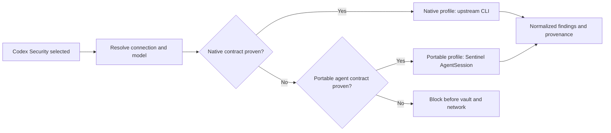

# Provider-Agnostic Codex Security Design

**Date:** 2026-08-11

**Status:** Approved in conversation; written specification pending user review

**Scope:** Let the existing Codex Security scanner card run with every configured provider/model that proves the required capabilities, without mislabeling a Sentinel-owned runtime as the upstream CLI.

## Problem

The product currently treats “Codex Security methodology” and “the `@openai/codex-security` runtime” as the same thing. That works for native OpenAI routes, but it fails for gateways whose APIs do not implement Codex-specific Responses items such as `agent_message`.

The failed MiMo run demonstrated the boundary precisely: authentication and preflight succeeded, but the gateway rejected `agent_message` during the real multi-agent scan. Merely accepting an API key, listing a model, or completing a normal tool call is not proof that the upstream Codex Security runtime can use that provider.

The user requirement is broader: selecting the Codex Security scanner must not force an OpenAI account. MiMo, MiniMax, Gemini, DeepSeek, xAI, Anthropic, OpenRouter, and custom OpenAI/Anthropic-compatible connections must be usable when the selected model passes a real capability probe.

## Decision

The single **Codex Security** scanner card will support two explicit execution profiles:

1. **Native** — executes the real `@openai/codex-security` package when the connection/model tuple is supported and proven for that runtime.
2. **Portable** — executes a Sentinel-owned, versioned implementation of the reviewed Codex Security methodology through the existing constrained `AgentSession` runtime.

The product will never translate Chat Completions or Anthropic Messages into fake Codex multi-agent events. A universal protocol proxy would need to recreate threads, delegation, `agent_message`, tool results, streaming, cancellation, accounting, and runtime preflight. That is a second Codex runtime disguised as an adapter and is explicitly out of scope.



## Product Behavior

### Scanner selection

The scanner remains `codex-security` in the main scanner selector. A new profile value is resolved server-side:

```ts
type CodexSecurityExecutionProfile = "native" | "portable";
type CodexSecurityProfilePreference = "auto" | CodexSecurityExecutionProfile;
```

The default preference is `auto`:

- Prefer `native` only when the exact native driver and its capability evidence are available.
- Otherwise choose `portable` when the selected model has a fresh, complete AgentSession capability report.
- Otherwise mark the selection ineligible before reading credentials or starting a child process.

When both profiles are eligible, the initial release still uses `auto`; the confirmation panel states the resolved profile. The resolved profile, not the preference, is persisted for reproducibility. A manual profile selector is deferred until real usage demonstrates a need for comparing both profiles with the same provider/model.

### User-visible identity

The UI must never imply that Portable is byte-for-byte upstream execution.

- Confirmation: `Codex Security · Native` or `Codex Security · Portable`.
- Run detail: profile, runtime version, methodology reference, model, connection, protocol, and capability-check ID.
- Report: same provenance fields in machine-readable and rendered output.
- Comparator: runs with different profiles remain comparable, but the profile difference is visible and included in the comparison recipe identity.

### No silent fallback

Profile resolution happens before credentials, network calls, or child-process launch. Once a scan starts, it never silently switches profiles. If Native fails after execution begins, the run fails with its telemetry and cost preserved; the UI may offer an explicit retry using Portable when that profile is eligible.

This prevents duplicate spend, mixed methodologies, and misleading results.

## Compatibility Model

Eligibility is capability-based. Provider and model names are metadata, not proof.

### Native profile

The first-class native drivers are:

- OpenAI API.
- Local Codex/ChatGPT authenticated sessions.
- OpenRouter using the upstream Codex Security provider contract.
- Fireworks using the upstream Codex Security provider contract.
- Amazon Bedrock using the upstream Codex Security provider contract.

OpenRouter, Fireworks, and Bedrock require explicit drivers and credential handling; they are not enabled merely because their names match. Custom Responses providers may become Native only after a Codex-specific probe proves the full upstream contract, including multi-agent event semantics. Ordinary `/models`, Chat Completions, Responses, or tool-call success is insufficient.

### Portable profile

Portable accepts a connection/model only when the current capability report proves all of the following:

- The model is still present in the latest live catalog for that connection.
- The connection route, transport, protocol, authentication kind, and model match the probed tuple exactly.
- The constrained agent loop completes a tool call and consumes the tool result.
- Snapshot list/read/search tools work within their pinned roots.
- The model writes the required artifact through `results.write`.
- The final structured result validates against the profile schema.
- Deadline, cancellation, output limits, and tool-call limits are enforced.
- The capability report is fresh and is the latest report for the tuple.

This profile can therefore use existing eligible routes for OpenAI Responses/Chat, OpenRouter, Gemini, DeepSeek, MiMo, MiniMax, xAI OAuth/API, Anthropic Messages, and custom OpenAI/Anthropic-compatible APIs. No provider gets an allow-by-brand exception.

## Portable Methodology

Portable uses a pinned, reviewed methodology derived from the bundled Codex Security skills, schemas, and report contract. It is implemented locally and versioned independently from the upstream package.

The runtime consists of six defensive stages:

1. **Inventory and trust boundaries** — map application surfaces, privileged components, data classes, and external boundaries.
2. **Sensitive inputs and operations** — enumerate attacker-controlled inputs, authorization decisions, dangerous operations, and security controls.
3. **Source-to-sink traces** — trace candidate paths through source, controls, transformations, and sinks with file/line anchors.
4. **Static falsification and deduplication** — try to disprove each candidate, remove unsupported duplicates, and retain rejection reasons in coverage.
5. **Severity calibration and attack paths** — assess prerequisites, impact, exploitability, chained paths, and confidence.
6. **Findings and coverage finalization** — emit schema-valid findings, verified evidence anchors, and coverage metadata for the Inspector.

`standard` mode runs one bounded session per stage. `deep` mode uses the same stages and tool surface but allows bounded partitioned discovery and independent validation sessions. Deep mode does not gain shell, browser, network, or arbitrary filesystem access.

### Tool boundary

Portable sessions receive only:

- `workspace.list`
- `workspace.read`
- `workspace.search`
- `results.write`

The repository snapshot is immutable and read-only. The result root is private and write-only through the constrained artifact host. Prompts explicitly treat repository contents and prior-stage state as untrusted data, not instructions.

### Evidence contract

Every emitted finding must include:

- stable finding ID and fingerprint inputs;
- title, severity, confidence, and category;
- concise summary and impact;
- at least one primary `path:line[-line]` evidence locator;
- source, control, and sink roles when applicable;
- remediation guidance;
- falsification/validation status;
- profile and methodology provenance.

Evidence paths are resolved against the pinned snapshot, must reference regular files inside it, and must point to existing bounded line ranges. Invalid evidence rejects the artifact instead of producing an empty Inspector.

## Components and Boundaries

### Shared contracts

Extend scan contracts with:

```ts
interface CodexSecurityProfileProvenance {
  executionProfile: "native" | "portable";
  profileVersion: string;
  methodologyRef: string;
  recipeHash: string;
  capabilityCheckId: string | null;
}
```

`StartScanRequest` accepts an optional `executionProfilePreference`, but the API derives and persists the resolved profile. Browser-provided provenance is ignored.

### Compatibility resolver

The resolver returns profile-aware eligibility:

```ts
interface CodexSecurityProfileResolution {
  eligible: boolean;
  selectedProfile: "native" | "portable" | null;
  availableProfiles: Array<"native" | "portable">;
  reasons: string[];
  capabilityCheckId: string | null;
}
```

It performs only metadata and capability checks. It does not read the vault or make provider calls.

### Native drivers

Each native driver owns exactly one upstream contract: tuple validation, sanitized child environment, CLI arguments/configuration, and capability evidence. The existing OpenAI drivers remain. OpenRouter, Fireworks, and Bedrock are separate drivers; credentials never enter run manifests or telemetry.

### Portable runner

The Portable implementation is isolated in focused files rather than added to Mantis or VulnHunter:

- runtime/progress and usage state;
- HTTP/xAI provider-plan resolution;
- six-stage worker;
- structured artifact validation and normalization;
- reconcile and ingestion.

It reuses the existing `AgentSession`, HTTP upstreams, snapshot protection, redaction registry, telemetry persistence, and evidence helpers. It does not refactor the established Mantis or VulnHunter runners in this delivery.

### Scanner launch

The launch plan contains identifiers and provenance only:

- scan ID;
- connection ID;
- route kind and protocol;
- model ID;
- resolved execution profile;
- capability-check ID;
- profile version and methodology reference;
- snapshot/source reference;
- mode and bounded limits.

Credentials are resolved in the worker only after the repository snapshot and complete tuple have been revalidated. Secrets stay in memory/child environment for the minimum required scope and remain registered with the redactor while in use.

## Persistence, Cost, and Telemetry

Each run freezes:

- resolved profile and profile version;
- methodology reference and recipe hash;
- connection, route, protocol, and model IDs;
- capability-check ID;
- provider-reported model metadata used at launch;
- pricing source, timestamp, currency, and per-token rates when available.

Token usage includes input, cached input, cache write, reasoning output when exposed, and output. Cost is labeled an estimate. Missing provider usage or pricing remains unavailable (`null`), never `0`.

Portable emits durable stage/progress events through the existing telemetry log. Leaving and reopening a completed or failed scan must preserve the same history.

## Error Handling

Errors are safe codes with actionable UI copy:

- `codex_native_contract_unavailable` — Native is not proven for this tuple; offer Portable when eligible.
- `codex_portable_capability_required` — run or refresh the model capability probe.
- `codex_portable_capability_stale` — the model/connection changed after its last probe.
- `codex_portable_stage_invalid` — a stage did not produce its required schema-valid artifact.
- `codex_portable_evidence_invalid` — an evidence anchor is outside the snapshot or invalid.
- existing vault, cancellation, deadline, and provider-unreachable codes remain authoritative.

Provider response bodies, API keys, OAuth tokens, custom headers, and private base URLs do not appear in errors, manifests, logs, SSE, or public DTOs.

## UI and Localization

The New Scan page remains connection-first and model-driven:

- scanner card: `Codex Security`;
- selected connection and model come from live catalogs;
- reasoning effort comes only from discovered/probed model metadata;
- confirmation shows `Native` or `Portable`, profile version, and why that profile was selected;
- an ineligible tuple shows its specific reason and a direct action to inspect/probe the connection;
- after a Native runtime compatibility failure, an explicit `Retry with Portable` action appears only if the server reports Portable eligible.

All new copy ships in English, German, French, Portuguese (Brazil), and the existing Spanish locale. Controls retain the current responsive frame, keyboard access, full selected borders, and narrow-screen containment.

## Security Invariants

1. Resolve compatibility and pin the repository snapshot before reading credentials.
2. Revalidate connection, model, protocol, capability-check ID, and snapshot immediately before every stage boundary that can spend tokens.
3. Never accept browser-supplied provider URLs, secrets, provenance, or capability claims as authoritative.
4. Never auto-fallback after execution begins.
5. Never expose a profile as Native unless it executes the upstream package through a proven native driver.
6. Never let Portable use shell, browser, network, arbitrary write, MCP, or dynamic tools.
7. Preserve cancellation and total deadline across preflight, credential resolution, every provider request, tool execution, and cleanup.
8. Keep usage unknown when the provider does not report it.

## Testing Strategy

### Contract tests

- Native driver matrix covers exact provider/route/transport/protocol/auth tuples.
- Every visible connection preset is tested against Portable compatibility.
- Unknown/custom routes remain blocked until a fresh complete probe exists.
- Browser-stale or forged profile/capability IDs are rejected before vault access.

### Portable runner tests

- Six stages execute in order with bounded state transfer.
- Standard and Deep limits are deterministic.
- Malicious repository text and prior-stage output remain inert data.
- Missing/malformed artifacts fail the run.
- Traversal, symlink, nonexistent path, invalid line range, and oversized evidence are rejected.
- Cancellation/deadline remains authoritative when upstream or credential resolution ignores `AbortSignal`.
- API keys and OAuth tokens never appear in configuration, logs, telemetry, errors, or findings.
- Usage and pricing snapshot are aggregated without converting unknown values to zero.

### Integration tests

- Fake OpenAI Responses, OpenAI Chat, Anthropic Messages, xAI OAuth, MiMo, MiniMax, Gemini, DeepSeek, OpenRouter, and custom routes can complete Portable when their probes are valid.
- A real-shape `agent_message` rejection cannot enter Native and receives a Portable retry suggestion when eligible.
- Native and Portable outputs both populate the existing Inspector and comparator with provenance.

### Web tests and visual QA

- Profile state and reason copy render for eligible, blocked, running, failed, and completed scans.
- Reasoning-effort controls remain fully dynamic for zero, one, many, and long provider values.
- Keyboard and screen-reader names identify the resolved profile.
- Visual checks cover 390x844, 817x900, and 1440x1000 without page-level horizontal overflow, clipped controls, or open borders.

## Rollout

1. Land profile/provenance contracts and compatibility resolution with all Portable launches still disabled.
2. Land the Portable runner behind the server-resolved capability gate.
3. Connect launch, persistence, Inspector, report, cost, and retry behavior.
4. Connect the localized New Scan UI and run visual QA.
5. Add official OpenRouter, Fireworks, and Bedrock native drivers independently; Portable remains available for their non-native model/protocol combinations.
6. Keep the previous MiMo Native route blocked. MiMo becomes available through Portable once its model has a fresh complete AgentSession probe.

No step silently migrates or reruns historical scans. Existing runs retain their previous recipe identity and provenance.

## Non-Goals

- Building a universal Responses/Chat/Anthropic translation proxy.
- Claiming Portable is the upstream `@openai/codex-security` runtime.
- Hardcoding model IDs, reasoning efforts, context windows, or capability claims.
- Calling real customer provider accounts during automated tests.
- Refactoring Mantis and VulnHunter into a new shared framework in this delivery.
- Adding billing or treating estimated provider cost as an invoice.

## Acceptance Criteria

The feature is complete when:

1. A capability-proven MiMo, MiniMax, Gemini, DeepSeek, xAI, Anthropic, OpenRouter, or custom connection can start and complete `Codex Security · Portable` without an OpenAI credential.
2. Supported native connections execute `Codex Security · Native` through the real upstream package.
3. Unsupported Native tuples are blocked before vault/network and can explicitly retry Portable only when eligible.
4. The Inspector, telemetry, report, comparator, usage, and cost pipelines work for both profiles.
5. Every run visibly and durably records its resolved profile and methodology provenance.
6. No model, reasoning effort, or provider capability is inferred from its name.
7. API/shared/web typechecks, focused tests, full test suites, production build, and responsive visual QA pass under the repository-declared Node 24 runtime.

## References

- [Codex Security CLI runtime configuration](https://learn.chatgpt.com/docs/security/cli/reference#configure-the-runtime)
- [Codex Security with OpenRouter or Fireworks](https://learn.chatgpt.com/docs/security/cli/reference#use-openrouter-or-fireworks)
- [OpenRouter Responses API](https://openrouter.ai/docs/api_reference/responses/overview)
- [MiMo Responses API](https://mimo.mi.com/docs/en-US/api/chat/responses)
- [MiniMax Token Plan integrations](https://platform.minimax.io/docs/token-plan/other-tools)
- [Gemini OpenAI compatibility](https://ai.google.dev/gemini-api/docs/openai)
- [DeepSeek Responses API](https://api-docs.deepseek.com/api/create-response)
- [Anthropic Messages API](https://platform.claude.com/docs/en/api/messages)
