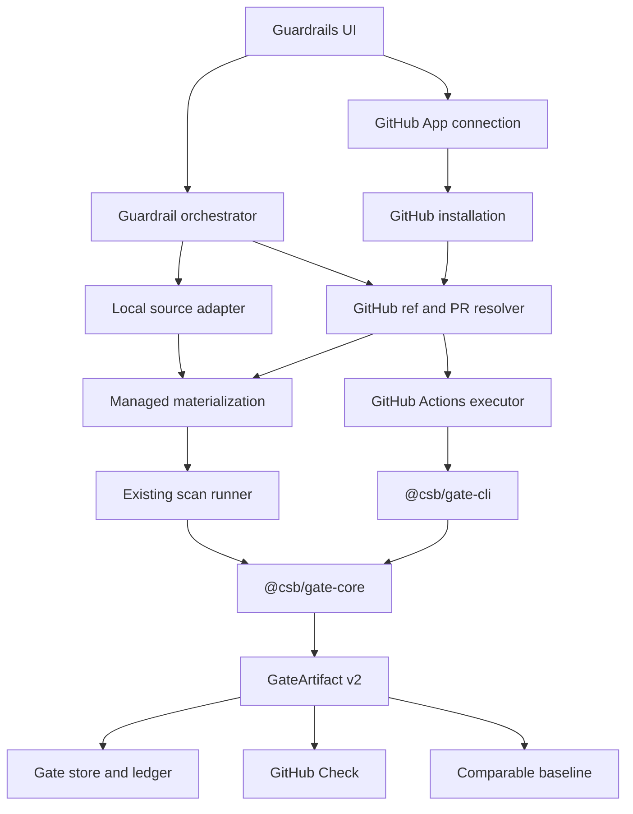
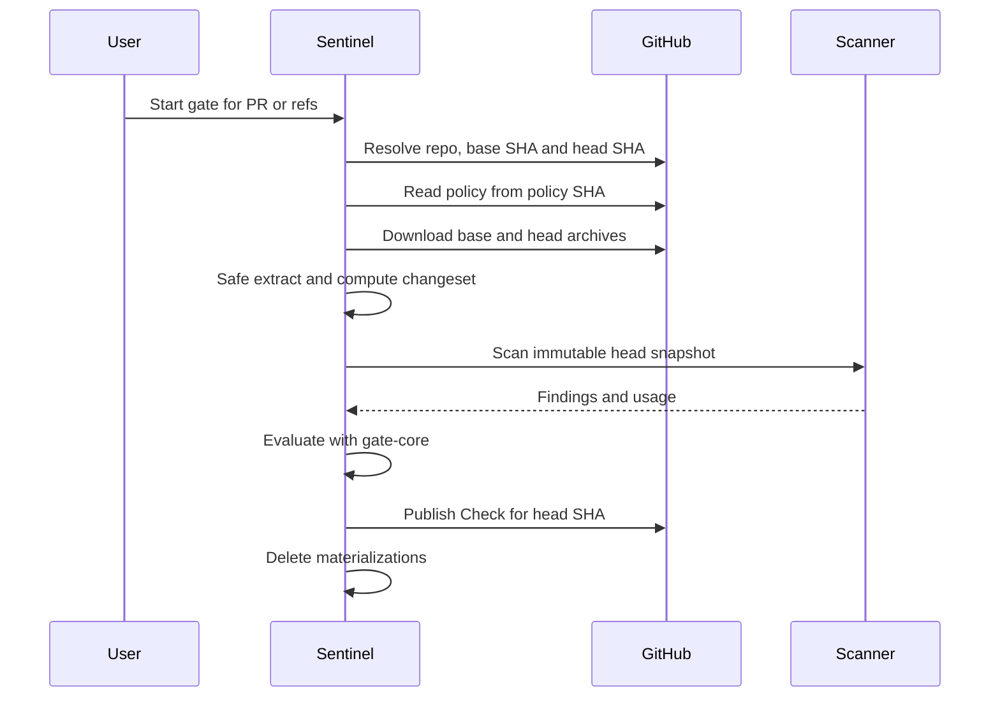

# Guardrails remotos com GitHub App

**Status:** aguardando revisão do documento

**Data:** 2026-08-12

**Produto:** Okami Sentinel

**Direção:** repositórios locais e GitHub remotos, com execução gerenciada no Sentinel ou no GitHub Actions

## Relação com o desenho anterior

Este documento estende e substitui as partes conflitantes de
`2026-08-07-security-change-gate-design.md`.

As seguintes premissas antigas deixam de valer:

- um `GuardrailRepository` não precisa possuir uma pasta local permanente;
- `gh` CLI não é mais a identidade oficial da integração GitHub;
- GitHub Actions não é o único executor remoto;
- policy e exceções não podem ser lidas do `head` que está sendo fiscalizado;
- um gate não pode declarar um SHA e escanear outro conteúdo;
- baseline ausente ou incompatível nunca pode resultar em aprovação normal.

O `@csb/gate-core`, o contrato de decisão e a visão Portfolio Pipeline continuam
sendo compartilhados por todos os executores.

## Problema

Guardrails hoje cadastra somente uma pasta Git local. O backend executa
`git rev-parse`, lê `.csb` do filesystem e entrega `repositoryPath` ao scanner.
GitHub já aparece no produto, mas apenas como complemento para baseline,
workflow e publicação de Check.

Esse desenho falha para uma pessoa que possui apenas acesso remoto a
`https://github.com/owner/repository`. Também cria três problemas de integridade:

1. o diff pode ser resolvido para um SHA enquanto o scanner lê outro estado da
   pasta local;
2. um pull request pode tentar alterar a policy que avalia o próprio pull
   request;
3. o workflow atual pode operar sem baseline efetiva e cair em
   `bootstrap/neutral` sem deixar a limitação suficientemente explícita.

Adicionar somente um campo de URL à tela não resolve nenhum desses problemas.
O produto precisa separar identidade do repositório, materialização do código,
executor do scan e autoridade da policy.

## Objetivos

- Cadastrar um repositório privado do GitHub sem checkout permanente no Mac.
- Usar GitHub App como identidade oficial, limitada aos repositórios instalados.
- Manter o modo local existente.
- Oferecer dois executores para uma origem GitHub:
  - snapshot efêmero analisado pelo Sentinel;
  - GitHub Actions no repositório protegido.
- Resolver base, head e policy para SHAs imutáveis antes de consumir custo.
- Executar o mesmo `@csb/gate-core` e produzir o mesmo schema de artifact nos
  dois executores.
- Publicar o Check somente depois de validar integralmente o artifact.
- Apagar snapshots gerenciados em sucesso, erro, cancelamento e recuperação
  após restart.
- Preservar baseline e lifecycle apenas entre execuções comparáveis.
- Nascer com UX responsiva e traduções completas em EN, PT-BR, ES, DE e FR.

## Não objetivos

- GitLab, Bitbucket ou Azure Repos.
- GitHub Enterprise Server ou GitHub Apps enterprise-owned na primeira entrega.
- Um serviço hospedado obrigatório da Okami.
- Webhook público obrigatório para o app desktop.
- Executar build, testes, package scripts ou código do repositório analisado.
- Resolver conteúdo de submódulos ou baixar objetos Git LFS automaticamente.
- Alterar policy, criar commit ou abrir pull request automaticamente.
- Incorporar a conexão GitHub à lista de conexões de modelos de IA.
- Usar PAT clássico ou OAuth amplo como identidade oficial.
- Prometer equivalência de findings quando os dois executores usam engines,
  modelos ou profiles diferentes.

## Decisões aprovadas

### Dois executores desde a primeira entrega

Uma origem GitHub aceita:

- `sentinel-managed`: o Sentinel baixa snapshots por SHA, executa o scanner e
  remove a materialização;
- `github-actions`: um workflow versionado executa o scanner no GitHub e entrega
  um artifact para validação e importação.

Os executores não possuem regras próprias. Policy, lifecycle, avaliação,
baseline, decisão e schema final pertencem ao núcleo compartilhado.

### GitHub App oficial

O produto usa GitHub App installation tokens. `gh` continua disponível apenas
como adapter de conveniência para um workspace local já autenticado.

Para manter o produto local-first sem distribuir uma chave privada global, a
primeira versão usa o **GitHub App Manifest flow**:

1. o Sentinel inicia um fluxo com state de uso único;
2. o navegador abre o registro preconfigurado no GitHub;
3. o GitHub retorna um code temporário ao callback loopback;
4. a API troca o code por App ID e chave PEM;
5. a chave PEM é armazenada no vault local e nunca no SQLite;
6. o usuário instala o App somente nos repositórios desejados.

O produto não confia em `installation_id` recebido por redirect. Ele lista e
valida instalações e repositórios usando autenticação do próprio App.

### Policy da base protegida

Em pull requests e comparações, a fonte autoritativa é o commit base resolvido.
O `head` analisado nunca controla a policy nem as exceções aplicadas a si mesmo.

- PR: policy e exceções vêm de `baseSha`.
- Comparação manual: vêm de `baseSha`.
- Gate de baseline na branch protegida: vêm do próprio `headSha` protegido.
- Arquivos ausentes: aplica-se a policy padrão e o artifact registra
  `policySource: default`.
- JSON inválido ou schema futuro: `error/action_required`; não há fallback
  silencioso.

### SHAs antes de materialização

Branches e tags servem somente como entrada humana. Antes do gate começar, o
backend resolve e congela:

- `baseSha`;
- `headSha`;
- `policySha`;
- número do PR, quando existir;
- identidade numérica do repositório e da instalação.

Uma branch mudar depois disso não altera o conteúdo analisado.

### Sem webhook obrigatório no desktop

Na primeira entrega:

- execução gerenciada é iniciada pelo usuário no Sentinel;
- execução automática em PR usa o workflow do GitHub Actions;
- o Sentinel também pode disparar manualmente esse workflow pela API;
- webhooks do GitHub App ficam fora do escopo.

Isso evita transformar uma aplicação local em um serviço público apenas para
receber eventos. Um deployment servidor pode ganhar webhooks em uma spec futura.

## Arquitetura



### Boundaries

#### `RepositorySourceAdapter`

Responsável por identidade e resolução de refs. Não executa scanner nem avalia
policy.

```ts
type RepositoryLocator =
  | {
      kind: "local";
      repositoryPath: string;
    }
  | {
      kind: "github";
      connectionId: string;
      installationId: string;
      repositoryId: string;
      owner: string;
      name: string;
    };
```

Uma URL GitHub é somente entrada de cadastro. A API normaliza `owner/name` e
confirma que o `repositoryId` aparece na instalação selecionada. URLs fora de
`github.com` são rejeitadas na primeira versão.

#### `RefResolver`

Recebe um alvo humano e retorna um alvo congelado:

```ts
type GateTarget =
  | { kind: "pull_request"; number: number }
  | { kind: "compare"; baseRef: string; headRef: string }
  | { kind: "protected_branch"; ref: string };

interface ResolvedGateTarget {
  baseRef: string;
  headRef: string;
  baseSha: string;
  headSha: string;
  policySha: string;
  pullRequestNumber: number | null;
}
```

Para PRs, `head.sha` e `base.sha` são usados diretamente. O merge commit de
teste do GitHub não vira a identidade da análise.

#### `SnapshotMaterializer`

Produz uma pasta somente leitura dentro de uma raiz gerenciada. Para GitHub, o
materializador baixa archives da base e do head usando commit IDs completos.
Para Git local com refs commitadas, usa snapshots derivados dos mesmos SHAs.

O materializador:

- nunca coloca token na URL persistida ou nos logs;
- segue redirects somente para hosts permitidos pelo adapter GitHub;
- rejeita path absoluto, `..`, device nodes e hardlinks perigosos;
- impede travessia de symlink durante leitura;
- limita archive comprimido a 512 MiB;
- limita conteúdo extraído a 2 GiB;
- limita a 500.000 entradas;
- limita arquivo individual extraído a 128 MiB;
- calcula uma identidade canônica do conteúdo extraído;
- registra uma lease atômica vinculada ao `gateId`;
- remove base e head em `finally`.

Symlinks internos podem permanecer como metadado, mas scanners continuam sem
segui-los. Submódulos e pointers de LFS são declarados no coverage envelope;
uma policy que exija cobertura completa termina em `action_required`.

#### `ChangeSetResolver`

O modo GitHub gerenciado compara as duas árvores materializadas. Isso evita os
limites de paginação de PR files/Compare como fonte de verdade.

- arquivos iguais por path e hash são ignorados;
- path novo é `added`;
- path ausente no head é `deleted`;
- hash diferente é `modified`;
- rename pode ser representado conservadoramente como delete + add;
- limites de paths e fallback continuam sendo aplicados pela policy.

APIs de PR files e Compare podem enriquecer a apresentação, mas nunca podem
converter um diff parcial em aprovação.

#### `GateExecutor`

```ts
type GateExecutorKind = "sentinel-managed" | "github-actions";
```

O executor recebe apenas identidade congelada, policy validada e plano de scan.
Ele retorna uso, status do scanner e findings normalizados. Não avalia decisão.

#### `ArtifactValidator`

Artifacts locais e vindos do Actions passam pela mesma validação antes de entrar
no store. A validação confirma:

- schema suportado;
- `gateId`, repository ID, base SHA, head SHA e policy SHA esperados;
- executor declarado;
- lineage do scanner;
- findings e evidências válidos;
- ausência de paths de host, tokens e campos desconhecidos;
- digest do artifact quando fornecido pelo GitHub Actions.

## Fluxo gerenciado pelo Sentinel



O scan usa a conexão, engine, modelo, effort, mode e teto de custo escolhidos no
Sentinel. O teto continua sendo uma estimativa reativa: impede a próxima chamada
depois do uso observado, mas uma chamada em voo pode ultrapassá-lo.

## Fluxo GitHub Actions

O caller workflow é instalado manualmente e versionado no repositório. Ele
aceita `pull_request`, `push` na branch protegida e `workflow_dispatch`.

1. O workflow resolve e fixa base/head.
2. Policy e exceções são obtidas da base protegida em diretório separado.
3. O checkout do head usa o SHA exato.
4. Nenhum build, teste, package manager ou script do repositório é executado.
5. O CLI executa o scanner e produz `GateArtifact v2`.
6. O CLI valida integralmente o artifact antes de devolvê-lo ao workflow.
7. O workflow publica o Check no head SHA e envia o artifact com digest, gate ID
   e head SHA.
8. Quando estiver disponível, o Sentinel baixa e valida novamente o artifact
   antes de importá-lo para o ledger local.

Para execução manual iniciada no Sentinel, a GitHub App usa workflow dispatch e
persiste o `workflowRunId`. A permissão exigida é Actions write. Para leitura do
resultado e baseline, Actions read. Em execução automática iniciada pelo próprio
GitHub, o workflow continua autônomo mesmo com o Sentinel offline; o ledger local
reconcilia esses runs posteriormente pelo workflow run ID e pelo artifact.

O dono da publicação é explícito: `sentinel-managed` publica pelo GitHub App e
`github-actions` publica pelo `GITHUB_TOKEN` do job. Nunca existem dois
publicadores concorrentes para o mesmo gate.

O workflow usa `pull_request`, nunca `pull_request_target`, para analisar código
não confiável. PR de fork sem acesso ao secret do scanner termina em
`action_required`; não há retry privilegiado que faça checkout do fork com
secrets da base.

Todas as actions externas e o reusable workflow são fixados por commit SHA
completo. Tags móveis como `@v1` não são aceitas no contrato de produção.

## Plano de scan e comparabilidade

A policy continua declarando intenção:

```ts
interface GuardrailScanIntent {
  engine: string;
  model: string;
  effort: string;
  mode: "standard" | "deep";
  maxCostUsd: number;
}
```

Cada executor resolve essa intenção para um plano efetivo e o congela no
artifact:

- engine e versão;
- connection route e protocol;
- provider e model;
- reasoning effort enviado ou provider-default;
- methodology/profile/recipe hash;
- source revision canônica;
- pricing quote, quando houver.

O modo Actions só aparece como pronto quando o workflow consegue materializar a
mesma intenção com secrets nomeados. A UI verifica nomes e capacidades, nunca o
valor dos secrets.

Dois gates compartilham baseline e lifecycle somente quando:

- repository ID e protected branch são iguais;
- lineage efetiva do scanner é compatível;
- policy schema e metodologia são compatíveis;
- ambos possuem revisão canônica conhecida;
- a baseline terminou com artifact válido.

Executor diferente não invalida comparabilidade por si só. Lineage diferente,
sim. Resultado ausente em lineage incompatível nunca vira `fixed`.

## Policy e exceções

Os arquivos continuam versionados:

- `.csb/guardrails.json`;
- `.csb/guardrails-exceptions.json`.

No modo GitHub, o editor é inicialmente somente leitura. Ele mostra a policy da
branch protegida e oferece copiar ou baixar a proposta JSON. Não solicita
Contents write e não faz commit remoto.

No modo local, a escrita segura no workspace continua disponível após preview e
confirmação. Commit e push permanecem sob controle do usuário.

`protectedBranches` passa a ser aplicado de verdade:

- PR é avaliado contra a branch base protegida correspondente;
- push/manual fora das branches protegidas pode executar preflight, mas não
  publicar conclusão bloqueante;
- tentativa de usar policy de branch não protegida fica explícita no artifact.

## GitHub App connection

A conexão GitHub é um domínio SCM separado das conexões de inferência. Ela
aparece em Guardrails Setup, não em Settings > Connections.

### Permissões

- Metadata: read;
- Contents: read;
- Pull requests: read;
- Checks: write;
- Actions: read e write.

Contents write e Workflows write não são solicitados. Por isso a instalação do
caller workflow continua sendo uma ação manual e revisável.

### Segredos

SQLite guarda somente:

- `connectionId`;
- App ID e slug;
- owner da App;
- timestamps e estado;
- installations e repositories selecionados.

O vault guarda a chave PEM. Client secret e webhook secret não são preservados
quando webhooks e user authorization não estiverem habilitados. Tokens de
instalação são curtos, ficam apenas em memória e podem ser cacheados até perto da
expiração; nunca entram em logs, eventos SSE ou artifacts.

### Revogação

Se uma instalação, repositório ou permissão for removida:

- novos gates ficam bloqueados antes da materialização;
- gates em curso param antes da próxima operação GitHub;
- artifacts locais já completos permanecem auditáveis;
- publicação recebe estado `action_required` sem alterar a decisão local.

## Contratos de domínio

### `GuardrailRepository`

```ts
interface GuardrailRepository {
  repositoryKey: string;
  source: "local" | "github";
  repositoryPath: string | null;
  githubConnectionId: string | null;
  githubInstallationId: string | null;
  githubRepositoryId: string | null;
  remoteOwner: string | null;
  remoteName: string | null;
  displayName: string;
  defaultBranch: string;
  defaultExecutor: GateExecutorKind;
  enabled: boolean;
  policyPath: ".csb/guardrails.json";
  lastGateId: string | null;
  githubStatus: RepositoryGitHubStatus;
}
```

Invariantes:

- `local` exige `repositoryPath` e não exige IDs GitHub;
- `github` exige connection/installation/repository/owner/name e não aceita
  `repositoryPath` persistido;
- `repositoryKey` remoto usa o repository ID estável, não apenas slug mutável.

### `GateRun`

Campos adicionados:

- `executor`;
- `resolvedBaseSha`;
- `resolvedHeadSha`;
- `policySha`;
- `workflowRunId`;
- `materializationState` resumido, sem path;
- `scanLineageHash`;
- `artifactSchemaVersion`.

`repositoryPath` torna-se nullable para runs GitHub históricos. O path efêmero
nunca é persistido no contrato público.

### `GateArtifact v2`

O schema v2 adiciona obrigatoriamente:

- repository ID e locator sanitizado;
- source e executor;
- refs humanas e SHAs resolvidos;
- policy source e policy SHA;
- lineage efetiva do scanner;
- coverage envelope;
- referência opcional ao workflow run;
- identidade canônica do snapshot;
- versão do materializer.

Artifacts v1 continuam renderizáveis como histórico. Eles não são baseline
remota elegível para v2 sem uma migração explícita e verificável.

## API

### GitHub App

- `POST /guardrails/github-app/manifest/start`
- `GET /guardrails/github-app/manifest/flows/:flowId`
- `GET /guardrails/github-app/manifest/callback`
- `GET /guardrails/github-app/connections`
- `DELETE /guardrails/github-app/connections/:connectionId`
- `GET /guardrails/github-app/connections/:connectionId/installations`
- `GET /guardrails/github-app/installations/:installationId/repositories`

O start retorna uma URL e um flow ID, nunca state ou segredo bruto. O callback
valida state de uso único e marca o flow. A UI faz polling do estado fechado:
`pending | completed | expired | denied | failed`.

### Repositórios

`POST /guardrails/repositories` recebe um body discriminado:

```ts
type EnrollGuardrailRepositoryRequest =
  | {
      source: "local";
      repositoryPath: string;
      displayName?: string;
    }
  | {
      source: "github";
      connectionId: string;
      installationId: string;
      repositoryId: string;
      defaultExecutor: GateExecutorKind;
      displayName?: string;
    };
```

O backend deriva owner, name e default branch. O frontend não é autoridade para
esses campos.

### Gates

`POST /guardrails/gates` recebe:

```ts
interface StartGateRequest {
  repositoryKey: string;
  executor?: GateExecutorKind;
  target: GateTarget;
}
```

O executor opcional permite override por run; ausente usa o default do
repositório. Local não aceita `github-actions` sem remoto GitHub pronto.

Endpoints existentes de leitura, eventos, cancelamento, artifact e publicação
permanecem compatíveis.

### Actions setup

- `GET /guardrails/repositories/:repositoryKey/actions-status`
- `GET /guardrails/repositories/:repositoryKey/caller-workflow`
- `POST /guardrails/repositories/:repositoryKey/actions-dispatch`

`caller-workflow` devolve conteúdo e path esperados para download/cópia. Não
escreve no GitHub.

## Persistência e migração

SQLite recebe uma migração versionada. Novas tabelas e colunas são aditivas, mas
`guardrail_repositories` e `gate_runs` precisam ser reconstruídas dentro de uma
transação para tornar `repository_path` nullable sem perder os registros atuais:

- `github_app_connections` sem segredos;
- `github_installations`;
- `github_installation_repositories`;
- novas colunas de source/executor/IDs no enrollment;
- novas colunas de SHAs, workflow e lineage no gate run;
- `materialization_leases` para cleanup recuperável;
- cache de artifacts Actions validado por digest.

Migração dos registros atuais:

- enrollment com path vira `source=local`;
- repositoryPath permanece inalterado;
- gates existentes mantêm `source=local` e artifact v1;
- remotos derivados de `remote.origin` não são convertidos automaticamente;
- vincular um enrollment local a uma instalação GitHub é uma ação explícita.

## Experiência da tela

### Adicionar repositório protegido

“Cadastrar repositório” vira “Adicionar repositório protegido”. A sheet começa
com um radiogroup:

- `Workspace local`;
- `GitHub remoto`.

Local revela o browser de diretórios existente. GitHub revela:

1. conexão GitHub App;
2. instalação;
3. repositório autorizado;
4. executor padrão;
5. branch protegida detectada;
6. capability preflight.

A sheet possui scroll interno e CTA sticky no mobile; o browser de 256 px não
pode empurrar ações para fora da viewport.

### Portfolio Pipeline

Cada lane mostra badges textuais:

- `LOCAL` ou `GITHUB`;
- `MANAGED` ou `ACTIONS`;
- branch/PR;
- policy SHA curta;
- baseline;
- engine/model/effort;
- custo e estado de publicação.

Origem e executor nunca dependem somente de cor.

### Executar gate

Local mantém refs e ganha um modo explícito de workspace quando houver conteúdo
não commitado. Um gate de workspace registra uma revisão `content:` e não finge
possuir um commit SHA nem publica Check remoto.

GitHub oferece:

- selecionar pull request; ou
- comparar duas refs remotas.

O formulário não usa `HEAD`. Antes da confirmação, mostra os SHAs resolvidos,
executor, policy source, scan plan, teto de custo e readiness.

### Setup

Setup separa três coisas que hoje aparecem misturadas:

1. origem do repositório;
2. conexão GitHub App;
3. credencial/rota do scanner.

O usuário vê uma capability trace por executor. “GitHub pronto” só aparece
quando as permissões realmente necessárias ao modo selecionado estiverem
presentes.

### Policy Editor

- local: editar, mostrar diff e salvar no workspace;
- GitHub: visualizar a policy efetiva da branch protegida e baixar/copiar uma
  proposta;
- ambos: simular contra artifact existente sem escrita.

### Idiomas e acessibilidade

Todo texto novo e todo texto hard-coded tocado por esta entrega migram para o
i18n de cinco idiomas. QA obrigatório em 390 px, 1024 px e 1600 px.

Seletores usam labels, radiogroup semântico, foco visível e descrição de impacto.
Erros de capability apontam o bloqueio exato e não usam uma mensagem genérica.

## Estados e falhas

Novos códigos fechados:

- `github_app_connection_required`;
- `github_installation_unavailable`;
- `github_repository_access_revoked`;
- `github_permission_missing`;
- `github_ref_not_found`;
- `github_archive_unavailable`;
- `github_archive_unsafe`;
- `github_snapshot_limit`;
- `policy_invalid`;
- `policy_source_unavailable`;
- `actions_workflow_missing`;
- `actions_secret_missing`;
- `actions_dispatch_failed`;
- `actions_artifact_invalid`;
- `actions_artifact_mismatch`;
- `baseline_incompatible`;
- `materialization_cleanup_failed`.

Mensagens persistidas são sanitizadas e não incluem token, PEM, redirect URL
temporária, path absoluto do host ou payload bruto do provider.

### Recuperação

- Materialização falha antes do scan: gate termina `error/action_required`.
- API reinicia durante managed: scan recuperável continua; lease órfã sem scan
  ativo é apagada pelo reconciliador.
- API reinicia durante Actions: `workflowRunId` permite retomar polling.
- Artifact Actions chega após cancelamento: é validado para auditoria, mas não
  altera o gate cancelado nem publica Check.
- Cleanup falha: resultado não some, mas o gate recebe alerta operacional e a
  lease entra na fila de limpeza; nunca vira lixo invisível.

## Segurança

- PEM somente no vault; nunca em SQLite, frontend ou log.
- Installation token limitado ao repository ID e permissões necessárias.
- Token revogado ou descartado ao final quando não houver reutilização segura.
- Redirects de archive privados tratados como credenciais transitórias.
- Archive extraído somente sob raiz criada pelo Sentinel.
- Nenhum arquivo do repositório é executado.
- Policy do head não governa o próprio gate.
- Checks publicados no `headSha` congelado.
- Workflow de PR usa token mínimo e não recebe secrets de fork não confiável.
- Artifacts externos são não confiáveis até passar schema, identidade e digest.
- API local continua bindada em loopback por padrão.
- GitHub App connection não reutiliza o contrato de conexões de IA.

## Baseline e lifecycle

Uma baseline elegível precisa:

- ser `GateArtifact v2` válido;
- pertencer ao mesmo repository ID e branch protegida;
- representar o commit real dessa branch;
- ter execução terminal sem erro;
- ter lineage comparável;
- possuir source revision canônica;
- não estar cancelada nem parcial.

Sem baseline elegível:

- outcome é `bootstrap`;
- GitHub conclusion é `neutral`;
- nenhum finding é chamado de regressão ou fixed;
- a UI oferece estabelecer baseline na branch protegida.

Artifact expirado, inacessível ou incompatível não vira “sem vulnerabilidades”.
Ele produz estado fechado e explicável.

## Testes

### Contratos e migração

- parse dos locators local/GitHub;
- invariantes de campos mutuamente exclusivos;
- migração de enrollment e GateRun existentes;
- round-trip de GateArtifact v2;
- artifact v1 somente histórico;
- baseline por lineage compatível.

### GitHub App

- manifest state de uso único, expiração, deny e replay;
- PEM gravada somente no vault;
- installation ID de redirect não confiável;
- seleção de repository ID permitido;
- token limitado ao repositório e permissões;
- revogação durante gate;
- nenhum segredo em resposta, evento ou log.

### Materialização

- archive base/head por SHA;
- branch muda depois da resolução sem afetar o scan;
- traversal, symlink escape, hardlink, device e archive bomb;
- caps de bytes, arquivos e entries;
- diff completo e fallback;
- cleanup em sucesso, erro, cancelamento e restart;
- scanner recebe exclusivamente o head snapshot esperado.

### Orquestração

- managed e Actions chamam o mesmo gate core;
- policy sempre vem da base;
- PR que altera `.csb` não relaxa sua decisão;
- `protectedBranches` é aplicado;
- custo/usage preservado;
- erro operacional nunca publica pass;
- conteúdo local dirty recebe revisão `content:`, não SHA falso.

### GitHub Actions

- workflow pinado por SHA;
- checkout do head exato e policy da base;
- baseline entregue ao CLI;
- fork sem secret retorna action_required;
- dispatch persiste workflow run ID;
- artifact inválido, trocado ou de SHA errado é rejeitado;
- restart retoma polling;
- nenhum `pull_request_target`.

### Frontend

- escolha Local/GitHub muda somente os campos aplicáveis;
- URL remota normaliza e seleciona repo autorizado;
- executor indisponível não pode ser confirmado;
- PR/ref preview mostra SHAs e policy source;
- pipeline mostra origem e executor;
- policy GitHub não oferece escrita enganosa;
- cinco idiomas sem texto PT-BR hard-coded;
- teclado, foco, contraste e leitores de tela.

### Visual QA

- 390 px, 1024 px e 1600 px;
- sheet com teclado mobile e CTA acessível;
- sem sobreposição, corte ou overflow;
- repository names, SHAs e erros longos quebram corretamente;
- estados READY, BLOCKED, BOOTSTRAP e ACTION REQUIRED distinguíveis sem cor;
- console sem erros do produto.

## Critérios de aceite

- Cadastrar repositório privado usando somente GitHub App, sem pasta permanente.
- Executar um PR por managed e por Actions.
- Os dois modos usam os mesmos repository/base/head/policy SHAs.
- Com a mesma lineage e os mesmos findings de fixture, produzem a mesma decisão.
- Mover a branch depois do start não muda o conteúdo analisado.
- Alterar policy no PR não relaxa o gate desse PR.
- Managed não deixa snapshots após sucesso, falha, cancelamento ou restart.
- Actions não executa código do repositório além do scanner que o lê como dado.
- Check é publicado no head SHA correto.
- Baseline ausente retorna bootstrap/neutral.
- Lineage incompatível não produz fixed.
- Diff parcial ou coverage incompleta não produz pass.
- Repositório local existente continua funcionando.
- A tela funciona nos cinco idiomas e nos três breakpoints de QA.

## Sequência de implementação

1. Contratos v2, migrações e baseline comparável.
2. GitHub App Manifest flow, vault e seleção de instalações/repositórios.
3. Ref resolver, policy authority e materializador seguro.
4. Executor managed e cleanup recuperável.
5. Workflow/CLI v2, dispatch, polling e importação de artifact.
6. UI de enrollment, preflight, capability trace e policy read-only remota.
7. Checks, recuperação, i18n e visual QA transversal.

Cada etapa termina com testes determinísticos. A feature só é considerada pronta
quando managed e Actions passam pelos critérios de aceite reais.

## Referências oficiais do GitHub

- [GitHub App installation authentication](https://docs.github.com/en/apps/creating-github-apps/authenticating-with-a-github-app/authenticating-as-a-github-app-installation)
- [Installation tokens, repository scope and one-hour expiry](https://docs.github.com/en/apps/creating-github-apps/authenticating-with-a-github-app/generating-an-installation-access-token-for-a-github-app)
- [Registering a GitHub App from a manifest](https://docs.github.com/en/apps/sharing-github-apps/registering-a-github-app-from-a-manifest)
- [Managing GitHub App private keys](https://docs.github.com/en/apps/creating-github-apps/authenticating-with-a-github-app/managing-private-keys-for-github-apps)
- [Downloading source archives by commit ID](https://docs.github.com/en/repositories/working-with-files/using-files/downloading-source-code-archives)
- [Repository contents permissions](https://docs.github.com/en/rest/repos/contents)
- [Workflow dispatch and Actions permissions](https://docs.github.com/en/rest/actions/workflows)
- [GitHub Actions artifact permissions and digests](https://docs.github.com/en/rest/actions/artifacts)
- [Checks API permissions](https://docs.github.com/en/rest/checks/runs)
- [Secure use of pull_request_target](https://docs.github.com/en/actions/reference/security/securely-using-pull_request_target)
